# UniQuant 系统架构拓扑与接口抽提报告

> 扫描时间: 2026-06-07 | 基于 `src/uniquant/` 物理结构 | 仅分析目录/类声明/函数签名/Import/DI
> **注意**: 部分文件名在后续重构中已变更（`analysis_service.py`→`analysis_service_v2.py`, `constants.py`→`constants/` 等）。Mermaid 图反映的是扫描时结构，未更新。

---

## 1. 全局模块依赖图 (Mermaid)

```mermaid
graph TD
    subgraph "Layer 0: shared 基础设施"
        SH[shared<br/>23 文件]
        SH_IF[interfaces.py<br/>5 Protocol + 2 dataclass]
        SH_CONST[constants/<br/>6 文件 30 常量类]
        SH_CACHE[cache/<br/>CacheInterface + 2 Backend]
        SH_EXC[exceptions.py<br/>37 异常子类]
        SH_COST[cost_model.py]
        SH_LIMIT[limit_checker.py]
        SH_RULES[market_rules.py]
    end

    subgraph "Layer 1: data 数据层"
        D_FETCH[data_fetcher.py<br/>DataFetcher]
        D_LAKE[lake/storage_manager.py<br/>StorageManager]
        D_SRC[sources/<br/>7 DataSource 子类]
        D_PIPE[pipeline/<br/>Cleaner/Validator/Adjuster/Aligner]
        D_MGR[managers/<br/>14 Manager 类]
        D_PROTO[sources/protocols.py<br/>9 能力协议]
        D_SCRIPTS[scripts/<br/>8 同步脚本]
    end

    subgraph "Layer 2: brain 决策层"
        B_FSM[fsm/<br/>FSM + DecisionBrain]
        B_CZSC[czsc/<br/>CZSCEngine]
        B_LPPL[lppl/<br/>LPPLEngine + 9 子模块]
        B_WYCK[wyckoff/<br/>WyckoffEngine + 10 子模块]
        B_NTF[ntf/<br/>NTFEngine]
        B_REG[regime/<br/>RegimeDetector]
        B_ALPHA[alpha_decoupler/<br/>AlphaDecoupler]
        B_FACT[factors/<br/>FactorRegistry + 22 auto_mined]
        B_IND[indicators/<br/>Indicators]
        B_SCR[screener/<br/>StockScreener]
    end

    subgraph "Layer 2: risk 风险层"
        R_SIZER[sizer.py<br/>PositionSizer + PortfolioSizer]
        R_EVT[evt_risk.py<br/>EVTRisk + HistoricalSimulationRisk]
        R_DD[drawdown_analyzer.py]
        R_OPT[portfolio_optimizer.py]
        R_STRUCT[structural.py]
    end

    subgraph "Layer 2: signal 信号层"
        S_MODELS[models.py<br/>Signal/SignalBatch/Consensus]
        S_NORM[normalizer.py<br/>4 Normalizer + Registry]
        S_AGG[aggregator.py<br/>4 聚合方法]
        S_QUAL[quality.py<br/>QualityAssessor]
        S_DB[db.py<br/>SignalDatabase]
    end

    subgraph "Layer 3: hands 执行层"
        H_BACK[backtest/<br/>BacktestEngine + 12 辅助模块]
        H_STRAT[strategies/<br/>14 策略 + StrategyRegistry]
        H_REP[reporter.py]
        H_RES[results_manager.py]
    end

    subgraph "Layer 4: services 服务层"
        SVC_CONT[service_container.py<br/>ServiceContainer DI]
        SVC_ASVC[analysis_service.py<br/>AnalysisService GOD OBJECT]
        SVC_D[data_service.py<br/>DataService]
        SVC_EF[analysis/engine_factory.py<br/>AnalysisEngineFactory]
        SVC_FSM[analysis/fsm_analysis_engine.py]
        SVC_CZSC[analysis/czsc_analysis_engine.py]
        SVC_LPPL[analysis/lppl_analysis_engine.py]
        SVC_WYCK[analysis/wyckoff_analysis_engine.py]
        SVC_REG[analysis/regime_analysis_engine.py]
        SVC_NTF[analysis/ntf_analysis_engine.py]
        SVC_MACRO[analysis/macro_service.py]
        SVC_TECH[analysis/technical_service.py]
        SVC_SCAN[scan_service.py<br/>ScanPipeline]
        SVC_PORT[portfolio_service.py]
    end

    subgraph "Layer 5: ui 展示层"
        UI[dashboard.py<br/>Streamlit 1518 行]
        UI_COMP[components.py]
        UI_MGR[manager_logic.py]
    end

    %% === shared → 所有层 ===
    SH --> D_FETCH
    SH --> D_LAKE
    SH --> D_MGR
    SH --> B_FSM
    SH --> B_CZSC
    SH --> B_LPPL
    SH --> B_WYCK
    SH --> R_SIZER
    SH --> R_EVT
    SH --> H_BACK
    SH --> SVC_ASVC
    SH --> SVC_D
    SH --> S_MODELS

    %% === data 内部 ===
    D_SRC --> D_FETCH
    D_PIPE --> D_FETCH
    D_MGR --> D_FETCH
    D_LAKE --> D_FETCH

    %% === data → services ===
    D_FETCH --> SVC_D
    D_LAKE --> SVC_CONT

    %% === services DI 容器 ===
    SVC_CONT --> SVC_D
    SVC_CONT --> SVC_EF
    SVC_EF --> SVC_FSM
    SVC_EF --> SVC_CZSC
    SVC_EF --> SVC_LPPL
    SVC_EF --> SVC_WYCK
    SVC_EF --> SVC_REG
    SVC_EF --> SVC_NTF
    SVC_EF --> SVC_MACRO
    SVC_EF --> SVC_TECH

    %% === services 编排 ===
    SVC_ASVC --> SVC_EF
    SVC_ASVC --> SVC_D
    SVC_SCAN --> B_FACT
    SVC_SCAN --> B_SCR
    SVC_SCAN --> B_IND
    SVC_SCAN --> D_LAKE

    %% === brain → risk (DI) ===
    B_FSM --> R_SIZER
    B_FSM --> R_EVT
    B_FACT --> D_FETCH

    %% === hands 依赖 ===
    H_BACK --> D_MGR
    H_BACK --> SH_COST
    H_BACK --> SH_LIMIT
    H_BACK --> S_MODELS
    H_BACK --> S_AGG
    H_STRAT --> B_WYCK
    H_STRAT --> SH_COST

    %% === services → brain 硬编码 (红色虚线) ===
    SVC_FSM -.->|hard import| B_FSM
    SVC_CZSC -.->|hard import| B_CZSC
    SVC_LPPL -.->|hard import| B_LPPL
    SVC_WYCK -.->|hard import| B_WYCK
    SVC_REG -.->|hard import| B_REG
    SVC_NTF -.->|hard import| B_NTF
    SVC_MACRO -.->|hard import| B_LPPL
    SVC_MACRO -.->|hard import| B_REG
    SVC_MACRO -.->|hard import| B_NTF
    SVC_TECH -.->|hard import| B_CZSC
    SVC_TECH -.->|hard import| B_IND

    %% === hands → brain 违规 (红色虚线) ===
    H_STRAT -.->|hard import| B_WYCK

    %% === brain → signal (断裂) ===
    B_FSM -..->|Dict output| S_NORM
    B_CZSC -..->|Dict output| S_NORM
    B_LPPL -..->|Dict output| S_NORM
    B_WYCK -..->|Dict output| S_NORM
    S_NORM --> S_AGG
    S_AGG --> S_QUAL
    S_QUAL --> S_DB

    %% === services → ui ===
    SVC_ASVC --> UI
    SVC_PORT --> UI
    SVC_SCAN --> UI

    %% 样式
    classDef hardImport stroke:#f00,stroke-dasharray: 5 5
    classDef brokenLink stroke:#f90,stroke-dasharray: 2 2
```



---

## 2. 核心接口契约清单

### 2.1 Protocol 接口 (`shared/interfaces.py`)

| Protocol | 方法签名 | 职责 | 显式实现者 |
|----------|----------|------|------------|
| `DataFetcherProtocol` | `fetch_history(symbol, start_date, end_date, adjust, period) → DataFrame` | 数据获取抽象 | `DataFetcher` (鸭子类型) |
| `RiskAssessmentProtocol` | `calculate_metrics(returns: DataFrame) → Dict` | 风险评估抽象 | `EVTRisk`, `HistoricalSimulationRisk` |
| `PositionSizerProtocol` | `calculate_shares(price, stop_loss, czsc_bottom, market, symbol) → Dict` | 仓位计算抽象 | `PositionSizer` |
| `AnalysisEngineProtocol` | `analyze(data: DataFrame, **kwargs) → Dict` | 分析引擎统一接口 | **无显式实现** (各引擎签名不一致) |
| `CalculationPluginProtocol` | `name/version/description` + `calculate(data, **kwargs) → Dict` | 插件式计算扩展 | 通过 `CalculationRegistry` 注册 |

### 2.2 数据类契约 (`shared/interfaces.py`)

| 数据类 | 字段数 | 用途 | 使用方 |
|--------|--------|------|--------|
| `ResearchDataPack` | 12 | 类型化 Brain 输出数据包（替代 Dict），受 `use_research_data_pack` 开关保护 | `DataService`, `AnalysisService`, `ResearchPipeline` |
| `MarketSignalContext` | 18 | DecisionBrain 类型化输入信号包 | `FSM`, `DecisionBrain.make_decision()` |
| `TradingSignal` | 6 | Brain↔Hands 统一信号 (action 映射) | BacktestEngine 输入 |
| `RegimeOutput` | 4 | Regime 引擎类型化输出 | `regime_analysis_engine.py` |
| `LPPLOutput` | 4 | LPPL 引擎类型化输出 | `lppl_analysis_engine.py` |
| `CZSCOutput` | 4 | CZSC 引擎类型化输出 | `czsc_analysis_engine.py` |
| `NtfOutput` | 2 | NTF 引擎类型化输出 | `ntf_analysis_engine.py` |
| `WyckoffOutput` | 5 | Wyckoff 引擎类型化输出 | `wyckoff_analysis_engine.py` |
| `AlphaOutput` | 2 | Alpha 引擎类型化输出 | `alpha_decoupler.py` |
| `DecisionOutput` | 7 | DecisionBrain 类型化决策结果 | `arbitrator.py` |

**TradingSignal action 映射表**:
```
EXECUTE_BUY  → BUY    |  EXECUTE_SELL → SELL
ADD          → BUY    |  FORCE_WAIT  → HOLD
FORCE_EXIT   → SELL   |  CIRCUIT_BREAK → HOLD
STAY_CURRENT_STATE → HOLD
```

### 2.3 数据源能力协议 (`data/sources/protocols.py`)

| Protocol | 方法 | 能力 |
|----------|------|------|
| `HasBasicInfo` | `fetch_basic_info(symbol) → DataFrame` | 基本信息 |
| `HasFundFlow` | `fetch_fund_flow(symbol) → DataFrame` | 资金流 |
| `HasIndustryList` | `fetch_industry_list() → DataFrame` | 行业列表 |
| `HasConceptList` | `fetch_concept_list() → DataFrame` | 概念列表 |
| `HasSectorFundFlow` | `fetch_sector_fund_flow() → DataFrame` | 板块资金流 |
| `HasHotRanking` | `fetch_hot_ranking() → DataFrame` | 热门排名 |
| `HasMinuteData` | `fetch_minute_data(symbol, period, start, end, adjust) → DataFrame` | 分钟 K 线 |
| `HasDragonTiger` | `fetch_dragon_tiger_list(symbol, start, end) → DataFrame` | 龙虎榜 |
| `HasTickData` | `fetch_tick_data(symbol) → DataFrame` | 逐笔成交 |

### 2.4 数据源抽象基类 (`data/sources/base.py`)

```python
class DataSource(ABC):
    @property name → str
    @abstractmethod fetch_daily(symbol, start_date, end_date) → DataFrame
    @abstractmethod fetch_real_time(symbol) → DataFrame
    @abstractmethod fetch_market_cap(symbol) → float
```

**实现者 (8 个)**: `BaostockSource`, `TdxSource`, `SinaSource`, `TencentSource`, `ThsSource`, `MootdxLocalSource`, `MootdxOnlineSource`, `EastmoneySource`

### 2.5 Brain 引擎签名对比 (非统一)

| 引擎 | 核心方法 | 输入类型 | 输出类型 |
|------|----------|----------|----------|
| `FSM` | `infer_state(df)` | `DataFrame` | `Dict` (state, reason, ma_status) |
| `DecisionBrain` | `make_decision(data_pack)` | `Dict[str, DataFrame]` | `DecisionOutput` (action, score, reason) |
| `CZSCEngine` | `get_czsc_signals(df)` | `DataFrame` | `CZSCOutput` (is_3rd_buy, bi_count, bottom) |
| `LPPLEngine` | `detect_bubble(df, column)` | `DataFrame` | `LPPLOutput` (risk_level, confidence, days_to_tc) |
| `WyckoffEngine` | `analyze(df, ...)` | `DataFrame` | `WyckoffOutput` (phase, confidence, spring, utad) |
| `RegimeDetector` | `detect(df)` | `DataFrame` | `RegimeOutput` (regime, entropy, turnover_z) |
| `NTFEngine` | `detect_intervention(df, ...)` | `DataFrame` | `NtfOutput` (side, intensity) |
| `AlphaDecoupler` | `get_alpha_score(stock_df, bench_df, sector_df)` | `DataFrame × 3` | `AlphaOutput` (score, factors) |

**问题**: 无统一的 `analyze(data, **kwargs) → Dict` 签名，`AnalysisEngineProtocol` 形同虚设。
**Phase 4 改进**: LPPL/CZSC/NTF/Wyckoff 4 个 AnalysisEngine 已返回 `LPPLOutput`/`CZSCOutput`/`NtfOutput`/`WyckoffOutput` 类型化输出，受 `use_research_data_pack` 开关保护。ResearchDataPack 字段注解已更新为对应输出类型。

### 2.6 因子系统契约 (`brain/factors/`)

```python
# 因子注册契约 — 无基类继承，纯函数式注册
@dataclass
class FactorInfo:
    name: str                    # 唯一标识
    category: str                # technical / fundamental / alternative / custom
    compute_func: Callable[[pd.DataFrame], pd.Series]  # 计算函数
    default_weight: float = 1.0
    enabled: bool = True
    description: str = ""
```

**注册方式**: `FactorRegistry.register(name, compute_func, category, weight, description)`
**当前因子**: 22 个 auto_mined 因子 (round01~round13 + round_01~round_10)

### 2.7 Signal 层契约 (`signal/`)

```python
# 归一化器抽象基类
class SignalNormalizer(ABC):
    @abstractmethod normalize(raw_signal: Dict[str, Any]) → Signal
    def normalize_batch(raw_signals: List[Dict]) → List[Signal]
    @staticmethod _compute_strength(confidence: float) → SignalStrength

# 4 个内置归一化器
LPPLSignalNormalizer(SignalNormalizer)    # SignalSource.LPPL
WyckoffSignalNormalizer(SignalNormalizer) # SignalSource.WYCKOFF
IndicatorSignalNormalizer(SignalNormalizer) # SignalSource.INDICATOR
CZSCSignalNormalizer(SignalNormalizer)    # SignalSource.CZSC

# 注册表
class SignalNormalizerRegistry:
    register(source, normalizer)
    normalize(source, raw_signal) → Signal
    normalize_batch(source, raw_signals) → List[Signal]
```

### 2.8 策略层契约 (`hands/strategies/`)

```python
# 回测引擎期望的策略协议
class StrategyProtocol(Protocol):
    def generate_signal(df: DataFrame, idx: int) → Dict[str, Any]

# BacktestEngine.run_backtest() 实际签名
def run_backtest(
    df: DataFrame,
    signal_generator: Callable[[DataFrame, int, Dict], Dict],  # (df, idx, context) → signal
    symbol: str,
    name: Optional[str],
    position_size: int,
) → BacktestResult

# 实际策略注册 (函数式，非类)
STRATEGY_MAP = {
    "wyckoff":     trade_wyckoff,
    "ma_atr":      trade_ma,
    "ma_cross":    trade_ma,
    "reversal":    trade_str_reversal,
    "str_reversal": trade_str_reversal,
    "regime":      trade_regime,
}
```

### 2.9 缓存接口 (`shared/cache/cache_interface.py`)

```python
class CacheInterface(ABC):
    @abstractmethod get(key) → Optional[Any]
    @abstractmethod set(key, value, ttl)
    @abstractmethod delete(key)
    @abstractmethod clear()
    @abstractmethod has(key) → bool
```

**实现者**: `MemoryCache`, `DiskCache` (通过 `CacheFactory.create("memory"|"disk")` 创建)

### 2.10 DI 容器 (`services/service_container.py`)

```python
class ServiceContainer:  # 双重检查锁单例
    register(name, service)
    register_factory(name, factory)
    get(name) → Any
    has(name) → bool
    initialize()  # 拓扑排序初始化

# 初始化 DAG:
StorageManager ──→ DataService ──→ AnalysisEngineFactory
TradeCalendarManager ──→ ServiceContainer
CacheCoordinator ──→ ServiceContainer
```

---

## 3. 高危耦合点分析

### 3.1 CRITICAL: AnalysisService — God Object (850+ 行)

**文件**: `services/analysis_service.py`

**职责清单** (违反单一职责原则):
- 缓存管理 (`_initialize_cache`, `_get_cached_result`, `_set_cached_result`)
- 市场级缓存 (`_init_market_level_cache`, `clear_market_cache`, `_cache_lock`)
- 数据优化 (`_optimize_dataframe`, `_sample_data`)
- 精度一致性 (`ensure_precision_consistency`)
- FSM/CZSC/LPPL/Wyckoff/Regime/NTF 分析编排
- ETF/板块数据获取 (`_fetch_etf_daily`, `_fetch_sector_daily`)
- 报告生成 (`generate_report`)
- Alpha 分析 (`analyze_alpha`)
- 宏观健康分析 (`analyze_macro_health`)
- 个股分析 (`analyze_ticker`)

**建议拆分**: `CacheOrchestrator` + `DataOptimizer` + `AnalysisOrchestrator` + `MarketDataService`

### 3.2 CRITICAL: services → brain 硬编码依赖 (19 处)

| services 文件 | 导入的 brain 具体类 |
|---------------|---------------------|
| `analysis/fsm_analysis_engine.py` | `brain.fsm.DecisionBrain` |
| `analysis/czsc_analysis_engine.py` | `brain.czsc.CZSCEngine` |
| `analysis/lppl_analysis_engine.py` | `brain.lppl.LPPLEngine` |
| `analysis/wyckoff_analysis_engine.py` | `brain.wyckoff.WyckoffEngine` |
| `analysis/regime_analysis_engine.py` | `brain.regime.RegimeDetector` |
| `analysis/ntf_analysis_engine.py` | `brain.ntf.NTFEngine` |
| `analysis/signal_service.py` | `brain.fsm.FSM` + `brain.alpha_decoupler.AlphaDecoupler` |
| `analysis/macro_service.py` | `brain.lppl.LPPLEngine` + `brain.regime.RegimeDetector` + `brain.ntf.NTFEngine` |
| `analysis/technical_service.py` | `brain.czsc.CZSCEngine` + `brain.indicators.Indicators` |
| `analysis/engine_factory.py` | `brain.fsm.DecisionBrain` |
| `scan_service.py` | `brain.factors.*` + `brain.screener.StockScreener` + `brain.indicators.Indicators` |
| `health_service.py` | `brain.fsm.DecisionBrain` |

**问题**: 上层 (services) 直接导入下层 (brain) 具体类。虽然使用了延迟导入 (`importlib` / 函数内 `from ...brain.xxx import`)，但依赖方向是**具体类**而非 **Protocol 接口**。

**违反**: 依赖倒置原则 (DIP) — 上层不应依赖下层具体实现。

### 3.3 HIGH: hands → brain 跨层直接依赖 (3 处)

| hands 文件 | 导入的 brain 具体类 |
|------------|---------------------|
| `strategies/wyckoff.py` | `brain.wyckoff.engine.WyckoffEngine` |
| `strategies/wyckoff.py` | `brain.wyckoff.models.ConfidenceLevel` |
| `strategies/regime_strategy.py` | `brain.regime_detector.RegimeDetector` |

**问题**: hands 层 (Layer 3) 直接导入 brain 层 (Layer 2) 的具体实现类。按 DAG 规则，hands 应只通过 signal 层或 Protocol 接口与 brain 通信。

### 3.4 HIGH: DecisionBrain 违反依赖倒置

**文件**: `brain/fsm/fsm.py:189-218`

```python
class DecisionBrain:
    def __init__(self, evt_risk=None, sizer=None, ...):
        if evt_risk is None:
            from ...risk.evt_risk import HistoricalSimulationRisk  # 硬编码具体类
            evt_risk = HistoricalSimulationRisk()
        if sizer is None:
            from ...risk.sizer import PositionSizer  # 硬编码具体类
            sizer = PositionSizer()
```

**问题**: 构造函数接受 Protocol 类型参数 (`RiskAssessmentProtocol`, `PositionSizerProtocol`)，但 fallback 逻辑硬编码了具体实现类。应通过 DI 容器注入默认值。

### 3.5 HIGH: AnalysisEngineProtocol 未被实际使用

**文件**: `shared/interfaces.py:228-248`

`AnalysisEngineProtocol` 定义了 `analyze(data, **kwargs) → Dict`，但:
- 9 个 analysis engine 无一实现此 Protocol
- 每个引擎使用不同的方法名:
  - `run_fsm_analysis` / `run_czsc_analysis` / `run_lppl_analysis`
  - `run_wyckoff_analysis` / `run_regime_detection` / `run_ntf_analysis`
- `AnalysisEngineFactory` 返回 `Any` 类型，无类型安全

### 3.6 MEDIUM: DataService 门面模式不彻底

**文件**: `services/data_service.py`

`DataService` 持有 6 个子服务依赖:
```
DataFetcher, StorageManager, DataCleaner,
CacheCoordinator, DataQualityService, StockQueryService, DataAccessService
```

**问题**:
- `self.lake = self.storage_manager` 别名暴露了内部实现
- `analysis_service.py` 中 `self.data_service.lake.read_data()` 穿透了抽象层
- 缓存逻辑分散在 `DataService`, `CacheCoordinator`, `AnalysisService` 三处

### 3.7 MEDIUM: FactorRegistry 全局单例 + 无接口约束

**文件**: `brain/factors/registry.py`

- 全局单例 `_instance`，任何模块可直接 `FactorRegistry.register()`
- 因子签名 `Callable[[pd.DataFrame], pd.Series]` 无运行时类型检查
- `_ensure_loaded()` 自动导入 `custom_factors` 模块作为副作用
- 22 个 auto_mined 因子通过 `register_auto_mined.py` 批量注册

### 3.8 MEDIUM: signal 层与 brain 层未打通

**问题**:
- `signal/normalizer.py` 定义了 4 个归一化器 (LPPL, Wyckoff, Indicator, CZSC)
- brain 引擎输出 `Dict[str, Any]`（非 `Signal` 对象）
- 无自动桥接: brain → signal 归一化需手动调用
- `hands/backtest/signal_integrator.py` 是唯一使用 `signal` 层的 hands 模块
- `signal/db.py` 和 `signal/quality.py` 存在但无调用方

### 3.9 MEDIUM: 策略注册硬编码

**文件**: `hands/strategies/registry.py:1-11`

```python
from uniquant.hands.strategies.ma_cross import trade_ma
from uniquant.hands.strategies.regime import trade_regime
from uniquant.hands.strategies.str_reversal import trade_str_reversal
from uniquant.hands.strategies.wyckoff import trade_wyckoff

STRATEGY_MAP = {"wyckoff": trade_wyckoff, "ma_atr": trade_ma, ...}
```

**问题**: 顶层 import 触发所有策略模块加载（包括 `wyckoff.py` 对 brain 的硬依赖），无延迟注册。

### 3.10 MEDIUM: BaseStrategy 可选依赖 backtrader

**文件**: `hands/strategies/base.py`

```python
try:
    import backtrader as bt
    HAS_BACKTRADER = True
except ImportError:
    HAS_BACKTRADER = False
    bt = None
```

**问题**: `BaseStrategy(bt.Strategy)` 继承 backtrader，但回测引擎 (`BacktestEngine`) 完全不使用 backtrader。两套并行的回测体系增加了维护成本。

### 3.11 LOW: 跨层常量耦合

```
brain/fsm/fsm.py       → shared.constants.IndicatorThresholds (FSM_SCORE_CZSC 等)
brain/lppl/engine.py    → shared.constants.LPPLConstants
brain/wyckoff/classifiers.py → shared.constants.IndicatorThresholds
```

**评估**: 可接受，常量属于 shared 层，符合 DAG 规则。

---

## 4. 文件统计

| 包 | 路径 | Python 文件数 | __init__.py 延迟导入 |
|---|------|---------------|---------------------|
| shared | `src/uniquant/shared/` | 23 | 否 (直接导入) |
| data | `src/uniquant/data/` | 42 | 是 (`__getattr__`) |
| brain | `src/uniquant/brain/` | 35 | 部分 (try/except) |
| risk | `src/uniquant/risk/` | 6 | 部分 (try/except) |
| signal | `src/uniquant/signal/` | 6 | 是 (延迟 db) |
| hands | `src/uniquant/hands/` | 22 | 是 (`__getattr__`) |
| services | `src/uniquant/services/` | 18 | 是 (`__getattr__`) |
| ui | `src/uniquant/ui/` | 7 | 否 |
| **总计** | | **~159** | |

---

## 5. 架构健康度矩阵

| 维度 | 评分 | 说明 |
|------|------|------|
| 层次分离 | ⭐⭐⭐☆☆ | data→brain 无反向依赖 ✓；services/hands→brain 硬编码 ✗ |
| 接口抽象 | ⭐⭐☆☆☆ | 5 Protocol 定义存在但几乎未被使用；引擎签名不统一 |
| 依赖注入 | ⭐⭐⭐☆☆ | ServiceContainer 存在但仅覆盖 4 个服务；brain 层无 DI |
| 单一职责 | ⭐⭐☆☆☆ | AnalysisService 是 God Object；DataFetcher 职责过重 |
| 可扩展性 | ⭐⭐⭐☆☆ | FactorRegistry + SignalNormalizerRegistry 支持扩展；策略注册需改代码 |
| 信号标准化 | ⭐⭐⭐⭐☆ | signal 层设计完整 (models/normalizer/aggregator/quality)；但未与 brain 打通 |

---

## 6. 关键数据流路径

```
[外部数据源] Baostock / TDX / Sina / THS / Tencent / EastMoney / AkShare
       │
       ▼
  DataFetcher ──→ StorageManager (DataLake / Parquet)
       │
       ▼
  DataService (门面模式)
       │
       ▼
  AnalysisService (God Object 编排)
       │
       ▼
  AnalysisEngineFactory (延迟工厂, importlib)
       │
       ├──→ FsmAnalysisEngine    → brain.fsm.FSM + DecisionBrain
       ├──→ CzscAnalysisEngine   → brain.czsc.CZSCEngine
       ├──→ LpplAnalysisEngine   → brain.lppl.LPPLEngine
       ├──→ WyckoffAnalysisEngine→ brain.wyckoff.WyckoffEngine
       ├──→ RegimeAnalysisEngine → brain.regime.RegimeDetector
       └──→ NtfAnalysisEngine    → brain.ntf.NTFEngine
       │
       │  输出: Dict[str, Any] (非标准化)
       │
       ▼
  ═══════════ 断裂点: 无自动信号采集管道 ═══════════
       │
       ▼ (手动调用)
  signal.normalizer (4 归一化器) → Signal 对象
       │
       ▼
  signal.aggregator (加权平均/多数表决/最大置信度/共识阈值)
       │
       ▼
  signal.quality (精确率/召回率/F1/命中率/盈利因子)
       │
       ▼
  TradingSignal {action: BUY|SELL|HOLD, confidence, reason}
       │
       ▼
  BacktestEngine (回测撮合, A股 T+1/涨跌停/成本模型)
       │
       ├──→ risk.PositionSizer (仓位计算)
       ├──→ risk.EVTRisk (VaR/CVaR)
       └──→ risk.DrawdownAnalyzer (回撤分析)
       │
       ▼
  hands.strategies (14 策略, 函数式注册)
       │
       ▼
  ui.dashboard (Streamlit 1518 行)
```

---

## 7. Phase 0 修复优先级

| 优先级 | 问题 | 修复方案 |
|--------|------|----------|
| P0 | `services/__init__.py` 幽灵导入 | 删除 8 个不存在的导入 (已用 `__getattr__` 修复) |
| P0 | `brain/lppl/__init__.py` 幽灵导入 | 精简为实际存在的导出 |
| P1 | AnalysisEngineProtocol 未实现 | 统一 9 个引擎签名为 `analyze(data, **kwargs) → Dict` |
| P1 | services→brain 硬编码 (19 处) | 引入引擎 Protocol，通过 DI 注入 |
| P2 | hands→brain 跨层依赖 (3 处) | 策略层通过 signal 层获取 brain 输出 |
| P2 | AnalysisService God Object | 拆分为 4 个专职服务 |
| P3 | signal↔brain 未打通 | 实现自动 Signal Collector Pipeline |
| P3 | 策略注册硬编码 | 改为装饰器自动注册 |

---

*生成时间: 2026-06-07 | 基于代码物理结构扫描, 禁止幻觉*
