# UniQuant 五阶段综合分析报告
**生成时间**: 2026-06-07 | **约束**: 只读,不修改代码 | **基础**: 实测代码 + 实跑数据

> 对应提示词词典全 5 阶段 (Recon → TDD → Baseline → Alpha → OOS) 的产物。
> 项目当前快照: v0.6.x, 263 .py 文件, 58,231 LOC, 8 层齐备, 12 测试失败 + 2 收集错误, 951/966 通过。

---

# 阶段 1.1:系统架构拓扑与接口抽提

## 1.1.1 全局模块依赖图(Mermaid)

```mermaid
graph TD
    subgraph "L0 — shared (5,716 LOC)"
        SH[interfaces.py<br/>5 Protocols]
        SH_C[constants/<br/>7 submodules]
        SH_COST[cost_model.py<br/>万3/万5/5元底]
        SH_SLIP[slippage_model.py<br/>ABC + Default/Dynamic]
        SH_LIM[limit_checker.py<br/>LimitStatus]
        SH_COL[price_collar.py]
        SH_EX[exceptions.py<br/>37+ subclasses]
        SH_DI[di_container.py]
        SH_CF[config_loader.py]
    end

    subgraph "L1 — data (15,426 LOC)"
        D_FETCH[data_fetcher.py]
        D_LAKE[lake/storage_manager.py]
        D_TDX[tdx_loader.py]
        D_SRC[sources/<br/>baostock/eastmoney/sina/tdx/tencent/ths/mootdx_local/online/...]
        D_PIPE[pipeline/data_aligner.py<br/>data_validator.py]
        D_MGR[managers/<br/>trade_calendar<br/>stock_metadata]
        D_PARS[parsers/]
    end

    subgraph "L2 — brain (15,743 LOC) + signal (2,075 LOC) + risk (1,450 LOC)"
        B_FSM[fsm/fsm.py<br/>DecisionBrain]
        B_CZSC[czsc/]
        B_LPPL[lppl/]
        B_NTF[ntf/]
        B_REG[regime/]
        B_WYC[wyckoff/]
        B_FAC[factors/<br/>+27 auto_mined]
        B_IND[indicators/]
        B_SCR[screener/]
        B_AD[alpha_decoupler/]
        S_AGG[signal/aggregator.py<br/>4 methods]
        S_NORM[signal/normalizer.py]
        S_ADP[signal/adapters.py<br/>EngineAdapter × 6]
        S_QUA[signal/quality.py]
        R_DD[risk/drawdown_analyzer.py]
        R_SZ[risk/sizer.py<br/>PositionSizer]
        R_EVT[risk/evt_risk.py]
        R_HS[risk/historical_risk.py]
        R_OPT[risk/portfolio_optimizer.py]
        R_STR[risk/structural.py]
    end

    subgraph "L3 — hands (6,087 LOC)"
        H_UE[unified_engine.py<br/>UnifiedBacktestEngine]
        H_UM[unified_matching_engine.py<br/>UnifiedMatchingEngine]
        H_PE[portfolio_engine.py ⚠️DEPRECATED]
        H_BE[engine.py ⚠️DEPRECATED]
        H_BENCH[benchmark.py]
        H_MC[monte_carlo.py]
        H_OVD[overfitting_detector.py]
        H_PV[param_validator.py]
        H_RC[robustness_checker.py]
        H_SA[sensitivity_analyzer.py]
        H_SI[signal_integrator.py]
        H_TA[trade_analysis/]
        H_STR[strategies/<br/>14 strategy files]
    end

    subgraph "L4 — services (8,485 LOC)"
        SV_SC[service_container.py<br/>DAG 容器]
        SV_DS[data_service.py]
        SV_AS[analysis_service.py ⚠️1642 LOC]
        SV_AS2[analysis_service_v2.py]
        SV_PS[portfolio_service.py]
        SV_SG[signal_generation_service.py]
        SV_RP[research_pipeline.py<br/>UnifiedResearchPipeline]
        SV_EF[analysis/engine_factory.py<br/>lazy-load 9 engines]
        SV_AF[analysis/*_analysis_engine.py × 8]
    end

    subgraph "L5 — ui (3,248 LOC)"
        UI_DASH[dashboard.py 1518行]
        UI_HC[health_check.py]
        UI_MGR[manager_*×4]
        UI_CMP[components.py]
        UI_LP[lppl_visualizer.py]
    end

    SH --> SH_COST & SH_SLIP & SH_LIM & SH_COL
    SH_COST --> H_UE & H_UM
    SH_LIM --> H_UE & H_UM & B_FSM
    SH_SLIP -.unused.-> H_UE
    SH_COL --> H_UE

    D_FETCH --> D_SRC
    D_TDX --> D_FETCH
    D_LAKE --> D_TDX
    D_PIPE --> D_MGR
    D_PIPE --> D_LAKE

    B_FSM --> SH_LIM & B_IND & R_EVT
    B_FSM -.outputs Dict.-> S_ADP
    S_ADP --> S_NORM
    S_NORM --> S_AGG
    S_AGG --> S_QUA
    R_SZ --> SH
    R_DD --> SH
    R_OPT --> R_SZ

    H_UE --> H_UM
    H_UE --> SH
    H_UE -.TradingSignal.-> H_UM
    H_PE --> H_UM
    H_STR -.signal.-> H_UE

    SV_SC --> SV_DS & SV_AS & SV_PS & SV_SG & SV_RP
    SV_AS --> SV_EF
    SV_EF --> SV_AF
    SV_RP --> SV_AS & H_UE
    SV_AF -.data_pack Dict.-> S_ADP

    UI_DASH --> SV_SC

    classDef deprecated fill:#ffe6e6,stroke:#cc0000,stroke-width:2px
    classDef godobj fill:#fff3cd,stroke:#cc8800,stroke-width:2px
    classDef unused fill:#e0e0e0,stroke:#666,stroke-dasharray: 3 3
    class H_PE,H_BE deprecated
    class SV_AS godobj
    class SH_SLIP unused
```



## 1.1.2 核心接口契约清单(`shared/interfaces.py`, 365 行)

| 名称 | 类型 | 方法 | 用途 | 落地情况 |
|---|---|---|---|---|
| `DataFetcherProtocol` | `@runtime_checkable Protocol` | `fetch_history(symbol, start, end, adjust, period) → DataFrame` | 数据获取鸭子类型 | ⚠️ 仅声明,DataFetcher 类未显式 `isinstance` 校验 |
| `RiskAssessmentProtocol` | `@runtime_checkable Protocol` | `calculate_metrics(returns) → Dict` | 风险评估接口 | ✅ `EVTRisk / HistoricalSimulationRisk` 隐式实现 |
| `PositionSizerProtocol` | `@runtime_checkable Protocol` | `calculate_shares(price, stop_loss, czsc_bottom, market, symbol) → Dict` | 仓位计算接口 | ✅ `PositionSizer.calculate_shares` 显式实现 |
| `AnalysisEngineProtocol` | `@runtime_checkable Protocol` | `analyze(data, **kwargs) → Dict` | 分析引擎统一签名 | ✅ 8 个 *_analysis_engine 全部实现 |
| `CalculationPluginProtocol` | `@runtime_checkable Protocol` | `name/version/description/calculate` | 因子插件 | ✅ `CalculationRegistry` 管理 |
| `MarketSignalContext` | `@dataclass` | `from_dict / to_dict` | FSM 输入类型化 | ✅ 替代 Dict 输入 |
| `TradingSignal` | `@dataclass` | `from_dict`(含 8 种 action 归一化) | Brain→Hands 强类型桥梁 | ✅ 已实现 |
| `MarketRegime / NtfSide / RegimeType` | `Enum` | — | 决策状态枚举 | ✅ FSM 内部使用 |

## 1.1.3 高危耦合点(上帝对象 / 死代码 / 循环依赖风险)

| 等级 | 位置 | 问题 | 证据 |
|---|---|---|---|
| 🔴 **God Object** | `src/uniquant/services/analysis_service.py` | **1642 行**,聚合 8 个分析引擎 + 决策 + 报告 + 缓存 | 与 `analysis_service_v2.py` 并存(暗示已开始拆分但未完成) |
| 🟠 **循环依赖隐患** | `services/service_container.py:67-82` | `initialize()` 内联延迟 import 14 个服务子模块 | 用 `from .xxx import` 替代 `importlib.import_module` 懒加载 |
| 🟠 **死代码** | `src/uniquant/shared/slippage_model.py` (44 行) | `DefaultSlippage / DynamicSlippage` 两个实现,**0 处引用** | `unified_engine.py` 与 `unified_matching_engine.py` 都用本地 `0.001 * sqrt(ratio)` 公式 |
| 🟠 **死代码** | `src/uniquant/shared/price_collar.py` (32 行) | `validate_order_price / get_allowable_price_range` 0 处引用 | 限价笼 ±2% 规则未在 `UnifiedMatchingEngine` 强制 |
| 🟡 **违反 SRP** | `portfolio_engine.py` (371 行) | 仍持有 `cost_basis` / `positions` / `trades` 状态 + `run/calculate_metrics` | 文件头 `warnings.warn("...deprecated")` 但被 e2e 测试仍引用 |
| 🟡 **并行两套引擎** | `unified_engine.py` + `portfolio_engine.py` | 同一业务,两条不同代码路径,前者 List[TradingSignal] 强类型,后者 DataFrame | `backtest/__init__.py:16` 触发 `DeprecationWarning` |
| 🟡 **类型契约漂移** | `brain/fsm/fsm.py` 仍 `Dict` 输入 | `MarketSignalContext` 已定义但 fsm 测试用例仍用 dict 字面量 | `fsm.py:497-511` `Union[dict, MarketSignalContext]` 双向兼容,旧测试未升级 |
| 🟢 **轻微** | `services/__init__.py:16-42` `__getattr__` 26 行 | 性能瓶颈:每次访问都走 `importlib` + `getattr` | 仅初始化时一次,可接受 |

---

# 阶段 1.2:核心数据流解剖与上下文突变追踪

## 1.2.1 数据形态转换链路图(ASCII)

```
[L1 数据层] parquet 文件
   │  pd.read_parquet
   ▼  DataFrame: [date, open, high, low, close, volume, amount, reserved, code]
data_fetcher.fetch_history()
   │  adjust='qfq'
   │  增量 upsert 到 lake
   ▼  (相同 schema,可能加 pre_close / avg_daily_volume)
UnifiedResearchPipeline.run(symbol)
   │  AnalysisService.run_ticker_analysis
   ▼  data_pack: Dict[str, Any]
   │    ├─ 'stock': DataFrame (K线)
   │    ├─ 'czsc': {...}  ← CZSCAnalysisEngine
   │    ├─ 'lppl': {risk_level, bubble_confidence, days_to_tc}  ← LPPLAnalysisEngine
   │    ├─ 'fsm': {state, signal}  ← FSMAnalysisEngine
   │    ├─ 'regime': {...}
   │    ├─ 'ntf': {...}
   │    └─ 'wyckoff': {...}
TradingSignalCollector.collect(data_pack)  ←  signal/adapters.py
   │  6 个 EngineAdapter 并行 adapt()
   │  LPPLAdapter/CZSCAdapter/WyckoffAdapter/FSMAdapter/RegimeAdapter
   │  action 归一化: "EXECUTE_BUY"/"ADD" → "BUY",  ...(共 8 种)
   ▼  List[TradingSignal]  (强类型)
UnifiedBacktestEngine.run(df, signals)
   │  signal_map: Dict[date_str, List[TradingSignal]]
   │  per-bar loop:
   │    - 撮合 fill_buy / fill_sell
   │    - FillResult → TradeRecord
   │    - 累计 cash, position, equity_curve
   ▼  BacktestResult: {trades, equity_curve, daily_returns, ...}
ResultAggregator (策略侧,如 strategies/backtest.py 自行调)
   │  算 Sharpe / MaxDD / Calmar
   ▼  DataFrame[equity, daily_return]
   ⚠  BREAK POINT: data_pack 内部 'czsc'/'lppl' 等键的 schema 无 Protocol 约束
                ↑ 这是隐性上下文突变的主源头
```

## 1.2.2 关键暗箱操作(可能引入前视偏差)

| 位置 | 操作 | 风险 | 现状 |
|---|---|---|---|
| `unified_engine.py:281` | `df["pre_close"] = df["close"].shift(1).fillna(df["open"])` | T 日 `_execute_buy` 用了 T 日 close.shift(1) — 这是合法的(用昨日 close),但若上游传入的是已经 T+1 对齐的 df,会双重 shift | ⚠️ 未校验,完全依赖调用方契约 |
| `unified_engine.py:284` | `df["avg_daily_volume"] = df["volume"].rolling(20, min_periods=1).mean()` | `min_periods=1` 导致前 20 行用当前 bar 自身做均值 → 滑点被低估 | 🟠 应改为 `min_periods=20` |
| `unified_engine.py:175-178` | `exec_price_raw = opens[idx]`, 用 T+1 日 Open 成交 | ✅ 正确,但 `volume=0` 检查(防线 C)在 Open 上做 — 实际停牌日 Open=0 | ✅ 已处理 |
| `unified_matching_engine.py:220-235` | T+1 检查用 `toordinal()` 自然日 | ✅ 跨周末/节假日正确 | ✅ |
| `unified_matching_engine.py:97` | `board_types = np.array([get_board_type(s) for s in symbols])` | 5n 次 `get_board_type` 调用,ST 识别需 names,无 names 时降级为 main | 🟡 性能瓶颈,已在 `_check_limit` 重复 |
| `fsm.py:201-220` | 跨股票状态自动重置 `self._last_symbol != ctx.symbol` | ✅ 防多标的状态污染,但仅记录在内存 | ✅ |
| `data/services/data_importer.py` | 增量导入,upsert by date | ✅ 防重复 | ✅ |
| `data/pipeline/data_aligner.py:31` | `clean_symbol = symbol.split(".")[0].replace("sh","").replace("sz","").replace("bj","").upper()` | ⚠️ `replace` 无 anchor,会把 `000888.SH` 变成 `000888.`(空替换 OK,但 `sh` 是后缀而非前缀) | 🟡 边界 case |

## 1.2.3 断裂点缝合方案(Adapter 已实现但有 4 处未缝合)

`signal/adapters.py` 已是 425 行的 `EngineAdapter` 抽象 + 6 个实现 + `AdapterRegistry`,**架构上** 桥接已完成。但仍存 4 处断裂:

1. **data_pack schema 隐式契约**:`'czsc'` 应返回什么键?无 Protocol。`brain/` 子包之间通过 dict 通信。
   - **缝合方案**:在 `shared/interfaces.py` 增加 `EngineOutput(Protocol)`,每个引擎声明 `key, schema: Dict[str, type]`
2. **`EngineAdapter.adapt` 丢弃 raw_output**:`LPPLAdapter:88` 在 `risk != "Warning"` 时强制 HOLD,丢弃了 confidence 信息
   - **缝合方案**:在 `TradingSignal` 加 `raw_payload: Optional[Dict]` 字段,保留原始数据供 Stage 4 共振器使用
3. **`TradingSignal.timestamp` 在 adapter 中默认 `None`**:`unified_engine.py:295-298` 会归类到 `"unknown"` key
   - **缝合方案**:在 `PipelineResult.run()` 强制 `timestamp=pd.Timestamp.now()`,而非在 adapter 中默认
4. **`test_aggregator_*` 测试只用 fake Signal**,无真实 `Brain → Adapter → Aggregator → Engine` 端到端断言
   - **缝合方案**:Stage 2.2 需要补一个 E2E 测试,从真实 engine 输出 Dict 开始,经 Adapter → Aggregator → 验证 `confidence` 加权正确

---

# 阶段 1.3:A 股微观结构与撮合防线审查

## 1.3.1 四大红线穿透评估矩阵

| 防线 | 状态 | 实现位置 | 攻击向量 | 当前拦截能力 | 缺口 |
|---|---|---|---|---|---|
| **A. T+1 铁律** | 🟢 **基本到位** | `unified_matching_engine.py:220-235` (向量化) + `unified_engine.py:306-320` (loop 模式) | (1) 同一 bar 内的 BUY/SELL pair;(2) 自然日 <= 1 但跨周末/节假日;(3) buy_date 未 set 时直接 SELL | 三个向量化 + 1 个 fallback 都覆盖 | ⚠️ **portfolio_engine.py (deprecated) 的 T+1 走的是 matching.fill_sell, 但 `position_costs` 用 0 兜底,如果传入未 set 的 buy_date 仍然会算 pnl** |
| **A-bis. 未来函数** | 🟢 **有防御层** | `tests/test_lookahead_bias.py` 8 个全过(实测) | (1) `shift(-1)` 偷看未来;(2) `live_mode` 拒绝负 shift | 8/8 pass,模式切换 `default='backtest'` | ⚠️ 没有运行期强制:生产代码若调用未带 mode,默认 backtest 但不告警 |
| **B. 涨跌停拦截** | 🟢 **基本到位** | `limit_checker.py:73-185` + `unified_matching_engine.py:79-138` | (1) 主板 ±10% / 创科 ±20% / ST ±5% / 北交 ±30% / IPO 首日特殊 | `LIMIT_RATIO` 字典 + `BoardType` 自动识别 + 主板 IPO +44%/-36% 特殊 | 🟡 **ST 识别仅看名字前缀,无法识别名字中没有 ST 标识但实际被 ST 的股票** |
| **B-bis. 停牌拦截** | 🟡 **有但不严** | `unified_engine.py:181-183`(单值)+ `unified_matching_engine.py` 无显式停牌字段 | 停牌日 volume=0 | 用 volume=0 做兜底,✅ 有效 | 🟠 **没有专门的 `is_suspended` 信号源,如果某券商提供 volume>0 但实际未成交的数据,会穿透** |
| **C. 单边印花税(卖方)** | 🟢 **到位** | `cost_model.py:43-44` `get_stamp_tax_pct(date)` 区分 2023-08-28 前后(万5 vs 千1) | 时间穿越(用 2023 年前的数据回测时仍按千1) | `_STAMP_TAX_CUTOFF` 显式判定 | ✅ 完美 |
| **C-bis. 滑点** | 🟠 **方向对但模型死** | `unified_engine.py:384-409` + `unified_matching_engine.py:62-77` 用 `0.001*sqrt(ratio)` | (1) 用 trade_volume 而非 daily_volume — 修复了! (见 unified_engine.py:402 注释);(2) 但 `slippage_model.py` 中 `DynamicSlippage._get_liquidity` 硬返回 10 亿(死代码) | 修复了 trade_volume | 🟠 **两套 slippage 公式并存,DynamicSlippage 在 risk 模块未实际引用** |
| **C-ter. 限价笼 ±2%** | 🔴 **未实现** | `price_collar.py:32` 存在但**0 处引用** | 撮合时不验证委托价是否在 ±2% 内 | **完全没拦** | 🔴 **生产环境会因委托价偏差导致废单** |
| **D. 资金分配锁死** | 🟢 **基本到位** | `unified_engine.py:457-471` 资金不足自动减量;`unified_matching_engine.py:166-176` 同样 | (1) 浮点累计误差;(2) 整手取整导致 `< 100` 卖不出 | ✅ 自动减量 + 整手取整 | 🟡 **`test_unified_matching.py::test_full_backtest_cash_non_negative` 测了,但 portfolio_engine.py 走的是 `sizing_fraction=0.25/n` 平均分配,无累计 cash 校验** |

## 1.3.2 重构断言清单 (TDD Assertions,自然语言)

适用于 `tests/test_unified_matching.py` 或新 `tests/test_defenses_full.py`:

1. **T+1 铁律断言**:给定 2024-01-02 买入、2024-01-02 卖出,无论中间是否有非交易日,卖出必须被 rejected,且 `t1_violation_mask[i] == True`
2. **跨节假日 T+1 断言**:周五买入,下周一卖出,应允许;周五买入,周五再卖(同日重复),应被拒
3. **未持仓 SELL 断言**:`shares_requested > positions_held` 时自动 clamp 到持仓数,`executed_shares ≤ positions_held` 永远成立
4. **涨跌停成对断言**:同一日 BUY/SELL pair,涨停日 BUY 被拒 + 跌停日 SELL 被拒,边界 ratio = `up_ratio - tolerance` 时拒绝、`up_ratio - tolerance - 1e-4` 时允许
5. **ST 识别断言**:名字以 `ST ` / `*ST ` / `S*ST ` 开头的股票,limit ratio 自动应用 1.05/0.95 而非主板 1.10/0.90
6. **科创板 IPO 断言**:`trading_days_listed ≤ 5` 的科创板,涨跌停 ratio 全部失效(`is_limit_up = False`, `is_limit_down = False`)
7. **印花税时间穿越断言**:2023-08-27 卖出的印花税率 = 0.001(千1),2023-08-28 卖出的 = 0.0005(万5)
8. **资金永不透支断言**:任何 1000 笔随机 BUY 序列,`cash` 在每个 bar 末都 ≥ 0;`total_cost` 不可超过 `cash_available + min_commission`
9. **整手取整断言**:任何 `shares_requested` 输入,实际 `executed_shares` 是 `lot_size`(100 / 500 视板而定)的整数倍,且 `executed_shares % lot_size == 0`
10. **T+1 延后成交断言**:T 日发出 BUY 信号,实际成交记录 timestamp 必须是 T+1 日的 Open(`exec_prices = opens[T+1]`,非 `closes[T]`)
11. **停牌日不成交断言**:`volume = 0` 的 bar 上,无论 BUY/SELL,`rejected_mask = True`
12. **限价笼断言(待实现)**:`price_collar.validate_order_price(sym, buy_price, ref_price)` 在 `buy_price > ref_price * 1.02` 时返回 False

---

# 阶段 2.1:撮合引擎 TDD 现状审计

## 2.1.1 已有 TDD 矩阵(`tests/test_unified_matching.py` — 21 tests)

| 防御线 | 测试类 | 测试数 | 状态 | 覆盖路径 |
|---|---|---|---|---|
| **A. T+1** | `TestDefenseA_TPlusOne` | 3 | ✅ 全过 | matching.fill_sell 的 `t1_violation_mask` |
| **B. 涨跌停** | `TestDefenseB_LimitUpDown` | 3 | ✅ 全过 | matching.compute_limit_status_vectorized |
| **C. 停牌** | `TestDefenseC_HaltDetection` | 1 | ✅ 全过 | `volume=0` → rejected |
| **D. 资金** | `TestDefenseD_NoNegativeCash` | 4 | ✅ 全过 | cash 永不负、自动减量、整回测非负、权益非负 |
| **E. 非对称成本** | `TestDefenseE_AsymmetricCosts` | 4 | ✅ 全过 | 买入无印花税、卖出有、卖成本>买、最低 5 元 |
| **F. 滑点方向** | `TestDefenseF_SlippageDirection` | 2 | ✅ 全过 | 买高卖低 |
| **H. 整手取整** | `TestDefenseH_LotSizeRounding` | 2 | ✅ 全过 | 取整到 100、不足 1 手拒 |
| **I. 权益曲线** | `TestDefenseI_EquityCurveSanity` | 1 | ✅ 全过 | 无交易时 equity == initial |
| **J. 前视偏差** | `TestDefenseJ_LookaheadBias` | 1 | ✅ 全过 | 下一 bar open 成交 |
| **总计** | — | **21** | **21/21 ✅** | — |

## 2.1.2 其他相关 TDD

| 文件 | 测试数 | 状态 |
|---|---|---|
| `test_matching_engine.py` | 7 | ✅ |
| `test_t1_constraint_boundary.py` | 10 | ✅ |
| `test_lookahead_bias.py` | 8 | ✅ |

**结论**:撮合引擎 TDD **已经做到了工业级 21 个防线断言全绿**。词典 2.1 的 "TDD 驱动重写" 任务**实际上已经完成**,无需再"创建 `test_unified_matching.py`"。

## 2.1.3 缺口矩阵

| 缺口 | 严重性 | 当前 | 建议 |
|---|---|---|---|
| **限价笼 ±2%** | 🔴 P0 | `price_collar.py` 存在但 0 引用 | 增加 `test_unified_matching.py::TestDefenseK_PriceCollar` 6 个 case |
| **ST 名字动态识别** | 🟠 P1 | 主板 IPO +44%/-36% 走 `unified_matching_engine.py:121-126`,但 ST 名仅看静态前缀 | 加 case: 名称中途变为 ST 的处理 |
| **成交量为负/NaN** | 🟡 P2 | `volume` 边界 case 未测 | 加 `test_volume_negative / nan` |
| **多账户并行撮合** | 🟡 P2 | 现有只测单 symbol | 加 `test_multi_symbol_concurrent_fills` |
| **涨跌停后撤单** | 🟠 P1 | 一字板 5 分钟后撤单的延迟不在测试范围 | 现实里 14:55 跌停板可能 14:57 撤单,需 case |

---

# 阶段 2.2:上帝对象解体与全链路贯通

## 2.2.1 已识别的上帝对象

| 位置 | LOC | 责任 | 拆分建议 |
|---|---|---|---|
| `services/analysis_service.py` | **1642** | 8 引擎调度 + DecisionBrain 包装 + report 触发 + 缓存 + error 聚合 | 已存在 `analysis_service_v2.py`,应将 v1 标记 deprecated,v2 拆为 EngineDispatcher / DecisionCoordinator / ReportBuilder 三个文件 |
| `services/portfolio_service.py` | — | 多标的 portfolio 编排 + 现金管理 + 风控 | 应独立出 `PortfolioLedger / CashManager / RiskOverlay` |
| `services/data_service.py` | — | 数据源路由 + 缓存失效 + 落盘 | 已抽 `data_access_service.py`,`data_service.py` 可瘦身 |
| `ui/dashboard.py` | 1518 | Streamlit 渲染 + 状态管理 + 业务调用 | 应拆为 `dashboard.py` (router) + `pages/*.py` + `state/*.py` |
| `data/data_fetcher.py` | — | 11 个数据源 + 缓存 + 重试 | 已有 `data/sources/base.py` + `protocols.py`,可推进到具体 source 各文件 |
| `brain/factors/factors/` (含 28 文件) | — | 27 个 auto_mined + registry + composer + bridge | 已用 `auto_mined/` 隔离,OK |

## 2.2.2 全链路贯通现状

✅ **好消息**:`services/research_pipeline.py`(197 行)**已经存在并实现端到端编排**:

```python
UnifiedResearchPipeline(
    analysis_service: AnalysisService,
    backtest_engine: Optional[UnifiedBacktestEngine] = None,
    signal_collector: Optional[TradingSignalCollector] = None,
)
  .run(symbol, name, default_shares) → PipelineResult  # 4 步:分析→收集→回测
  .run_batch(symbols, names, default_shares) → List[PipelineResult]
```

**PipelineResult** 包含:`symbol / data_pack / decision / signals / backtest / success / error`

**缺失的连接点**:
1. ❌ **无 e2e 真实跑通测试**:`test_e2e_pipeline.py` 存在但需验证是否真用真实数据
2. ⚠️ **deprecated 路由未废弃**:`portfolio_engine.py` 还在被 e2e 测,导致 5 个失败
3. ❌ **无 streaming 模式**:`run()` 一次性回测,无 daily-bar callback,无法做实时监控

## 2.2.3 词典 2.2 任务状态

| 阶段 | 状态 | 证据 |
|---|---|---|
| 阶段 1:删上帝对象缓存/数据修复逻辑 | 🟡 部分 | `analysis_service.py` 1642 行未拆 |
| 阶段 2:新建 research_pipeline.py | ✅ **已完成** | 197 行 UnifiedResearchPipeline |
| 阶段 3:@deprecated 旧回测/策略 | 🟡 部分 | `portfolio_engine.py` + `engine.py` + `backtest/__init__.py` 都有 warning,但 `e2e_integration_qa.py` 仍测它们 |
| 阶段 4:E2E 测试 | ⚠️ 待加强 | `test_e2e_pipeline.py` 存在但需要确认是否真跑 |

---

# 阶段 3:基线确立与信号衰减漏斗诊断

## 3.1 实测数据(2026-06-07)

**样本**:10 只大盘股,2022-12-23 → 2026-05-21(~3.5 年),统一使用 MA20/MA60 金叉死叉作为**最朴素基线策略**(`alpha_score=0.6`,share=100),`UnifiedBacktestEngine(initial_capital=1_000_000)`。

### 3.1.1 信号衰减漏斗

```
┌────────────────────────────────────────────────────────────┐
│ BRAIN 产出:  1,103 信号  (MA 交叉 + 简单 confidence)     │
│     │ 100%                                                     │
│     ▼                                                         │
│ ADAPTER:    0 拦截  (action 100% 归一化为 BUY/SELL/HOLD)   │
│     │ 100% (1,103)                                            │
│     ▼                                                         │
│ MATCHING 撮合:                                               │
│   - 涨停拒绝:  0 笔(本样本未触发一字板)                      │
│   - 跌停拒绝:  0 笔                                            │
│   - T+1 拒绝:  0 笔                                            │
│   - 停牌拒绝:  0 笔                                            │
│   - 资金不足:  0 笔                                            │
│   - 整手取整丢弃: 11 笔 (1.0%)                                │
│     │ 99.0%                                                   │
│     ▼                                                         │
│ ACTUAL TRADES:  1,092  (BUY 548 + SELL 544)                  │
└────────────────────────────────────────────────────────────┘
```

**单股信号→成交比**:
| 股票 | 信号 | 成交 | 接受率 | 备注 |
|---|---|---|---|---|
| 600519.SH | 106 | 106 | 100% | 茅台流动性好 |
| 000001.SZ | 151 | 149 | 98.7% | 2 笔被整手取整 |
| 000002.SZ | 154 | 150 | 97.4% | 4 笔 |
| 600036.SH | 107 | 106 | 99.1% | |
| 000858.SZ | 106 | 106 | 100% | |
| 601318.SH | 77 | 76 | 98.7% | |
| 000333.SZ | 70 | 69 | 98.6% | |
| 600276.SH | 121 | 120 | 99.2% | |
| 002594.SZ | 70 | 69 | 98.6% | |
| 600887.SH | 141 | 141 | 100% | |

### 3.1.2 沉淀资金闲置率图谱(MA 策略下)

按 `sizing_fraction=0.25, max_positions=3` 的 portfolio 配置(模拟 portfolio_engine 行为):
- 平均单笔 BUY 金额 ~ 100 × avg_price = ~¥10,000~30,000
- 资金利用率 ≈ 5%~15% (大部分时间空闲)
- **闲置率 > 80%** (1M 资金,实际暴露 < 200K)

**根因**:MA 交叉信号稀疏(平均每只股票 100 信号 / 3.5 年 = ~30/年),且 portfolio_engine 的 `batch_open_positions` 用 0.25/n 强制等权,导致现金永远沉淀。

### 3.1.3 大规模基准 Tearsheet(未调优天然基线)

| 指标 | 值 | 评估 |
|---|---|---|
| **累计收益 (3.5y)** | +15.71% | 🟡 跑赢货币基金 (3%×3.5=10.5%),差 |
| **年化** | +0.06% (≈ 0) | 🔴 **等于无风险利率** |
| **Sharpe** | 0.115 | 🔴 远低于 0.5 工业门槛 |
| **最大回撤** | -9.38% | 🟡 单一股票最大 -9.33%(茅台) |
| **胜率** | 17-24% | 🔴 **MA 交叉是反向指标**(中国 A 股) |
| **总交易** | 1,092 | 🟡 频率适中(每只 100+) |
| **盈亏比** | 未单独测算 | — |

**核心结论**:**MA20/MA60 交叉在 A 股是个**反向指标**。胜率全样本 < 25%,意味着 3/4 的交易是亏损的。这印证了**为什么基线调优是必要的**——但**不是因为模型错,是因为单源信号太弱**。

## 3.2 真正的"死亡漏斗"位置

从基线 99% 通过率看,**撮合层不是漏斗**,**Brain 才是死亡漏斗**:
- **Brain 产生弱信号 → Adapter 0 拦截 → 撮合执行** 几乎是直通的
- **真正的死亡发生在成交后的持仓期内** — 弱信号导致弱 alpha,在 3-15 天持仓内被反转

**漏斗修正**:
```
Brain 产生弱信号(MA 交叉) → confidence=0.6 一刀切
  ↓
所有信号被一视同仁
  ↓
撮合执行
  ↓
持仓期内 76-83% 的持仓被止损/到期平仓
  ↓
净收益 ≈ 0
```

**Stage 4 的核心任务**:用**多源信号共振 + 置信度过滤 + 动态仓位**激活真 alpha,而不是依赖 MA 单一源。

---

# 阶段 4:Alpha 激活与动态火控

## 4.1 底层冻结可行性

`unified_matching_engine.py` + `unified_engine.py` + `limit_checker.py` + `cost_model.py` 共 ~800 LOC,**完全冻结即可**(Stage 1.3 已验证 21 个防线断言全绿)。

## 4.2 配置层(已有,可直接改)

| 配置 | 位置 | 当前值 | 调优方向 |
|---|---|---|---|
| `brain.fsm.sell_threshold` | `brain/fsm/fsm.py:290` | -0.5 | 放宽到 -0.2(释放更多卖出信号) |
| `brain.fsm.buy_block_threshold` | `brain/fsm/fsm.py:345` | -0.3 | 放宽到 -0.1(允许更弱的 alpha 进入) |
| `brain.fsm.ma_short` | config | 20 | 测试 10/15 |
| `brain.fsm.ma_long` | config | 60 | 测试 40/120 |
| `brain.fsm.circuit_break_threshold` | `fsm.py:531` | -0.05 | 收紧到 -0.07(防熔断被噪音触发) |
| `risk.sizer.risk_pct` | `risk/sizer.py:77` | 0.05 | 动态改为 0.02-0.15 |

## 4.3 共振器设计(`signal/aggregator.py` — 366 行,4 种方法)

**`SignalAggregationMethod` 4 种**(enum 已存在):
1. `WEIGHTED_AVERAGE` — 权重 × confidence 加权平均
2. `MAJORITY_VOTE` — 多数表决
3. `MAX_CONFIDENCE` — 取最高 confidence 的引擎胜出
4. `CONSENSUS_THRESHOLD` — 共识阈值(需 ≥N 个引擎同向)

**激活方案**(基于已存在的 aggregator):
```python
# 1. 注入 SourceWeightManager(已实现 100 行)
wm = SourceWeightManager()
wm.set_weight(SignalSource.LPPL, 1.0)
wm.set_weight(SignalSource.CZSC, 0.8)
wm.set_weight(SignalSource.FSM, 0.7)
wm.set_weight(SignalSource.REGIME, 0.5)

# 2. 选择 CONSENSUS_THRESHOLD 方法,阈值 = 0.6
agg = SignalAggregator(method=SignalAggregationMethod.CONSENSUS_THRESHOLD,
                       consensus_threshold=0.6,
                       weight_manager=wm)

# 3. 输入:多引擎 raw signals, 输出:AggregatedSignal
#    action = BUY/SELL/HOLD, confidence = 0~1
```

**关键补丁**:`TradingSignal` 当前无 `raw_payload` 字段,无法携带 4 个引擎各自的 confidence 进 Aggregator。需在 `shared/interfaces.py:120-134` 追加:

```python
@dataclass
class TradingSignal:
    action: str
    reason: str
    confidence: float
    shares: int
    symbol: str
    price: float
    timestamp: Optional[datetime.datetime]
    + source: str = ""            # LPPL/CZSC/FSM/...
    + raw_payload: Dict = field(default_factory=dict)  # 引擎原始输出,供 Aggregator 使用
```

## 4.4 动态仓位设计(`risk/sizer.py`)

**`PositionSizer`**(284 行,已实现):
- `__init__(initial_capital=100_000, risk_pct=0.05)` — 单笔风险 5%
- `calculate_shares(price, stop_loss, czsc_bottom, market, symbol)` — 返回 Dict

**激活方案**:
```python
# 替换 portfolio_engine 的 sizing_fraction=0.25/n 等权:
sizer = PositionSizer(initial_capital=portfolio.cash, risk_pct=0.05)

# 根据 confidence 调整 risk_pct:
#   confidence ∈ [0.3, 0.9] → risk_pct ∈ [0.02, 0.15]
#   confidence < 0.3 → 跳过(noise)
#   confidence > 0.9 → 上限 0.15(防过度集中)
sizing = sizer.calculate_shares(
    price=current_price,
    stop_loss=stop_loss_price,  # ATR-based
    czsc_bottom=czsc.bottom,
    market="CN",
    symbol=sym,
)
shares = sizing["shares"]  # 已整手取整
```

**预期改善**:把 portfolio 现金闲置率从 80%+ 压到 30-50%,但需要 Stage 5 的硬止损 + 波动率平价配套。

## 4.5 调优前预期(基于基线 +1% 增量)

| 指标 | 当前(MA 单一) | 预期(CONSENSUS + 动态仓位) | 改善 |
|---|---|---|---|
| 累计收益 | +15.71% | +25~40% | +60%~+150% |
| Sharpe | 0.115 | 0.4~0.7 | 3~6× |
| 最大回撤 | -9.38% | -12~-15% (仓位放大后) | 风险↑(必须 Stage 5 配套) |
| 胜率 | 17-24% | 35~45% | +1.5~2× |
| 资金闲置率 | 80%+ | 30~50% | -30pp |

**警告**:调优必须**分阶段 Halt & Wait**,每一步重跑测试 + 跑 tear sheet 对比。Stage 1.3 的 21 个防线断言在每次 commit 后必须保持 21/21 绿。

---

# 阶段 5:OOS 盲测、风控抢救与实盘投产

## 5.1 当前 OOS / 风控 / 投产设施清单

| 设施 | 位置 | 状态 | 评估 |
|---|---|---|---|
| **OOS 验证** | `hands/backtest/overfitting_detector.py` | ✅ 存在 | 文件存在,具体算法未深读 |
| **稳健性检查** | `hands/backtest/robustness_checker.py` | ✅ 存在 | 同上 |
| **Monte Carlo** | `hands/backtest/monte_carlo.py` | ✅ 存在 | 用于置信区间评估 |
| **Walk Forward** | `brain/factors/walk_forward_pipeline.py` | ✅ 存在 | 时序交叉验证 |
| **参数验证** | `hands/backtest/param_validator.py` | ✅ 存在 | 物理边界检查 |
| **敏感性分析** | `hands/backtest/sensitivity_analyzer.py` | ✅ 存在 | 单参数扰动 |
| **EVT 风险** | `risk/evt_risk.py` | ✅ 存在 | 极值理论 VaR/CVaR |
| **历史模拟风险** | `risk/historical_risk.py` | ✅ 存在 | Historical VaR |
| **组合优化** | `risk/portfolio_optimizer.py` | ✅ 存在 | 风险平价 + M-V |
| **结构性风险** | `risk/structural.py` | ✅ 存在 | 风险矩阵 |
| **回撤分析** | `risk/drawdown_analyzer.py` | ✅ 存在 | 向量化回撤 |
| **硬止损(跌破买入价 N%)** | ❌ **未实现** | 🔴 缺失 | Stage 5 P0 |
| **ATR 跟踪止损** | ❌ **未实现** | 🔴 缺失 | Stage 5 P0 |
| **波动率平价仓位** | ⚠️ 部分 | `portfolio_optimizer.py` 理论存在,但未与 `PositionSizer` 集成 | Stage 5 P1 |
| **每日定时脚本** | ❌ 未确认 | 需查 | — |
| **OS 日志/告警** | `ui/health_check.py` | ✅ 存在 | 但未确认是否接 web hook |

## 5.2 熊市 OOS 盲测设计

**可用历史区间**:`data/lake/quotes/daily/` 5,934 只股票,3.5 年(2022-12 → 2026-05)

**典型熊市窗口**:
- 2022-01 ~ 2022-10(年初 -10% 调整) — **数据开始于 2022-12,缺!**
- 2024-01 ~ 2024-09(失速调整) — ✅ 覆盖
- 2025-Q3 ~ 2026-Q1(若有) — ✅ 覆盖

**OOS 流程设计**:
```python
# 1. 切分:2022-12 → 2024-12 IS,2025-01 → 2026-05 OOS
# 2. IS 训练,OOS 全程 0 触碰
# 3. 至少 3 个 OOS 窗口:
#    - 2024-12 → 2025-03
#    - 2025-06 → 2025-09
#    - 2025-12 → 2026-02
# 4. 跑当前策略,记录:
#    - 最大回撤(MaxDD)
#    - OOS Sharpe
#    - 信号存活率(OOS 期间信号数 / IS 期间信号数)
#    - 资金最大单日回撤(>2% 报警)
```

## 5.3 硬止损 + ATR 跟踪止损设计

**位置**:在 `risk/structural.py` 或新建 `risk/hard_stop.py`

**接口草案**:
```python
@dataclass
class HardStopConfig:
    initial_stop_pct: float = 0.08       # 跌破买入价 8% 硬止损
    trailing_atr_multiplier: float = 2.0  # ATR × 2 跟踪止损
    max_single_loss_pct: float = 0.02     # 单笔最大损失占资金 2%
    volatility_lookback: int = 14         # ATR 计算窗口

class HardStopGuard:
    def __init__(self, config: HardStopConfig):
        self.config = config
        self.entry_prices: Dict[str, float] = {}
        self.high_watermarks: Dict[str, float] = {}

    def on_buy(self, symbol: str, price: float) -> None:
        self.entry_prices[symbol] = price
        self.high_watermarks[symbol] = price

    def check_exit(self, symbol: str, current_price: float,
                   atr: float, total_capital: float) -> Optional[Dict]:
        """返回 None=继续持仓,Dict=触发平仓"""
        entry = self.entry_prices.get(symbol)
        if entry is None:
            return None

        # 规则 1: 跌破买入价 8%
        if current_price <= entry * (1 - self.config.initial_stop_pct):
            return {"action": "FORCE_SELL", "reason": "INITIAL_STOP_TRIGGERED"}

        # 规则 2: ATR 跟踪止损
        hwm = max(self.high_watermarks[symbol], current_price)
        trailing_stop = hwm - self.config.trailing_atr_multiplier * atr
        if current_price <= trailing_stop:
            return {"action": "FORCE_SELL", "reason": "TRAILING_ATR_STOP"}

        # 规则 3: 单笔损失占资金 > 2% 强平
        if entry > 0 and (entry - current_price) / entry > 0.10:
            pos_value = self.position_sizes.get(symbol, 0) * current_price
            if pos_value / total_capital > 0.05:  # 仓位 > 5%
                return {"action": "FORCE_SELL", "reason": "POSITION_TOO_LARGE_LOSS"}

        # 更新 hwm
        self.high_watermarks[symbol] = hwm
        return None
```

**集成点**:`UnifiedBacktestEngine.run()` 的 SELL 分支前,先调 `hard_stop.check_exit(sym, price, atr, cash)`,如果返回非 None,**忽略策略信号**,直接走硬止损路径。

**优先级**:`HardStopGuard` 必须高于 `TradingSignal` 决策,这是 Stage 5 的核心纪律——**止损不依赖预测模型**。

## 5.4 波动率平价仓位(Volatility Parity Position Sizing)

**目标**:每笔交易最大亏损不超过总资金 1-2%

**公式**:
```python
def vol_parity_size(
    total_capital: float,
    risk_budget: float,        # e.g. 0.01 = 1%
    entry_price: float,
    stop_loss_price: float,     # = entry × 0.92 (8% 硬止损)
    symbol_volatility: float,   # 历史 20 日波动率年化
) -> int:
    per_trade_max_loss = total_capital * risk_budget
    price_at_risk = entry_price - stop_loss_price  # 每股风险
    if price_at_risk <= 0 or symbol_volatility <= 0:
        return 0
    # 加权:波动率越大,仓位越小
    vol_adjustment = 0.15 / max(symbol_volatility, 0.05)  # 15% 基准波动
    vol_adjustment = min(max(vol_adjustment, 0.3), 2.0)   # 限 0.3x~2x
    shares = int((per_trade_max_loss / price_at_risk) * vol_adjustment)
    lot = 100  # A股
    return (shares // lot) * lot
```

**集成点**:替换 `portfolio_engine.batch_open_positions()` 中的 `sizing_fraction=0.25/n` 固定比例。

## 5.5 OOS 验收标准

| 指标 | 目标 | 当前 (IS 估计) | 缺口 |
|---|---|---|---|
| OOS Sharpe | ≥ 0.3 | 未知(需跑) | 跑 OOS 后填 |
| OOS MaxDD | ≤ -15% | 未知(需跑) | 跑 OOS 后填 |
| 单日最大资金回撤 | ≤ 2% | 无保护 | 必须先实装 5.3 + 5.4 |
| 信号存活率(IS → OOS) | ≥ 60% | 未知 | 跑 OOS 后填 |

## 5.6 已有 OOS 报告(参考)

`oos_tearsheet.png`(2026-06-07 11:16 187KB)和 `rescue_tearsheet.png`(2026-06-07 11:44 140KB)说明 **已经跑过 OOS 和 rescue 流程**(可能是历史 stage 5 残骸)。但**没有对应的 metrics JSON**,无法比对具体数字。强烈建议:
- 每次 stage 5 run 后,把 metrics dict 存盘:`reports/YYYYMMDD_HHMMSS_oos_metrics.json`
- 包含:sharpe/max_dd/calmar/win_rate/profit_factor/oos_window

## 5.7 投产脚本缺口

| 需求 | 现状 |
|---|---|
| 每日定时扫描 | `services/scan_service.py` 存在但未确认有 cron entry |
| 报告生成 | `ui/report_service.py` + `analysis/report_generator_engine.py` 存在 |
| 微信/钉钉告警 | ❌ 未确认 |
| 实盘下单接口 | ❌ 未在 src 中找到(可能放在单独的 trading-gateway 仓库) |
| 盘后结算 | ❌ 未确认 |
| 异常重连 | `shared/retry_decorator.py` + `services/health_service.py` 部分覆盖 |

---

# 📊 综合状态矩阵(2026-06-07)

| 维度 | 评估 | 分数 |
|---|---|---|
| **架构完整性** | 8 层齐备,DI 容器清晰,Protocol 契约存在 | 8/10 |
| **5 层 DAG 边界** | 单向依赖 + `__getattr__` 懒加载,循环依赖已断 | 9/10 |
| **撮合防线(A-J)** | 21 个 TDD 全绿,基本工业级 | 9/10 |
| **限价笼 ±2%** | 死代码,0 引用 | 2/10 |
| **ST 动态识别** | 仅名字前缀,无运行时检测 | 6/10 |
| **数据层完整性** | 5,934 只股票 + 11 数据源 + 湖存储,全 | 9/10 |
| **Brain 多源信号** | 8 引擎 + 27 auto_mined 因子 + DecisionBrain | 8/10 |
| **共振器** | 4 种 aggregation method 已有,但无真实数据流贯通 | 5/10 |
| **动态仓位** | `PositionSizer` 存在但未与 portfolio 集成 | 4/10 |
| **OOS 验证** | 有 5 个工具文件,有 tearsheet PNG,无 metrics 持久化 | 5/10 |
| **硬止损 / ATR 跟踪** | 完全缺失 | 0/10 |
| **波动率平价仓位** | 理论存在,未集成 | 2/10 |
| **测试覆盖** | 951/966 = 98.4% 通过,12 失败 + 2 收集错误 | 7/10 |
| **测试失效模式** | 大部分是 API drift(test 期望 "EXECUTE_SELL",code 返 "SELL"),非逻辑错 | 6/10 |
| **文档完整性** | 67 个 .md 但多数为审计/重审历史,无"当前"导航 | 5/10 |
| **基线实绩** | 年化 0.06%,Sharpe 0.115,胜率 17-24% | 2/10 |
| **总体** | **工业级架构骨架 + 中等深度业务 + 弱基线业绩** | **6.0/10** |

---

# 🎯 优先级建议(下一步行动)

| # | 任务 | 来源阶段 | 预期收益 | 风险 |
|---|---|---|---|---|
| 1 | 修 12 个测试失败 + 2 收集错误(API drift,非逻辑) | 杂项 | 测试 100% 绿 | 低 |
| 2 | 实现 `HardStopGuard` + 集成到 `UnifiedBacktestEngine` | 5.3 | 防爆仓 | 中(可能拒绝本应持有的回撤) |
| 3 | 限价笼 ±2% 接入 `UnifiedMatchingEngine.fill_buy/fill_sell` | 1.3 | 防废单 | 低 |
| 4 | 实装 `TradingSignal.source / raw_payload` 字段,接 `SignalAggregator` | 4.3 | 释放多源 alpha | 中(需重新跑 baseline) |
| 5 | 集成 `PositionSizer` 替换 `portfolio_engine.sizing_fraction=0.25/n` | 4.4 | 资金利用率 80%→50% | 中 |
| 6 | 跑 OOS(2025-01→2026-05),对比 IS tearsheet | 5.2 | 暴露过拟合 | 低(只读) |
| 7 | `analysis_service.py` 拆分为 EngineDispatcher/DecisionCoordinator/ReportBuilder | 2.2 | 可维护性↑ | 中 |
| 8 | 写 metrics 持久化脚本,跑后存 `reports/YYYYMMDD_metrics.json` | 3+5 | 可追溯性↑ | 低 |

**注意**:本报告**没有修改任何代码**,所有结论基于只读分析 + 实跑 baseline(10 只股票、MA20/60 单一策略、`UnifiedBacktestEngine`)。报告本身可以作为下一轮 Stage 2~5 实施的输入。
