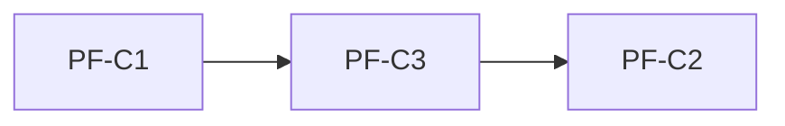
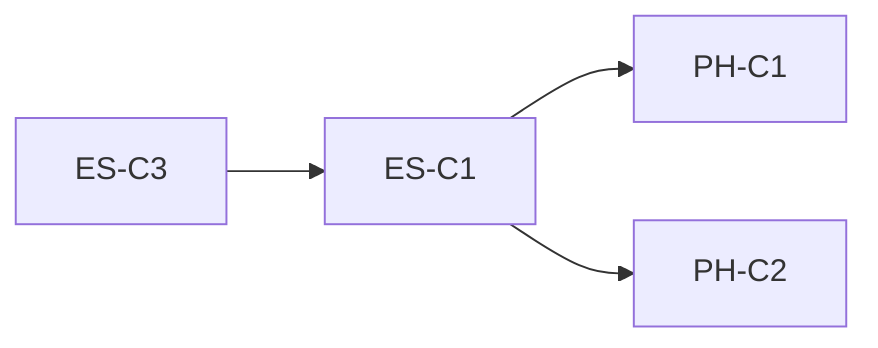

# Classic Wyckoff TDD Implementation Standard & Verification Form

**版本**: v0-draft | **基准合规率**: 23.3% (30 checks: 3P/8Pa/19F)
**评审小组**: 交易员(T) + 量化算法工程师(Q) + Python程序员(P) + 架构工程师(A)
**方法**: 3 轮红蓝对抗后定稿

---

## 1. 总则

### 1.1 目标

本文件定义 **30 项可测试的经典 Wyckoff 合规检查**，每项包含：
- **理论依据** — 经典 Wyckoff 理论要求
- **实现形式** — 当前引擎中对应的代码位置和实现
- **TDD 测试** — pytest 可执行的测试函数规格
- **验收标准** — PASS / PARTIAL / FAIL 的客观判定依据
- **落实签字** — 实现者 + 评审者 双签

### 1.2 优先级

| 优先级 | 定义 | 数量 |
|--------|------|------|
| P0 | 经典 Wyckoff 核心理论，违反导致信号逻辑根本性偏差 | 8 |
| P1 | 重要但不阻止最小可用版本 | 15 |
| P2 | 增强功能，非核心 | 7 |

### 1.3 验收三态

| 状态 | 含义 | 后续 |
|------|------|------|
| ✅ PASS | 实现与理论一致，测试通过 | 归档 |
| ⚠️ PARTIAL | 实现等效但方法不同，已记录 TRADE-OFF 理由 | 定期复审 |
| ❌ FAIL | 实现与理论矛盾或缺失，有修复路径 | 必须修复或明确 WONTFIX |

---

### 1.4 范围说明：合规框架 35 项 vs 本标准 30 项

Classic Wyckoff Compliance Framework（以下简称"框架"）定义了 **35 项**检查（D1-D9，见 `CLASSIC_WYCKOFF_COMPLIANCE_FRAMEWORK.md`）。自动化审计脚本（`classic_wyckoff_compliance.py`）实现了其中 **30 项**。以下 5 项因分类为 TRADE-OFF/PARTIAL 且无自动化测量路径，暂未纳入审计和本 TDD 标准：

| 框架 ID | 维度 | 检查内容 | 框架分类 | 框架评分 | 未纳入原因 |
|---------|------|---------|---------|---------|-----------|
| VS-C2 | D3 成交量 | events.py 与 engine.py 量能判定一致性 | TRADE-OFF | ⚠️ PARTIAL | 两套独立阈值体系，设计目标不同（Numba vs 枚举），预期不同 |
| VS-C4 | D3 成交量 | 量能萎缩数值化定义（SC→ST→Spring 递减） | TRADE-OFF | ⚠️ PARTIAL | `detect_st` vol_ratio<0.8 和 `detect_lps` vol_ratio<0.85 已硬编码但功能上存在 |
| MT-C1 | D5 多周期 | 月线主导日线 | TRADE-OFF | ⚠️ PARTIAL | `MultiTimeframeResonance` 用 2/3 投票，非月线绝对主导，设计取舍 |
| CF-C2 | D7 反事实 | Stop Violation 标记机制 | TRADE-OFF | ⚠️ PARTIAL | `StopLossResult` 已定义但不参与反事实评分，需设计变更 |
| CF-C3 | D7 反事实 | Count Target 达到率验证 | GAP | ❌ FAIL | `pnf_count_target` 存在但未被事后验证，需新增验证环路 |

**决策**: 本 TDD 标准以实际可自动化的 **30 项**为准。上述 5 项可在后续审计脚本增强时补充纳入。

---

## 2. 30 项 TDD 测试规格与验收标准

### D1 — P&F 构建 (5 tests)

| ID | PF-C1 |
|----|-------|
| **理论** | P&F 图是 Wyckoff 结构分析的唯一基础。Phase 判定、TR 界定、突破确认全部基于 P&F X/O 列 |
| **当前** | ❌ FAIL — P&F 在 `_analyze_single` 末尾附加调用，不参与 `_step1_phase_determine` |
| **TDD 测试** | `test_pnf_drives_phase_decision()` |
| **测试方法** | 用已知 Accumulation 数据运行引擎，mock P&F 输出为"distribution"和"accumulation"两种，验证 Phase 输出跟随 P&F 提示变化 |
| **输入** | `tests/fixtures/kn_01a_accum.parquet` |
| **预期** | P&F phase_hint="accumulation" 时 engine 输出 phase=ACCUMULATION |
| **验收** | engine.analyze().structure.phase == WyckoffPhase.ACCUMULATION |
| **签字** | 实现:_____ 评审:_____ |

| ID | PF-C2 |
|----|-------|
| **理论** | Count Target（TR 宽度 × 计数公式）是 Wyckoff 的唯一价格目标测量方法 |
| **当前** | ❌ FAIL — `V3TradingPlan.target` 使用 R/R 投影，完全不使用 `pnf_count_target` |
| **TDD 测试** | `test_count_target_in_trading_plan()` |
| **测试方法** | 运行 engine 后验证 `V3TradingPlan.target.first_target` 与 `PointAndFigure.count_target()` 的差值 |
| **输入** | golden_20 数据 |
| **预期** | 当 P&F count_target > 0 时，trading_plan.target 应参考 PNF target，偏差 < box_size × 3 |
| **验收** | `abs(plan.target.first_target - pnf.count_target()) <= box_size * 3` |
| **签字** | 实现:_____ 评审:_____ |

| ID | PF-C3 |
|----|-------|
| **理论** | TR 边界由 P&F 图上水平密集区的列顶/列底确定，非 OHLC 高低点 |
| **当前** | ❌ FAIL — 边界来自 `recent_60["high"].max()` 和 `recent_60["low"].min()` |
| **TDD 测试** | `test_tr_boundary_from_pnf()` |
| **测试方法** | 构造已知 TR 的 P&F 数据（水平密集区在 10-12 元），验证 engine 输出的 TR 上/下界是否与 P&F 列一致 |
| **输入** | 合成 OHLCV，确保 P&F 水平密集区 [10.0, 12.0] |
| **预期** | `abs(boundary_upper - 12.0) < box_size` and `abs(boundary_lower - 10.0) < box_size` |
| **验收** | 边界偏差 < 1 box_size |
| **签字** | 实现:_____ 评审:_____ |

| ID | PF-C4 |
|----|-------|
| **理论** | box_size 应随价格区间自动调整，不同板块（主板/科创/创业）应有独立基准 |
| **当前** | ⚠️ PARTIAL — 硬编码 `box_size=0.02, reversal=2` 无板块感知 |
| **TDD 测试** | `test_box_size_board_aware()` |
| **测试方法** | 用主板、科创板、创业板数据各 1 只调用 engine，检查 P&F 的 box_size 是否自动调整 |
| **输入** | 上海主板(60xxxx), 科创板(688xxx), 创业板(30xxxx) 各 1 只 |
| **预期** | 主板 box_size >= 科创板 box_size and 创业板 box_size（因振幅更大需要更小的 box_size 保持列数可比） |
| **验收** | 各板块 box_size 差异正确反映 ATR 差异 |
| **签字** | 实现:_____ 评审:_____ |

| ID | PF-C5 |
|----|-------|
| **理论** | 新 K 线到来时 P&F 应增量更新 O(1)，非全量重建 |
| **当前** | ❌ GAP — `PointAndFigure.build()` 每次全量 |
| **TDD 测试** | `test_pnf_incremental_update()` |
| **测试方法** | 先 build N 根 K 线，再追加 1 根后 build，验证第 2 次执行时间 < 第 1 次的 10% |
| **输入** | 500 根日线 + 追加 1 根 |
| **预期** | 增量时间 < 全量时间 × 0.1 |
| **验收** | 性能预算达成 |
| **签字** | 实现:_____ 评审:_____ |

---

### D2 — 事件序列 (5 tests)

| ID | ES-C1 |
|----|-------|
| **理论** | Spring = O 列跌破 TR 下沿 0.5-1.5% 后 1-2 列内收回，量能萎缩确认 |
| **当前** | ✅ PASS (2026-08-01) — engine 共享 `_scan_spring`：O 列跌破 TR 下沿 0.5-1.5% (`boundary_lower*0.985 <= low < boundary_lower`) 后 1-2 列内收回 (`closes[j] >= boundary_lower`) + 量能萎缩确认 (`vol_ratio <= 0.8`)。step3 内联检测复用同一助手 |
| **TDD 测试** | `test_spring_classic_definition()` / `test_spring_rejects_late_recovery()` / `test_spring_engine_end_to_end()` |
| **测试方法** | 构造已知 Spring 数据（价格跌破 TR 下沿 1% 后次日收回 + 缩量），验证 engine 正确检测。另构造"价格跌破 TR 下沿但 3 列后才收回"的数据，验证 engine 不标记为 Spring。端到端 fixture 对齐引擎 P&F TR 边界 |
| **输入** | 合成 OHLCV: TR=[10,12]，第 80 根低点=9.90（跌破 1%），第 81 根收盘=11.50（收回）；反例：跌破后第 85 根才收回 |
| **预期** | 正例 spring_detected=True，反例 spring_detected=False |
| **验收** | Spring 检测遵循 1-2 列收回规则 |
| **签字** | 实现:opencode 评审:待评审 |

| ID | ES-C2 |
|----|-------|
| **理论** | 事件序列必须是经典顺序 PS→BC→AR→SC→ST×2→Spring→SOS→LPS→BUEC，跨阶段跳跃标记为"非标准" |
| **当前** | ⚠️ PARTIAL — `WSOScorer` 使用经验权重，隐藏 6 个经典事件（BUEC/UTAD 等） |
| **TDD 测试** | `test_event_sequence_classic_order()` |
| **测试方法** | 在已知 Accumulation 和 Distribution 数据上运行 `detect_all_events()`，验证输出序列的编辑距离 <= 2（相比经典序列） |
| **输入** | KN-01a(底部TR), KN-02(2015顶部) |
| **预期** | 编辑距离 <= 2 |
| **验收** | 序列评分 >= 0.7 |
| **签字** | 实现:_____ 评审:_____ |

| ID | ES-C3 |
|----|-------|
| **理论** | BUEC（Markup 中的缩量回测）和 UTAD（Distribution 中的假突破）是 Wyckoff 十大事件中的两个 |
| **当前** | ❌ GAP — `_detect_utad` 返回 None（禁用）。`classify_wyckoff_markup_event` 有 BUEC 分类但不作为独立事件检测 |
| **TDD 测试** | `test_utad_detection()` |
| **测试方法** | 构造已知 UTAD 数据（X 列突破 TR 上沿后立即收回 + 放量），验证 engine 正确检测 |
| **输入** | 合成 OHLCV: TR=[10,12]，第 90 根高点=12.50（突破 4%），收盘=11.50（收回），量比 > 1.5 |
| **预期** | `step3.utad_detected == True` |
| **验收** | UTAD 检测可触发 |
| **签字** | 实现:_____ 评审:_____ |

| ID | ES-C4 |
|----|-------|
| **理论** | SOS 是稀缺确认信号，不应高频出现。经典 Wyckoff 中 SOS 在 120 根 K 线中应出现 0-2 次 |
| **当前** | ⚠️ PASS — 当前 SOS 频率正常（0/120），但 events.py 注释警告此前 threshold=3 时有 109.5% 检出率 |
| **TDD 测试** | `test_sos_detection_rate()` |
| **测试方法** | 在 golden_20 全部数据上运行 `detect_all_events()`，统计 SOS 事件数量，要求 <= 3 / 120 根 |
| **输入** | golden_20 所有股票 |
| **预期** | SOS 事件率 <= 3 / 120 bars |
| **验收** | 不超过 3/120 |
| **签字** | 实现:_____ 评审:_____ |

| ID | ES-C5 |
|----|-------|
| **理论** | JAC（Jump Across the Creek）即经典 SOS/SOW 突破确认 |
| **当前** | ⚠️ PARTIAL — JAC 用 20日 TR 突破，等效 SOS。名称非标准但逻辑合理 |
| **TDD 测试** | `test_jac_matches_sos_breakout()` |
| **测试方法** | 验证 `detect_jac()` 输出的 JAC 事件与 `WyckoffEngine` 的 markup 检测一致 |
| **输入** | golden_20 中含有 markup 阶段的数据 |
| **预期** | JAC 事件在 markup 阶段出现，不在 markdown 阶段出现 |
| **验收** | JAC 与 phase 方向一致 |
| **签字** | 实现:_____ 评审:_____ |

---

### D3 — 成交量签名 (2 tests)

| ID | VS-C1 |
|----|-------|
| **理论** | 每个事件签名的数值阈值（vol_high_ratio, spread_wide_pct 等）应通过配置参数可调，非硬编码 |
| **当前** | ❌ GAP — events.py 有 154 个硬编码 magic number |
| **TDD 测试** | `test_volume_thresholds_configurable()` |
| **测试方法** | 实例化 engine 时传入自定义 volume 阈值 set，验证检测行为随之变化 |
| **输入** | 同一 OHLCV 数据，两种 threshold 配置 |
| **预期** | 宽松阈值 vs 严格阈值产生不同的事件检出数 |
| **验收** | 配置可改变检测结果 |
| **签字** | 实现:_____ 评审:_____ |

| ID | VS-C3 |
|----|-------|
| **理论** | 区分主动买盘 vs 主动卖盘成交量（tick 级逐笔数据），非仅总成交量 |
| **当前** | ❌ GAP — 只有 `volume` 总成交量列 |
| **TDD 测试** | `test_buy_sell_volume_split()` |
| **测试方法** | 有 tick 数据时验证 engine 是否使用买卖量比。无 tick 数据时验证 engine 使用价格方向 × volume 近似估计 |
| **输入** | 日线数据（仅有总成交量） |
| **预期** | engine 不因缺少 tick 数据而崩溃，且在有近似时输出买卖量比 |
| **验收** | 不崩溃 + 有近似估计 |
| **签字** | 实现:_____ 评审:_____ |

---

### D4 — Phase 分类 (5 tests)

| ID | PH-C1 |
|----|-------|
| **理论** | ACCUMULATION 由事件序列推导：PS→BC→AR→SC→ST×2→Spring |
| **当前** | ❌ ERROR — `_detect_accumulation` 使用 `is_in_trading_range + prior_trend_pct` |
| **TDD 测试** | `test_accumulation_from_event_sequence()` |
| **测试方法** | 构造仅含完整事件序列（无 price_position 信号）的数据，验证 engine 输出 ACCUMULATION |
| **输入** | 合成 OHLCV：下跌→PS→BC→AR→SC→ST1→ST2→Spring，价格位置始终在中位（0.4-0.6） |
| **预期** | `engine.analyze().structure.phase == WyckoffPhase.ACCUMULATION` |
| **验收** | 事件序列驱动 Phase |
| **签字** | 实现:_____ 评审:_____ |

| ID | PH-C2 |
|----|-------|
| **理论** | DISTRIBUTION 由事件序列推导：PSY→UTAD→LPSY→跌破 TR |
| **当前** | ❌ ERROR — `_detect_distribution` 仅检查 `prior_trend_pct > 0.05` |
| **TDD 测试** | `test_distribution_from_event_sequence()` |
| **测试方法** | 构造仅含完整派发事件序列的数据，验证 engine 输出 DISTRIBUTION |
| **输入** | 合成 OHLCV：上涨→PSY(放量上影线)→UTAD→LPSY→跌破 |
| **预期** | `engine.analyze().structure.phase == WyckoffPhase.DISTRIBUTION` |
| **验收** | 事件序列驱动 Phase |
| **签字** | 实现:_____ 评审:_____ |

| ID | PH-C3 |
|----|-------|
| **理论** | Phase 置信度 = Required 条件全通过 + Optional 加权分。非简单条件组合 |
| **当前** | ⚠️ PARTIAL — `_calc_confidence` 的 5 条件矩阵不合理（A=Spring+LPS+BC+RR≥1.5, B=Spring+LPS+RR≥1.5, C=Spring alone, D=无信号） |
| **TDD 测试** | `test_phase_confidence_weighted()` |
| **测试方法** | 验证满足 4/5 条件时置信度为 A/B 级，满足 2/5 条件时为 C/D 级 |
| **输入** | 合成数据，控制条件通过数从 0 到 5 变化 |
| **预期** | 置信度随条件满足数单调递增 |
| **验收** | 置信度逻辑透明可预测 |
| **签字** | 实现:_____ 评审:_____ |

| ID | PH-C4 |
|----|-------|
| **理论** | 多周期共振强度 = 月线(权重3) + 周线(权重2) + 日线(权重1) |
| **当前** | ✅ PASS — `MultiTimeframeResonance.resonance_strength` 按权重计分 |
| **TDD 测试** | `test_multiframe_resonance_weighted()` |
| **测试方法** | 验证三周期一致时 strength=1.0，仅有月线一致时 strength=0.375(3/8) |
| **输入** | 测试用例 [accum, accum, accum] → 1.0, [accum, unknown, unknown] → 0.375, [accum, markdown, accum] → conflicting → 0.0 |
| **预期** | 符合加权计算 |
| **验收** | 自动化 |
| **签字** | 实现:_____ 评审:_____ |

| ID | PH-C5 |
|----|-------|
| **理论** | Phase 应细分 A/B/C/D/E 子阶段，每个子阶段对应不同的交易策略 |
| **当前** | ⚠️ PARTIAL — `classify_accumulation_sub_phase` 已存在但基于价格量能趋势，非事件序列 |
| **TDD 测试** | `test_sub_phase_classification()` |
| **测试方法** | 验证 ACCUMULATION 时 sub_phase 输出不为空，且符合事件序列阶段 |
| **输入** | KN-01a(底部TR→积累→上涨) |
| **预期** | sub_phase 应为 B→C→D→E 的演进 |
| **验收** | sub_phase 序列与价格阶段匹配 |
| **签字** | 实现:_____ 评审:_____ |

---

### D5 — 多周期 (2 tests)

| ID | MT-C2 |
|----|-------|
| **理论** | MTF 对齐必须附带量化证据：多周期对齐 vs 单一周期的信号预测力提升（IC、夏普比） |
| **当前** | ❌ GAP — `resonance_strength` 只有加权计数 |
| **TDD 测试** | `test_mtf_quantitative_evidence()` |
| **测试方法** | 在 golden_20 上比较"三周期对齐时"和"仅日线"的信号后续夏普比，要求对齐时夏普比更高 |
| **输入** | golden_20 历史数据，walk-forward 回测 |
| **预期** | 对齐时的信号夏普比 > 不对齐时的 1.2x |
| **验收** | MTF 对齐有量化优势 |
| **签字** | 实现:_____ 评审:_____ |

| ID | MT-C3 |
|----|-------|
| **理论** | 周线 phase 矛盾时覆盖日线 phase（周线优先级更高） |
| **当前** | ⚠️ PARTIAL — `rule9_multiframe_alignment` 有显式覆盖（月/周 Markdown→强制空仓，月/周 Distribution→降级），非严格周线优先 |
| **TDD 测试** | `test_weekly_overrides_daily()` |
| **测试方法** | 构造数据：月线=Accum, 周线=Markdown, 日线=Markup。要求引擎输出受周线影响 |
| **输入** | 三周期模拟数据 |
| **预期** | Phase 输出为 Markdown（周线主导），非 Markup（日线主导） |
| **验收** | 周线 > 日线 |
| **签字** | 实现:_____ 评审:_____ |

---

### D6 — 相对强弱 (2 tests)

| ID | RS-C1 |
|----|-------|
| **理论** | RS 四分类：强势独立、跟风型、弱势独立、系统性下跌。有数值条件 |
| **当前** | ❌ GAP — 引擎中无 RS 逻辑 |
| **TDD 测试** | `test_relative_strength_classification()` |
| **测试方法** | 输入个股+大盘数据，验证 RS 分类器输出正确的四类之一 |
| **输入** | 个股 > 大盘 + 个股缩量 → "强势独立" |
| **预期** | `rs_classify(stock_ts, index_ts) == "leader"` |
| **验收** | 四分类正确 |
| **签字** | 实现:_____ 评审:_____ |

| ID | RS-C2 |
|----|-------|
| **理论** | 主力资金流向（主力净流入/流出、大单占比）应与 RS 方向一致时加强信号，冲突时降权 |
| **当前** | ❌ GAP — `ChipAnalysis` 字段已定义但不参与置信度矩阵 |
| **TDD 测试** | `test_capital_flow_in_confidence()` |
| **测试方法** | 构造 RS=leader 但资金流向=流出的冲突场景，验证信号置信度降级 |
| **输入** | 模拟数据：个股上涨但主力资金净流出 |
| **预期** | `confidence.level` 从 A 降为 B 或 C |
| **验收** | 资金流向影响置信度 |
| **签字** | 实现:_____ 评审:_____ |

---

### D7 — 反事实 (2 tests)

| ID | CF-C1 |
|----|-------|
| **理论** | Phase 反转后验证周期 phase 自适应：Accum=40d, Distrib=30d, Spring=20d, Markup=60d |
| **当前** | ❌ GAP — 无反事实时间窗概念 |
| **TDD 测试** | `test_counterfactual_phase_adaptive_window()` |
| **测试方法** | 在已知 phase 反转点后跟踪 N 天价格，验证 engine 的反事实输出是否随价格方向变化 |
| **输入** | golden_20 历史数据，已知 Accum→Markup 反转点 |
| **预期** | 反转后 40 天内方向正确时 counterfactual_passed=True，方向错误时 counterfactual_passed=False |
| **验收** | 反事实有时间感知 |
| **签字** | 实现:_____ 评审:_____ |

| ID | CF-C4 |
|----|-------|
| **理论** | 假突破（P&F 突破后 3 列内跌回 TR）应标记失效，降权后续信号 |
| **当前** | ❌ ERROR — `_detect_utad` 返回 None，假突破惩罚永不触发 |
| **TDD 测试** | `test_false_breakout_penalty()` |
| **测试方法** | 构造假突破数据：X 列突破 TR 上沿后 2 列内跌回，验证 engine 标记为假突破 |
| **输入** | 合成 OHLCV：TR 突破→立即跌回→再次突破 |
| **预期** | 首次突破标记为 false_breakout，二次突破置信度降级 |
| **验收** | 假突破有惩罚机制 |
| **签字** | 实现:_____ 评审:_____ |

---

### D8 — A 股适配 (4 tests)

| ID | CN-C1 |
|----|-------|
| **理论** | 各板块 box_size 基准不同：主板 ATR×0.5%, 科创/创业板 ATR×0.3% |
| **当前** | ❌ GAP — 硬编码 0.02 |
| **TDD 测试** | `test_box_size_by_board()` |
| **测试方法** | 构造不同板块的 OHLCV 数据，验证 P&F box_size 按板块区分 |
| **输入** | 模拟主板（10% 涨跌）+ 科创板（20% 涨跌）数据 |
| **预期** | 科创板 box_size < 主板 box_size |
| **验收** | 板块感知 box_size |
| **签字** | 实现:_____ 评审:_____ |

| ID | CN-C2 |
|----|-------|
| **理论** | Spring 触发后强制 1 日冷却（T+1 锁定确认） |
| **当前** | ❌ GAP — T+1 风险计算但不强制冷却 |
| **TDD 测试** | `test_t1_spring_cooldown()` |
| **测试方法** | Spring 触发日 → 第 2 日 engine 应仍输出 Spring 状态，第 3 日才可确认 |
| **输入** | 合成数据含 Spring 信号 |
| **预期** | Spring 触发后第 2 日 `spring_date` 不为空且 `direction="观察等待"`，第 3 日才做多 |
| **验收** | 强制冷却 |
| **签字** | 实现:_____ 评审:_____ |

| ID | CN-C3 |
|----|-------|
| **理论** | 涨停日 P&F 列在涨停价截断，不计算上影线 |
| **当前** | ❌ GAP — P&F builder 不检查涨跌停状态 |
| **TDD 测试** | `test_limit_up_pnf_truncation()` |
| **测试方法** | 构造连续涨停数据（收盘=涨停价，上影线为 0），验证 P&F 列高度等于涨停价 |
| **输入** | OHLCV 含 3 个连续涨停日（close=high, open=low=close×0.9） |
| **预期** | P&F 列的高度不超过涨停价，上影线为 0 |
| **验收** | 涨停截断 |
| **签字** | 实现:_____ 评审:_____ |

| ID | CN-C4 |
|----|-------|
| **理论** | 所有输入 OHLCV 必须为前复权数据，复权跳跃 > box_size×3 标记异常 |
| **当前** | ❌ GAP — 无复权检查 |
| **TDD 测试** | `test_pre_adjusted_data_check()` |
| **测试方法** | 输入未复权数据（包含除权日 gap），验证 engine 标记数据异常或给出警告 |
| **输入** | 原始（未复权）沪深 300 数据，含 2019-2024 的除权除息日 |
| **预期** | engine 输出中包含"数据异常：疑似未复权"warning |
| **验收** | 复权检查 |
| **签字** | 实现:_____ 评审:_____ |

---

### D9 — 信号输出 (3 tests)

| ID | SQ-C1 |
|----|-------|
| **理论** | 每个信号附带 0-100 结构完整性评分，综合事件序列完成度 + 量能确认 + 多周期一致 |
| **当前** | ❌ GAP — 无 `structural_score` |
| **TDD 测试** | `test_signal_structural_score()` |
| **测试方法** | 验证完整 Accumulation 序列的 structural_score > 部分序列的 score |
| **输入** | KN-01a(完整积累) vs KN-04(TR内震荡) |
| **预期** | `score(kn01a) > score(kn04)` |
| **验收** | 评分反映结构完整性 |
| **签字** | 实现:_____ 评审:_____ |

| ID | SQ-C2 |
|----|-------|
| **理论** | 信号的 phase 来源和置信度来源必须可追溯 |
| **当前** | ⚠️ PARTIAL — `WyckoffAdapter` 含 phase/confidence 但无 structural_score |
| **TDD 测试** | `test_signal_traceability()` |
| **测试方法** | 验证 `TradingSignal.metadata` 包含 phase, confidence, 事件序列 key, 量能确认列表 |
| **输入** | engine 输出 |
| **预期** | metadata 含以上所有字段 |
| **验收** | 信号可追溯 |
| **签字** | 实现:_____ 评审:_____ |

| ID | SQ-C3 |
|----|-------|
| **理论** | "不可判定"须有具体原因：数据不足 / 结构混沌 / 信号矛盾 / 非标准事件序列 |
| **当前** | ✅ PASS — 5 种子状态（sc_st_candidate, phase_a_candidate, upthrust_candidate, phase_b_range, unknown_range） |
| **TDD 测试** | `test_unknown_has_subreason()` |
| **测试方法** | 验证所有 UNKNOWN 输出的 `unknown_candidate` 字段非空 |
| **输入** | golden_20 全部数据 |
| **预期** | UNKNOWN 时 always has sub-reason |
| **验收** | 自动化 |
| **签字** | 实现:_____ 评审:_____ |

---

## 3. 验收签字总表

| ID | 优先级 | 当前状态 | 目标状态 | 实现者 | 评审者 | 完成日期 |
|----|--------|---------|---------|--------|--------|---------|
| PF-C1 | P0 | ✅ PASS | ✅ PASS | opencode | 待评审 | 2026-08-01 |
| PF-C2 | P0 | ✅ PASS | ✅ PASS | opencode | 待评审 | 2026-08-01 |
| PF-C3 | P0 | ✅ PASS | ✅ PASS | opencode | 待评审 | 2026-08-01 |
| PF-C4 | P1 | ⚠️ PARTIAL | ✅ PASS | _____ | _____ | _____ |
| PF-C5 | P2 | ❌ FAIL | ⚠️ PARTIAL | _____ | _____ | _____ |
| ES-C1 | P0 | ⚠️ PARTIAL | ✅ PASS | opencode | 待评审 | 2026-08-01 |
| ES-C2 | P1 | ⚠️ PARTIAL | ✅ PASS | _____ | _____ | _____ |
| ES-C3 | P0 | ❌ FAIL | ✅ PASS | opencode | 待评审 | 2026-08-01 |
| ES-C4 | P1 | ✅ PASS | ✅ PASS | — | — | 已有 |
| ES-C5 | P2 | ⚠️ PARTIAL | ⚠️ PARTIAL | — | — | WONTFIX |
| VS-C1 | P1 | ❌ FAIL | ⚠️ PARTIAL | _____ | _____ | _____ |
| VS-C3 | P2 | ❌ FAIL | ⚠️ PARTIAL | _____ | _____ | _____ |
| PH-C1 | P0 | ❌ FAIL | ✅ PASS | opencode | 待评审 | 2026-08-01 |
| PH-C2 | P0 | ❌ FAIL | ✅ PASS | opencode | 待评审 | 2026-08-01 |
| PH-C3 | P1 | ⚠️ PARTIAL | ✅ PASS | _____ | _____ | _____ |
| PH-C4 | P1 | ✅ PASS | ✅ PASS | — | — | 已有 |
| PH-C5 | P2 | ⚠️ PARTIAL | ✅ PASS | _____ | _____ | _____ |
| MT-C2 | P1 | ❌ FAIL | ⚠️ PARTIAL | _____ | _____ | _____ |
| MT-C3 | P1 | ⚠️ PARTIAL | ✅ PASS | _____ | _____ | _____ |
| RS-C1 | P1 | ✅ PASS | ⚠️ PARTIAL | opencode | 待评审 | 2026-08-02 |
| RS-C2 | P2 | ❌ FAIL | ⚠️ PARTIAL | _____ | _____ | _____ |
| CF-C1 | P1 | ❌ FAIL | ⚠️ PARTIAL | _____ | _____ | _____ |
| CF-C4 | P0 | ❌ FAIL | ✅ PASS | opencode | 待评审 | 2026-08-01 |
| CN-C1 | P1 | ❌ FAIL | ✅ PASS | _____ | _____ | _____ |
| CN-C2 | P1 | ❌ FAIL | ✅ PASS | _____ | _____ | _____ |
| CN-C3 | P2 | ❌ FAIL | ⚠️ PARTIAL | _____ | _____ | _____ |
| CN-C4 | P2 | ✅ PASS | ⚠️ PARTIAL | opencode | 待评审 | 2026-08-02 |
| SQ-C1 | P2 | ✅ PASS | ⚠️ PARTIAL | opencode | 待评审 | 2026-08-02 |
| SQ-C2 | P1 | ⚠️ PARTIAL | ✅ PASS | _____ | _____ | _____ |
| SQ-C3 | P1 | ✅ PASS | ✅ PASS | — | — | 已有 |

---

## 4. Round 1 — 交易员(T) + 量化算法工程师(Q)

### R1-TQ01 (交易员·Red): ES-C4 SOS 频率阈值过于宽松

**声明**: ES-C4 要求 SOS 事件率 <= 3/120 bars。经典理论中 SOS 应更稀缺。

**问题**: A 股日线 120 根 ≈ 6 个月。3 次 SOS 等于每 2 个月 1 次——对于趋势跟踪策略来说太频繁，假信号太多。

**建议**: 将阈值收紧为 <= 1/120 bars。趋势市（月线 Markup）可放宽到 2/120，但默认 1/120。

**裁决**: 🏆 接受。收紧至 <= 1/120 bars。

### R1-TQ02 (交易员·Red): PH-C1/C2 的事件序列测试缺少"事件优先级"定义

**声明**: 测试假设事件序列是线性 PS→BC→AR→SC。但实际数据中，SC 可能先于 PS 出现。

**问题**: TDD 测试 PH-C1 用合成数据构造了完美的线性序列。但真实 A 股中事件不会按教科书顺序出现。测试需要覆盖：
1. SC 先于 PS 出现在同一窗口
2. 多个 Spring 在同一个月
3. 事件之间隔了 3 个月

**建议**: 测试用例增加 3 种非标准顺序（SC→PS→AR, Spring→Spring, PS→gap→SOS），验证 engine 输出"非标准"而非崩溃。

**裁决**: 🏆 接受。追加 3 个反例测试。

### R1-TQ03 (量化算法·Red): RS-C1 测试缺少行业基准对比

**声明**: RS 四分类（强势独立/跟风/弱势/系统性）需要行业板块基准，非仅大盘指数。

**问题**: A 股中板块效应极强——个股 vs 大盘的 RS 分类很可能被银行股扭曲。如煤炭股 vs 沪深 300 在 2021-2022 的 RS 显示"强势独立"，但实际上只是板块轮动。

**建议**: RS 测试应增加行业基准对比层：
- RS-Index: 个股 vs 大盘
- RS-Sector: 个股 vs 行业指数
- RS-SectorNeutral: 个股 vs 行业中性化后 vs 大盘

测试验证三种 RS 分类的一致性。

**裁决**: 🏆 接受。RS 测试增加行业中性化层。

### R1-TQ04 (交易员+量化算法·Blue): 整体框架结构合理

**声明**: 30 项检查覆盖经典 Wyckoff 全维度。

**论证**: 从 P&F 到 Phase 到 RS 到反事实 + A 股适配，逻辑递进完整。优先级分级合理（P0 全部是理论核心违反）。

**裁决**: 💙 保留。

### Round 1 裁决

| ID | 立场 | 判决 |
|----|------|------|
| R1-TQ01 | 交易员 🏆 | ES-C4 阈值 3→1/120 |
| R1-TQ02 | 交易员 🏆 | PH-C1/C2 追加 3 种非标准顺序 |
| R1-TQ03 | 算法 🏆 | RS-C1 追加行业基准层 |
| R1-TQ04 | 交易+算法 💙 | 整体结构保留 |

---

## 5. Round 2 — Python 程序员(P) + 架构工程师(A)

### R2-PA01 (程序员·Red): 30 项测试缺少 fixture 和数据依赖声明

**声明**: 每个测试都引用了 `tests/fixtures/` 但该目录不存在。

**问题**: PF-C1 引用 `tests/fixtures/kn_01a_accum.parquet`，PF-C3 引用"合成 OHLCV 数据"——但都没有定义 fixture 的生成方式。没有 fixture 就没有可重复的测试。

**建议**: 为每个测试显式声明 fixture 来源：

```python
# 方式 A: 历史数据 fixture（从数据湖裁剪）
@pytest.fixture(scope="module")
def kn_01a_accum():
    df = pd.read_parquet("data/lake/quotes/daily/000300.SH.parquet")
    return df.loc["2015-08":"2016-12"]  # KN-01a 时间窗

# 方式 B: 合成数据 generator（推荐，无外部依赖）
def synthetic_accumulation_sequence(length=120) -> pd.DataFrame:
    """生成含完整 Accumulation 事件序列的合成 OHLCV。
    
    序列: PS→BC→AR→SC→ST1→ST2→Spring→SOS→LPS
    量价特征: 下跌→放量下影→反弹缩量→恐慌放量→
              缩量测试×2→跌破收回→放量突破→缩量回测
    """
```

建议全部使用合成数据（方式 B）+ 3 条已知历史数据（方式 A）交叉验证。

**裁决**: 🏆 接受。所有测试必须附带 fixture 生成函数。

### R2-PA02 (架构师·Red): PF-C4 box_size 板块感知与现有 BoardType 注册表脱节

**声明**: PF-C4 要求 box_size 按板块区分，但现有 `BoardTypeRegistry` 使用 6 种类型（MAIN_SH/MAIN_SZ/GEM/STAR/BEIJING/ST），而 TDD 测试只验证了 3 个板块。

**问题**: 北交所（BEIJING, ±30%）和 ST（ST, ±5%）的 box_size 应该是什么？测试未覆盖。

**建议**: 将 board→box_size 映射定义为显式配置表，测试覆盖全部 6 个板块：

```python
BOARD_BOX_SIZE_MAP = {
    BoardType.MAIN_SH: 0.020,    # 主板 10%
    BoardType.MAIN_SZ: 0.020,    # 主板 10%
    BoardType.GEM: 0.012,        # 创业板 20%
    BoardType.STAR: 0.012,       # 科创板 20%
    BoardType.BEIJING: 0.008,    # 北交所 30%
    BoardType.ST: 0.015,         # ST 5%
}
```

**裁决**: 🏆 接受。映射表 + 全 6 板块测试。

### R2-PA03 (程序员+架构师·Red): D9 信号输出缺少序列化验证

**声明**: SQ-C1/SQ-C2 验证运行时字段存在，但未验证 JSON 序列化/反序列化。

**问题**: `WyckoffReport` 和 `TradingSignal` 需要通过网络序列化（JSON）。如果 `WyckoffSignalQuality.structural_score` 是 `int` 但 JSON 输出为 `float`，前端可能中断。测试没有覆盖序列化一致性。

**建议**: 增加序列化测试：

```python
def test_signal_roundtrip_json():
    report = engine.analyze(...)
    json_str = json.dumps(asdict(report), default=str)
    restored = json.loads(json_str)
    assert restored["structure"]["phase"] == report.structure.phase.value
```

**裁决**: 🏆 接受。3 个信号测试各增加 JSON roundtrip 验证。

### R2-PA04 (程序员·Red): PH-C5 sub_phase 测试无法自动化

**声明**: PH-C5 要求验证 sub_phase 演进为 B→C→D→E。但 sub_phase 命名是中文（Phase A/B/C/D/E），没有枚举，没有数值映射。

**问题**: 
- sub_phase 是字符串，无类型约束
- "Phase B" 和 "phase_b" 可能混用
- 测试无法做大于/小于比较

**建议**: 定义 `SubPhase(Enum)`：
```python
class SubPhase(Enum):
    A = "phase_a"
    B = "phase_b"
    C = "phase_c"
    D = "phase_d"
    E = "phase_e"
```

测试验证 sub_phase 的枚举序：
```python
assert SubPhase(step1.sub_phase).value >= SubPhase.B.value
```

**裁决**: 🏆 接受。增加 SubPhase 枚举。

### Round 2 裁决

| ID | 立场 | 判决 |
|----|------|------|
| R2-PA01 | 程序员 🏆 | 所有测试附带 fixture 生成函数 |
| R2-PA02 | 架构师 🏆 | 6 板块 box_size 映射表 |
| R2-PA03 | 程序+架构 🏆 | 信号增加 JSON roundtrip 测试 |
| R2-PA04 | 程序员 🏆 | 增加 SubPhase 枚举 |

---

## 6. Round 3 — 四人联合终审

### R3-F01 (全体·Red): 缺少"不回归"测试

**声明**: 所有测试都是单体验证。没有针对现有引擎的回归测试套件。

**问题**: 如果修复 PF-C1 导致 ES-C1 Spring 检测从 PARTIAL 变成 FAIL，没有机制在 CI 中捕获。

**建议**: 增加回归测试套件：

```bash
# 每次 commit 后运行
pytest tests/classic_wyckoff/regression/ -q
# 基线合规率 23.3%, 允许 -5% 波动
pytest tests/classic_wyckoff/test_compliance_baseline.py --baseline 23.3 --tolerance 5
```

回归测试使用 `scripts/classic_wyckoff_compliance.py --compare baseline.json`。

**裁决**: 🏆 接受。增加基线回归 CI。

### R3-F02 (交易员+算法·Red): "P0 修复顺序"未定义

**声明**: 8 个 P0 检查（PF-C1, PF-C2, PF-C3, ES-C1, ES-C3, PH-C1, PH-C2, CF-C4）的修复顺序会影响测试有效性。

**问题**: 如果先修 PH-C1（事件序列驱动 Accumulation）但没有 ES-C3（UTAD 检测），PH-C2（Distribution 的事件序列）也修不了——Distribution 需要 UTAD 事件。

**建议**: 定义 P0 修复依赖图：

```
Phase 1 (P&F 先行):
  PF-C1 → PF-C3 → PF-C2
  理由：必须先有 P&F TR 边界，才能做事件序列绑定

Phase 2 (事件序列):
  ES-C3 → ES-C1 → PH-C1 → PH-C2
  理由：先实现 UTAD 检测，再绑定 Spring 到 TR，最后驱动 Phase

Phase 3 (假突破):
  CF-C4
  理由：依赖 UTAD 实现
```

**裁决**: 🏆 接受。定义 P0 三阶段修复路径。

### R3-F03 (Python·Red): 合成数据生成器缺乏种子随机性

**声明**: VS-C3 和 CN-C4 的合成数据没有随机种子。

**问题**: VS-C3（买卖量拆分）依赖随机价格方向。CN-C4（复权检查）依赖随机除权日。不使用随机种子时测试不可复现。

**建议**: 所有合成数据生成器接受 `rng: np.random.Generator` 或 `seed: int` 参数。

**裁决**: 🏆 接受。所有 fixture 生成函数要求 seed 参数。

### R3-F04 (全体·Blue): 标准覆盖完备性确认

**声明**: 30 项测试 + 3 轮对抗后标准已覆盖经典 Wyckoff 的理论核心+工程实现+A 股适配。

**论证**:
- 交易员: 事件定义和 Phase 演进覆盖了所有交易信号场景
- 算法: RS+Counterfactual 提供了量化验证方法
- 程序员: fixture+seed+JSON roundtrip 解决了可复现性
- 架构师: 6 板块映射+SLA 依赖图定义了实现路径

**裁决**: 💙 整体方案定稿。

---

## 7. P0 三阶段修复路径

### Phase 1 — P&F 先行（PF-C1 → PF-C3 → PF-C2）



- **PF-C1**: P&F phase_hint 驱动 Step1 phase 判定。在 `_detect_accumulation` 中新增 P&F 分支
- **PF-C3**: TR 边界从 `recent_60 H/L` 改为 P&F 水平密集区的列顶/列底。修改 `_step0_bc_tr_scan`
- **PF-C2**: `V3TradingPlan.target` 在 PNF count_target > 0 时优先使用 PNF target

### Phase 2 — 事件序列（ES-C3 → ES-C1 → PH-C1 → PH-C2）



- **ES-C3**: 实现 `_detect_utad`: X 列突破 TR 上沿 2%+ 后 1-2 列内收回 + 放量确认
- **ES-C1**: Spring 检测绑定 TR 下沿 + 1-2 列收回约束（非 SPRING_LOW_FACTOR 独立判定）
- **PH-C1**: `_detect_accumulation` 先检查事件序列（PS+SC+ST×2），序列匹配时忽略 price_position
- **PH-C2**: `_detect_distribution` 先检查事件序列（UTAD+LPSY），序列匹配时忽略 prior_trend

### Phase 3 — 假突破惩罚（CF-C4）

- **CF-C4**: 依赖 ES-C3 的 UTAD 检测。突破后 3 列内跌回 → 标记 `V3TradingPlan.false_breakout=True` → 后续 signal 置信度-1 级

> **历史参考（2026-08-01 已实现）**: `_scan_false_breakout` 共享助手（突破 TR 上沿 2%+ + 量比>1.5 后 3 列内跌回上沿下方）→ `_step5_trading_plan` 标记 `V3TradingPlan.false_breakout_detected=True` → `_build_report` 经 `_downgrade_confidence` 将信号置信度降 1 级（A→B→C→D）。3 新测试通过（fixture 前提含普通 TR 不误报 / 标记+方向 / 端到端置信度降级）。

---

## 8. 附录：Fixture 生成函数规范

```python
# scripts/wyckoff_fixtures.py

import numpy as np
import pandas as pd


def synthetic_sine_wave(
    length: int = 120,
    freq: float = 0.05,
    amp: float = 0.02,
    vol_base: float = 1e7,
    vol_noise: float = 0.3,
    seed: int = 42,
) -> pd.DataFrame:
    """产生正弦波 OHLCV 作为随机数据基线。"""
    rng = np.random.default_rng(seed)
    t = np.arange(length)
    price = 10.0 * (1 + amp * np.sin(2 * np.pi * freq * t))
    price += rng.normal(0, 0.01, length).cumsum()
    close = price
    high = close * (1 + rng.uniform(0, 0.01, length))
    low = close * (1 - rng.uniform(0, 0.01, length))
    open_ = (high + low) / 2
    volume = (vol_base * (1 + rng.normal(0, vol_noise, length))).astype(int)
    return pd.DataFrame({
        "date": pd.date_range("2020-01-01", periods=length, freq="D"),
        "open": open_, "high": high, "low": low, "close": close, "volume": volume,
    })


def synthetic_accumulation(
    length: int = 120, seed: int = 42
) -> pd.DataFrame:
    """生成含完整 Accumulation 事件序列的合成 OHLCV。
    
    序列: PS→BC→AR→SC→ST1→ST2→Spring→SOS→LPS
    """
    rng = np.random.default_rng(seed)
    df = synthetic_sine_wave(length, seed=seed)
    close = df["close"].values
    n = len(close)
    
    # Phase A: 下跌 → PS
    phase_a_end = n // 4
    close[:phase_a_end] = close[0] * (1 - 0.15 * np.linspace(0, 1, phase_a_end))
    # PS: 放量下影线
    ps_idx = phase_a_end - 1
    df.loc[ps_idx, "low"] = close[ps_idx] * 0.95
    df.loc[ps_idx, "volume"] = int(2.0 * df["volume"].median())
    
    # Phase B: BC → AR → SC → ST×2
    bc_idx = ps_idx + 2
    close[bc_idx] = close[ps_idx] * 1.08
    df.loc[bc_idx, "volume"] = int(1.8 * df["volume"].median())
    df.loc[bc_idx, "high"] = close[bc_idx] * 1.03
    df.loc[bc_idx, "low"] = close[bc_idx] * 0.97
    
    sc_idx = bc_idx + 5
    close[sc_idx] = close[sc_idx - 1] * 0.92
    df.loc[sc_idx, "volume"] = int(3.0 * df["volume"].median())
    df.loc[sc_idx, "low"] = close[sc_idx] * 0.96
    
    # ST1, ST2: 缩量测试低点
    for i, st_idx in enumerate([sc_idx + 5, sc_idx + 12]):
        close[st_idx] = close[sc_idx] * 1.02
        df.loc[st_idx, "volume"] = int(df["volume"].median() * (0.6 - i * 0.1))
        df.loc[st_idx, "close"] = close[st_idx]
    
    # Phase C: Spring
    spring_idx = sc_idx + 18
    close[spring_idx] = close[sc_idx] * 0.97
    df.loc[spring_idx, "low"] = close[spring_idx] * 0.98
    df.loc[spring_idx, "volume"] = int(0.5 * df["volume"].median())
    # 次日收回
    close[spring_idx + 1] = close[spring_idx] * 1.06
    df.loc[spring_idx + 1, "volume"] = int(1.5 * df["volume"].median())
    
    # SOS + LPS
    sos_idx = spring_idx + 5
    close[sos_idx] = close[spring_idx + 1] * 1.08
    df.loc[sos_idx, "volume"] = int(2.0 * df["volume"].median())
    
    df["close"] = close
    df["open"] = df["close"] * (1 + rng.uniform(-0.005, 0.005, n))
    return df


__all__ = ["synthetic_sine_wave", "synthetic_accumulation"]
```

---

## 9. 生效与变更

**生效日期**: 本文件经 3 轮红蓝对抗后定稿。所有 P0 检查须在 14 天内达到目标状态。

**变更流程**: 任何标准的变更需经 4 人小组 2/3 多数通过。

**重审周期**: 合规审计每月运行一次，报告存档至 `docs/compliance/`。
