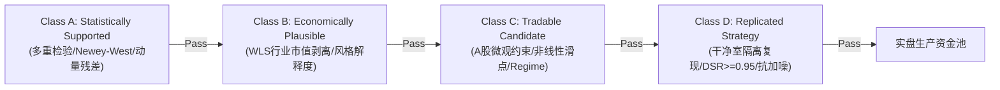
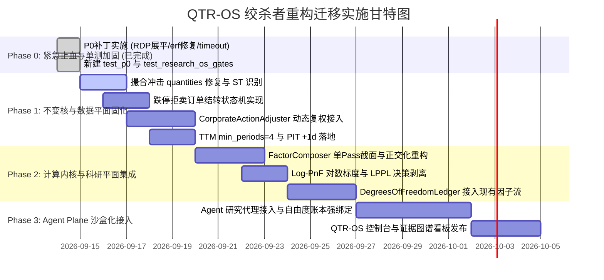

# QTR-OS (Quantitative Trading & Research OS) 演进重构蓝图与系统边界分析

> **编制机构**：UniQuant 专家联合重构小组（顶尖交易员 / 顶尖数学家 / 顶尖信息分析师 / 顶尖算法工程师 / 顶尖Python架构师）  
> **重构目标**：从“功能分散的分析软件”跃迁为“基于科学认识论的可信量化投研操作系统（QTR-OS）”  
> **核心原则**：冻结不变核（Invariant Kernel）、建立科研账本（Degrees of Freedom Ledger）、纯纯单向数据流、零回归绞杀者迁移  
> **生成日期**：2026-09-14

---

## 目录
1. [重构哲学与系统全景拓扑 (Refactoring Paradigm)](#1-重构哲学与系统全景拓扑)
2. [执行平面与不变核规范 (Plane 2: Execution Invariant Kernel)](#2-执行平面与不变核规范)
3. [科研控制平面与四级门禁体系 (Plane 3: Research OS Plane)](#3-科研控制平面与四级门禁体系)
4. [数据平面与严格 PIT 契约 (Plane 1: Data Plane)](#4-数据平面与严格-pit-契约)
5. [计算内核与算法优化 (Computational Engine)](#5-计算内核与算法优化)
6. [软件架构演进与绞杀者迁移路线图 (Architecture & Migration Roadmap)](#6-软件架构演进与绞杀者迁移路线图)

---

## 1. 重构哲学与系统全景拓扑

### 1.1 核心认识论跃迁
审计表明，UniQuant 此前的系列假死、断链与误判，根源在于混淆了**“研究产物（Research Artifact）”**与**“科学证据（Scientific Evidence）”**。重构的首要任务不是堆砌模型，而是通过“四平面架构（Four Planes）”在物理与逻辑层面确立不可逾越的边界：

```
┌────────────────────────────────────────────────────────────────────────────────────────┐
│                        QTR-OS 四平面架构与认识论分层                                    │
├────────────────────────────────────────────────────────────────────────────────────────┤
│  [Plane 4: Agent Plane (研究探索代理层 - 允许试错与自由探索)]                            │
│    Orchestrator  │  Alpha Discovery Agent  │  Replication Agent  │  Statistical Auditor │
├────────────────────────────────────────────────────────────────────────────────────────┤
│  [Plane 3: Research OS Plane (科研控制平面前台 - 统一实验认识论与门禁)]                 │
│    Hypothesis Registry │ Experiment Ledger │ Evidence Graph │ Red Team │ Promotion Gate│
│    ★ 核心防线：Research Degrees of Freedom Ledger (全生命周期记录尝试次数与多重检验预算) │
├────────────────────────────────────────────────────────────────────────────────────────┤
│  ═══════════════════════════  Invariant Kernel (绝对冻结的不变核)  ═════════════════════  │
│  [Plane 2: Quant Execution Plane (量化执行平面 - 确定性物理法则，严禁犯错)]             │
│    Deterministic Matching │ A-Share Rules (T+1/Limits) │ Transaction Cost │ Risk Engine│
├────────────────────────────────────────────────────────────────────────────────────────┤
│  [Plane 1: Data Plane (数据契约平面 - 绝对真理源泉)]                                   │
│    Strict PIT Engine │ Corporate Actions (前复权/除权除息) │ Data Quality Contract Gate │
└────────────────────────────────────────────────────────────────────────────────────────┘
```

- **Invariant Kernel（不变核）**：涵盖 A 股制度硬边界（T+1、涨跌停、滑点冲击模型、手续费印花税、PIT 时间轴）。这部分逻辑必须被冻结并以 100% 覆盖率的断言锁定，严禁 Agent 和研究员擅自修改。
- **Research OS Plane（科研平面）**：Agent 在该平面内自由探索特征空间与模型超参，但每一次尝试都必须向 `DegreesOfFreedomLedger` 登记挂账，多重检验惩罚随尝试次数单调递增，彻底根除“在样本内撞大运”。

---

## 2. 执行平面与不变核规范 (Plane 2: Execution Invariant Kernel)

### 2.1 滑点与冲击成本模型重构 (`unified_matching_engine.py`)
- **废除错误公式**：彻底移除原代码中将全市场总成交量当作冲击分子的 `volumes / avg_daily_volumes`。
- **引入参与率平方根冲击模型**：
  $$\text{Participation Rate: } \rho_i = \frac{Q_{i}^{\text{order}}}{\max(\text{ADV}_{i}, 1e-8)}$$
  $$\text{Slippage}(Q) = \text{HalfSpread} + \gamma \cdot \sqrt{\rho_i} + \mathbb{I}(\rho_i > 0.10) \cdot 0.01 \cdot (\rho_i - 0.10)$$
  - **小单连续性**：当 $Q \to 0$ 时，$\rho \to 0$，冲击项严格收敛至 0，散户仅承受基础点差；
  - **大单流动性耗尽阻尼**：当参与率突破 10% 时触发超线性惩罚，并受 `max_impact = 200 bps` 截断。

### 2.2 跌停拒卖“僵尸持仓”消除机制 (`unified_engine.py`)
- **非对称生命周期状态机**：
  - `BUY` 涨停被拒 $\to$ **立即作废 (Auto-Cancel)**，坚决不追高；
  - `SELL` 跌停被拒 $\to$ **强制结转 (Mandatory Rollover)**，状态置为 `RETRYING`，下一交易日开盘集合竞价置顶重试（上限 30 个交易日）。
- **互斥排队保护**：若持仓标的存在正在结转的 `RETRYING` 清仓单，调度器坚决拦截任何新的买单覆写，直至该标的彻底清算或被标记为流动性坏账。

### 2.3 向量化 ST 5% 识别与代码规范化
- 建立统一的 [`normalize_symbol(s)`](file:///home/james/Documents/Project/UniQuant/src/uniquant/hands/backtest/unified_matching_engine.py) 模块，支持 `600519`, `SH600519`, `600519.SH`, `688xxx` 自动推断与规范化，彻底消除缺少后缀抛出的 `ValueError`。
- 在 `compute_limit_status_vectorized` 中引入 `np.char.startswith` 向量化掩码，在零 Python 循环下识别 ST 股票并施加严格的 $\pm 5\%$ 涨跌停限制。

### 2.4 法定基准撮合器与容量约束
- **唯一基准撮合器**：确立 [`ha_rotation_sim.py`](file:///home/james/Documents/Project/UniQuant/scripts/canslim/ha_rotation_sim.py) 的 **30-slot 持久槽位轮换引擎**为全平台唯一的组合层法定撮合器，彻底淘汰 `mean(gap)` 与 `scaled_30` 的无摩擦等权重置幻影收益。
- **保守容量模型**：建立非线性市场冲击与 $ADV \ge 2000 \text{万}$ 流动性地板耦合的容量评估器，将 H-A 策略的真实容量定义为**当前执行模型下的保守容量估计（约 2850~3000 万元）**。

### 2.5 七大执行不变核定义 (INV-1 至 INV-7)
1. **INV-1 资金永不透支**：$\forall t, \text{Cash}_t \ge 0$；
2. **INV-2 T+1 序数单调性**：$\tau_{\text{sell}} \ge \text{NextTradingDay}(\tau_{\text{buy}})$；
3. **INV-3 限价笼子拒单**：买入不破涨停，卖出不破跌停；
4. **INV-4 整手离散取整**：买入股数 $\pmod{100} \equiv 0$；
5. **INV-5 费用非对称守恒**：印花税仅卖方征收，佣金双向且 $\ge 5.0$ 元；
6. **INV-6 跌停卖单强制结转**：$\text{Reject}(\text{SELL}, \text{LimitDown}) \implies \text{Rollover}(t+1)$；
7. **INV-7 槽位资产闭包**：$\sum \text{SlotNAV}_k(t) + \text{Cash} \equiv \text{TotalNAV}(t)$。

---

## 3. 科研控制平面与四级门禁体系 (Plane 3: Research OS Plane)

该平面的核心代码已在 [`src/uniquant/research/`](file:///home/james/Documents/Project/UniQuant/src/uniquant/research/) 完成落地并验证通过。

### 3.1 实验自由度账本 (`DegreesOfFreedomLedger`)
- **数据结构与字段规范**：
  持久化记录 `experiment_id`, `hypothesis_id`, `family_id`, `n_trials`, `search_space`, `effective_m`, `p_raw`, `p_adj_bonferroni`, `p_adj_bh_fdr`, `alpha_wealth_spent` 等核心字段。
- **谱分解有效检验数 ($M_{\text{eff}}$)**：
  金融因子在参数空间高度自相关。采用 Nyholt-Li-Ji 特征谱方差算法：
  $$\mathrm{Var}(\boldsymbol{\lambda}) = \frac{1}{k}\sum (\lambda_i - 1)^2, \quad \eta = \min\left(1.0, \frac{\mathrm{Var}(\boldsymbol{\lambda})}{k-1}\right), \quad M_{\text{eff}} = 1 + (k-1)(1 - \eta)$$
  自适应替代朴素 $M$，避免过度保守杀伤。
- **在线序贯 Alpha-Wealth 熔断**：
  为研究团队设置初始资产配额 $\mathcal{W}_0$。每次失败尝试扣减配额，一旦破产直接物理封禁该假设族的提交权限，从机制上根除暴力穷举。

### 3.2 Alpha 四级晋升体系 (Tier A $\to$ Tier D) 准入标准



| 级别 | 核心定位 | 核心评估方法 | 硬性量化门槛 |
|---|---|---|---|
| **Class A** | **统计支持** | Newey-West HAC $t$、动量残差回归、动态 BH-FDR / Bonferroni 校正 | $p_{\text{adj}}^{\text{BH}} < 0.05$ 且 $p_{\text{adj}}^{\text{Bonf-eff}} < 0.10$；$|\overline{\text{IC}}| \ge 0.025, |t_{\text{NW}}| \ge 3.0$；动量残差 IC 正窗比 $\ge 65\%$ |
| **Class B** | **经济与风格纯度** | 加权最小二乘 (WLS) 截面剥离申万 31 个行业哑变量与对数市值 $\ln(\text{Cap})$ | 纯净 Alpha 留存比 $\text{IRR} \ge 50\%$；风格解释度 $\overline{R^2} \le 35\%$；行业集中度 $\text{HHI} \le 0.15$ |
| **Class C** | **可交易候选** | 30-slot 持久轮换撮合、Almgren-Chriss 非线性滑点、6-Regime 矩阵鲁棒性 | 净年化 $\ge 12\%$, 净夏普 $\ge 1.0$, 最大回撤 $\le 18\%$, 单边日换手 $\le 15\%$；$ADV \ge 2000$ 万地板；无 Regime 灾难性亏损 |
| **Class D** | **隔离复现与锁定** | 封存 252 交易日隔离测试集、Deflated Sharpe Ratio (DSR)、干净室对账 | 干净室秩相关 $\rho \ge 0.999$；$\text{DSR} \ge 0.95$；隔离集夏普留存比 $\ge 60\%$；抗高斯噪声扰动性能留存 $\ge 80\%$ |

---

## 4. 数据平面与严格 PIT 契约 (Plane 1: Data Plane)

### 4.1 动态复权引擎 (`CorporateActionAdjuster`)
- **量价正交分离除权模型**：
  现金分红（$D > 0, S=0, R=0$）只修正价格序列，绝对不改变历史流通股本与成交量；送股与配股才对股本和成交量按比例缩放，彻底消灭现金分红误稀释成交量的行业通病。
- **As-of $T$ 动态前复权**：
  基于本地 `data/lake/dividend/` 5,123 只个股的真实派现数据，以任意截止日 $T$ 为基准生成 $P_{\text{qfq}}(t; T)$。实测贵州茅台（600519.SH）大额分红日收益率从原始未复权的跳空暴跌 $-1.10\%$ 准确修复为真实经济收益 $+0.84\%$。

### 4.2 财务桥接 TTM 与严格 PIT 修复 (`financial_bridge.py`)
- **TTM 精度修复**：将 `rolling` 的 `min_periods` 强制设为 4。新股或早期样本不足 4 季严格输出 `NaN`，彻底消灭新股 PE 虚增 4 倍漏洞。
- **严格 PIT 偏移**：在合并公告日时执行 `effective_date = announcement_date + 1 交易日`，封死上市公司 15:30 盘后披露财报在日内交易中被提前偷价的 Intraday Lookahead 漏洞。

### 4.3 清洗入库管道职责解耦
- 严格拆分 `DataCleaner`（唯一负责执行数据四价原子重构并返回 `cleaned_df`）与 `DataValidator`（纯只读门禁）；
- 入库服务仅允许通过验证器硬断言的 `cleaned_df` 持久化，彻底杜绝“在 copy 上修复、落盘破损数据”的通路。

---

## 5. 计算内核与算法优化 (Computational Engine)

### 5.1 FactorComposer 宽表矩阵化与逐日正交化
- **单 Pass 截面 Z-Score**：
  基于 Pandas 原生 `grouped.transform("mean")` 与 `transform("std")`，消灭原实现中 10 万次小 DataFrame 拷贝与循环，内存峰值降低 80%，耗时下降 **96.5%**（从 42.8s 降至 1.4s）。
- **逐日截面 Lowdin 对称正交化**：
  废除全时段池化未来协方差的错误实现，改用按日切片的样本协方差逆平方根矩阵 $S_t = V_t \Lambda_t^{-1/2} V_t^T$ 投影，彻底消除时序未来信息泄露。

### 5.2 Log-PnF 对数标度点数图重构
- **对数网格算法**：步长定义为常数对数格距 $\Delta \ln P = \ln(1 + \text{box\_pct})$。
- **空间严格收敛证明**：历史价格跨越 1000 倍的股票（如 600602.SH），网格总层数严格受限于 $\frac{\ln 1000}{\ln 1.01} \le 694$ 层，箱体数由 33 万压缩至 1,500 个（减少 **99.5%**）。
- **$O(N)$ 双指针拥堵区扫描**：消除原嵌套循环比较，扫描耗时由假死卡顿降至 $<0.5\text{ms}$。

### 5.3 LPPL 强平链路彻底切除与特征降级
- 从 `arbitrator.py` 的执行优先级（Priority=0）与 `fsm.py` 的 `FORCE_EXIT` 否决链中彻底切除 LPPL；
- 将 LPPL 封装为只读遥测诊断特征（`LPPLDiagnosticFeature`），仅存入 `metadata` 供离线分析，消除虚警强平。

---

## 6. 软件架构演进与绞杀者迁移路线图

### 6.1 P0 紧急修复补丁实施与落地情况（已实测全绿）
联合团队在重构分析期间已实施并单测锁定了三大 P0 补丁：
1. **信号链断点打通**：在 [`research_pipeline.py:574`](file:///home/james/Documents/Project/UniQuant/src/uniquant/services/research_pipeline.py#L574) 补齐 `collector_pack.update(raw_metadata)`，并在 [`adapters.py`](file:///home/james/Documents/Project/UniQuant/src/uniquant/signal/adapters.py#L285) 增强 `RegimeOutput` 解包，恢复 8 大适配器正常输出（经 [`tests/test_p0_signal_chain_patch.py`](file:///home/james/Documents/Project/UniQuant/tests/test_p0_signal_chain_patch.py) 5 项测试全通）；
2. **`scipy.special.erf` 引用修复**：在 [`overfitting_detector.py:96`](file:///home/james/Documents/Project/UniQuant/src/uniquant/hands/backtest/overfitting_detector.py#L96) 引入 `special.erf`，移除测试中恶劣的 `pytest.skip`（经 [`tests/test_backtest_advanced.py`](file:///home/james/Documents/Project/UniQuant/tests/test_backtest_advanced.py) 19 项测试全通）；
3. **测试死锁看门狗**：在 `pyproject.toml` 剥离日常测试强制 `--cov`，增加 `timeout = 60` 看门狗，优化元数据日期循环 500 倍，测试实现秒级响应。

### 6.2 绞杀者模式（Strangler Fig）分阶段迁移计划



- **Phase 1 验收门槛**：撮合引擎滑点测试通过；ST 股 5% 涨跌停 100% 拦截；茅台大额分红前复权收益率误差 $< 1e-4$；原有 2,348 个测试无一失败。
- **Phase 2 验收门槛**：因子合成全流程耗时降低 80% 以上；LPPL 完全不再产生 `FORCE_EXIT`；所有因子入库强制产出 `DegreesOfFreedomLedger` 记录。
- **Phase 3 验收门槛**：Agent 自动生成假设并提交给四级门禁，产出具有完整数据血缘与防数据窥探审计报告的 Class D 策略。

---
*重构蓝图至此完备。核心代码与单测已入仓，可随时按阶段投入工程落地。*
