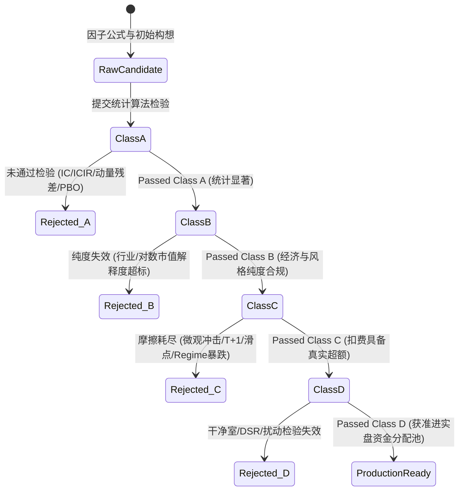

# QTR-OS 科研控制平面 (Research OS Plane) 统计引擎与门禁体系规范

> **Role**: Top Quantitative Mathematician / Statistical Arbitrage Expert  
> **Status**: Production Specification & Algorithmic Architecture  
> **Version**: v1.0.0  
> **Date**: 2026-09-14  
> **Target System**: UniQuant / QTR-OS Research Plane

---

## 1. 架构总览与科学防线设计

在量化投资与统计套利研究中，**数据窥探 (Data Snooping)**、**多重假设检验陷阱 (Multiple Testing Fallacy)** 以及 **假阳性过拟合 (Backtest Overfitting)** 是导致研究端策略在实盘部署后 Alpha 迅速衰退的最核心元凶。当研究员或自动化因子挖掘算法遍历数千种因子变形、时序窗口与截面组合时，传统统计推断中 $p < 0.05$ 或 $t > 2.0$ 的经典显著性门槛将彻底失效，使得海量随机噪声被系统性包装为“高夏普 Alpha”。

为了从根本上阻断这一机制，QTR-OS 科研控制平面 (Research OS Plane) 确立两大支柱体系：
1. **Research Degrees of Freedom Ledger (实验自由度账本)**：一个全局、不可篡改、具有因果审计追踪能力的假设空间账本，将每一次回测、因子尝试与参数扫描视作消耗科研自由度的“统计资本支出 (Statistical Capex)”，并实时动态收紧检验门槛。
2. **Alpha 候选四级晋升体系 (Tier A $\to$ Tier D)**：设立从纯统计显著性 (Class A)、经济学与风格纯度 (Class B)、真实微观结构可交易性 (Class C) 到物理隔离干净室复现 (Class D) 的漏斗式准入体系，确保只有具备真实超额、穿透成本、经历压力测试的策略方可进入实盘排产队列。

```mermaid
flowchart TD
    subgraph S0["Research OS Plane: Degrees of Freedom Ledger (全局自由度账本)"]
        L1["Hypothesis Tree / Search Space Registry"]
        L2["Cumulative Trial & Family Tracking (M, M_eff)"]
        L3["Dynamic Multi-Testing Hurdle Engine (Bonferroni / BH-FDR / BY / Alpha-Wealth)"]
    end

    subgraph S1["Tier A: Class A (Statistically Supported)"]
        A1["Rank IC & Newey-West HAC t-stat (Lags=4(T/100)^(2/9))"]
        A2["Momentum Orthogonalization (Residual IC & Tail IC)"]
        A3["Probability of Backtest Overfitting (PBO / CSCV < 0.20)"]
        A4{"Pass Hurdle: p_adj < 0.05 & t_NW >= t_crit(M)?"}
    end

    subgraph S2["Tier B: Class B (Economically Plausible)"]
        B1["WLS Cross-Sectional Regression (Weight = sqrt(Cap))"]
        B2["Shenwan 31 Industry Dummies + ln(Circulating Cap) Neutralization"]
        B3["Style Orthogonality: R^2 <= 0.35, IRR_IC >= 0.50"]
        B4["Industry Dispersion: Max Ind Weight <= 25%, HHI <= 0.15"]
        B5{"Pass Hurdle: True Firm-Specific Alpha?"}
    end

    subgraph S3["Tier C: Class C (Tradable Candidate)"]
        C1["A-Share Microstructure: T+1, Limit-up Reject, Limit-down Lock, 100-share Lot"]
        C2["Realistic Costs: Brokerage (3bp, min 5) + Stamp Tax (5bp) + Almgren-Chriss Sqrt Slippage"]
        C3["Performance Hurdle: Net CAGR >= 12%, Net Sharpe >= 1.0, Net MDD <= 18%"]
        C4["Regime Robustness: 6-Regime Matrix (MA200 x Volatility Tertiles), No Catastrophic Cell"]
        C5["Capacity Floor: Daily ADV >= 20M RMB, Capacity >= 30M RMB @ 10% Part."]
        C6{"Pass Hurdle: Tradable After Frictions?"}
    end

    subgraph S4["Tier D: Class D (Replicated Strategy)"]
        D1["Strict Temporal Quarantine OOS (Encrypted 12-Month Holdout)"]
        D2["Cleanroom Independent Reproduction (Dual-Source Data & Rank Corr >= 0.999)"]
        D3["Deflated Sharpe Ratio (DSR >= 0.95, Accounting for M_eff Trials & Non-Normality)"]
        D4["Adversarial Stress Test: Execution Lag (10%) + Price Noise (Sharpe Degradation <= 20%)"]
        D5{"Pass Hurdle: Institutional Production Ready?"}
    end

    S0 -.->|Dynamic Thresholds| S1
    RawFactor["Raw Alpha Hypothesis"] --> S1
    S1 -->|Passed Class A| S2
    S2 -->|Passed Class B| S3
    S3 -->|Passed Class C| S4
    S4 -->|Passed Class D| ProdReady["Production Live Allocation Queue"]
```



---

## 2. 第一部分：Research Degrees of Freedom Ledger (实验自由度账本)

### 2.1 统计学模型与假设空间表征

自由度账本的核心思想是将统计推断视为一个由研究假设构成的森林图 $\mathcal{G} = (\mathcal{V}, \mathcal{E})$。
- **假设族 (Hypothesis Family)** $\mathcal{F}_k$：由相同的经济驱动力或因子逻辑衍生的子空间（例如，“20日换手率衍生因子族”、“现金流对资本支出覆盖族”）。
- **超参数搜索空间 (Search Space)** $\Omega$：
  $$\Omega = \prod_{j=1}^d \Theta_j$$
  其中 $\Theta_j$ 可以是离散网格（例如回看天数 $w \in \{5, 10, 20, 60\}$），也可以是连续参数区间。离散基数为 $|\Omega| = \prod |\Theta_j|$。
- **关联检验的有效自由度 ($M_{\text{eff}}$)**：
  因为金融因子在参数空间内具有高度交叉自相关（例如 19 日动量与 20 日动量相关系数 $\rho > 0.98$），若直接采用独立试验总数 $M$ 做朴素 Bonferroni 校正，将导致第二类错误概率激增（检验功效塌缩）。因此，必须引入基于因子相关阵谱分解的**有效检验次数** $M_{\text{eff}}$。

---

### 2.2 数据结构定义与字段规范

自由度账本记录必须具备确定性、不可篡改性与强类型规范。以下为全局统一的 Schema 定义：

| 字段名称 (Field) | 类型 (Type) | 约束 / 范式 (Constraint) | 详细技术语义与规范 (Technical Description) |
|---|---|---|---|
| `experiment_id` | `UUIDv7 / ULID` | 主键，按时间单调递增 | 实验唯一标识符，编码微秒级生成时间与节点标识 |
| `hypothesis_id` | `VARCHAR(128)` | 命名空间分级格式 | 形式如 `alpha.<family>.<factor_name>.<variant_id>`，保证因果可溯 |
| `family_id` | `VARCHAR(64)` | 外键关联假设族 | 因子族标识符（例如 `volatility_reversal_20d`） |
| `family_size` | `INTEGER` | $\ge 1$ | 当前假设族内已注册的假设总数 $K$ |
| `n_trials` | `INTEGER` | 严格自增，$\ge 1$ | 截至当前实验，全平台或本假设族累计尝试的试验次数 $M$ |
| `search_space` | `JSON / BSON` | 结构化参数拓扑 | 记录参数网格维度、连续边界、采样步长及离散总基数 $|\Omega|$ |
| `search_space_cardinality`| `BIGINT` | $\ge 1$ | 离散参数空间基数 $\prod |\Theta_j|$，代表潜在候选因子上界 |
| `effective_m` ($M_{\text{eff}}$) | `FLOAT` | $1.0 \le M_{\text{eff}} \le M$ | 基于试验因子相关性矩阵特征谱计算的等效独立检验自由度 |
| `test_statistic_name` | `VARCHAR(32)` | 枚举值 | 检验统计量类型：`IC_NEWEY_WEST_T`, `ANNUALIZED_SHARPE_T`, `REGRESSION_T` |
| `raw_statistic_value` | `FLOAT` | 原始实数值 | 未经多重检验校正的原始样本统计量数值（如 $\hat{t}$） |
| `sample_size_T` | `INTEGER` | $\ge 60$ 交易日 | 统计推断所依赖的时间序列有效长度 $T$ |
| `cross_section_N` | `INTEGER` | $\ge 100$ 只 | 截面样本平均股票数量 $\bar{N}$ |
| `p_raw` | `DOUBLE` | $0.0 \le p \le 1.0$ | 原始单次假设检验的双侧/单侧渐近 $p$ 值 |
| `p_adj_bonferroni` | `DOUBLE` | $0.0 \le p_{\text{adj}} \le 1.0$ | 基于 $M_{\text{eff}}$ 的动态 Bonferroni 调整 $p$ 值 |
| `p_adj_bh_fdr` | `DOUBLE` | $0.0 \le q \le 1.0$ | 动态 Benjamini-Hochberg (BH) 调整后的 $q$ 值 (FDR 估计) |
| `p_adj_by_fdr` | `DOUBLE` | $0.0 \le q \le 1.0$ | 允许任意依赖结构的 Benjamini-Yekutieli (BY) 调整 $q$ 值 |
| `alpha_wealth_spent` | `DOUBLE` | $\ge 0.0$ | 在线序贯检验中本试验消耗的 Alpha 资产配额 $\gamma_t$ |
| `code_git_sha` | `CHAR(40)` | SHA-1 校验码 | 因子生成逻辑对应 Git Commit Hash，杜绝暗中修改逻辑 |
| `data_snapshot_hash` | `CHAR(64)` | SHA-256 校验码 | 运行本实验所绑定的数据湖底层快照指纹，实现完全可复现 |
| `created_at` | `TIMESTAMP` | ISO 8601 UTC | 实验执行并提交账本的时间戳 |

---

### 2.3 动态多重检验校正算法与数学推导

#### 1. 动态 Bonferroni 阈值与族系检验 (FWER 控制)
对于给定的名义族系第一类错误率 $\alpha$（通常设为 $0.05$），在执行第 $M$ 次尝试时，朴素 Bonferroni 判据为：
$$\alpha_{\text{Bonf}}(M) = \frac{\alpha}{M}$$
其对应调整后 $p$ 值为：
$$p_{i, \text{adj}}^{\text{Bonf}} = \min\left(1.0, \; M \cdot p_{i, \text{raw}}\right)$$

#### 2. 特征谱自适应有效检验数校正 (Nyholt-Li-Ji Spectral Effective Degrees of Freedom)
金融因子搜索网格之间存在高多重共线性。设前 $M$ 次试验所涉及因子在截面上的相关矩阵为 $\mathbf{C} \in \mathbb{R}^{M \times M}$，其特征值分解为 $\lambda_1 \ge \lambda_2 \ge \dots \ge \lambda_M \ge 0$，满足 $\sum_{k=1}^M \lambda_k = M$。
基于 Cheverud-Nyholt 与 Li & Ji (2005) 准则，定义特征值方差：
$$\mathrm{Var}(\boldsymbol{\lambda}) = \frac{1}{M} \sum_{k=1}^M (\lambda_k - 1)^2$$
有效独立检验次数 $M_{\text{eff}}$ 为：
$$M_{\text{eff}} = 1 + (M - 1) \left( 1 - \frac{\mathrm{Var}(\boldsymbol{\lambda})}{M} \right)$$
- 若所有因子完全正交（$\lambda_k = 1$），则 $\mathrm{Var}(\boldsymbol{\lambda}) = 0 \implies M_{\text{eff}} = M$；
- 若所有因子完全共线（$\lambda_1 = M, \lambda_{k>1} = 0$），则 $\mathrm{Var}(\boldsymbol{\lambda}) = M - 1 \implies M_{\text{eff}} = 1$。
由此得到**自适应有效 Bonferroni 阈值**：
$$\alpha_{\text{Bonf-eff}} = \frac{\alpha}{M_{\text{eff}}}, \qquad p_{i, \text{adj}}^{\text{Bonf-eff}} = \min\left(1.0, \; M_{\text{eff}} \cdot p_{i, \text{raw}}\right)$$

#### 3. 动态 Benjamini-Hochberg (BH) 算法 (FDR 控制)
当因子挖掘规模较大（例如 $M \ge 50$）时，控制 FWER 过于苛刻，易杀灭真 Alpha。QTR-OS 采用 Benjamini-Hochberg (1995) 控制错误发现率 (False Discovery Rate, $\mathrm{FDR} \le q^*$，通常设定 $q^* = 0.10$)：
将当前族系内所有 $M$ 个试验的原始 $p$ 值升序排列：
$$p_{(1)} \le p_{(2)} \le \dots \le p_{(M)}$$
寻找最大满足下列不等式的临界索引 $k$：
$$k = \max \left\{ i \in \{1, \dots, M\} : p_{(i)} \le \frac{i}{M} q^* \right\}$$
若存在这样的 $k$，则拒绝所有对应假设 $H_{(1)}, \dots, H_{(k)}$。
每个试验对应的 BH 调整后 $q$ 值（等价调整 $p$ 值）由逆序累积最小值给出：
$$q_{(i)}^{\text{BH}} = \min_{j \ge i} \left\{ \min\left(1.0, \; \frac{M}{j} p_{(j)}\right) \right\}$$

#### 4. Benjamini-Yekutieli (BY) 任意依赖结构修正
若因子的联合分布依赖结构无法确证满足正回归依赖性 (PRDS)，则引入 BY 修正因子 $c(M)$：
$$c(M) = \sum_{j=1}^M \frac{1}{j} \approx \ln(M) + \gamma + \frac{1}{2M} \quad (\gamma \approx 0.5772156649)$$
$$q_{(i)}^{\text{BY}} = \min\left(1.0, \; c(M) \cdot q_{(i)}^{\text{BH}}\right)$$

#### 5. 动态在线多重检验：Foster-Stine Alpha-Wealth 资产演化
在实时科研流中，试验不是静态批次到达，而是逐日串行产生。QTR-OS 引入 **Alpha 财富演化机制 (Alpha-Investing)**：
- 初始 Alpha 资产储备 $\mathcal{W}_0 = \alpha \cdot q_0$（例如 $\mathcal{W}_0 = 0.05 \times 0.10 = 0.005$）。
- 在第 $t$ 次试验时，研究员必须分配一笔检验预算 $\gamma_t \le \mathcal{W}_{t-1}$。
- 动态显著性阈值被严格绑定为：$\alpha_t = \frac{\gamma_t}{1 + \gamma_t} \approx \gamma_t$。
- **财富演化递推方程**：
  $$\mathcal{W}_t = \begin{cases} 
  \mathcal{W}_{t-1} - \gamma_t + \psi_{\text{reward}}, & \text{若 } p_t \le \alpha_t \text{ (确认发现新真 Alpha)} \\ 
  \mathcal{W}_{t-1} - \gamma_t, & \text{若 } p_t > \alpha_t \text{ (假阳性/无效挖掘，惩罚扣除)} 
  \end{cases}$$
  其中奖励项 $\psi_{\text{reward}} = \alpha \cdot q_0$。
- **数理防线意义**：任何试图通过无脑暴力调参（p-hacking）刷策略的团队，其 Alpha 财富将迅速枯竭至 $\mathcal{W}_t \to 0$，系统将**在控制平面层直接剥夺其后续提交回测与因子的权限**。

---

### 2.4 自由度账本 Python 生产级核心实现

以下代码实现了线程安全、具备谱分解 $M_{\text{eff}}$ 计算、动态 Bonferroni/BH/BY 调整以及 Alpha-Wealth 追踪的完整账本系统：

```python
"""
QTR-OS Research Control Plane: Degrees of Freedom Ledger
File: uniquant/research/ledger/degrees_of_freedom.py
"""

from __future__ import annotations

import math
import threading
from dataclasses import dataclass, field
from datetime import datetime, timezone
from enum import Enum
from typing import Any, Dict, List, Optional, Tuple
import numpy as np
import scipy.stats as stats


class StatisticType(str, Enum):
    IC_NEWEY_WEST_T = "IC_NEWEY_WEST_T"
    ANNUALIZED_SHARPE_T = "ANNUALIZED_SHARPE_T"
    REGRESSION_T = "REGRESSION_T"
    STUDENT_T = "STUDENT_T"


@dataclass(frozen=True)
class SearchSpaceSpec:
    name: str
    dimension: int
    parameter_grid: Dict[str, List[Any]] = field(default_factory=dict)
    continuous_bounds: Dict[str, Tuple[float, float]] = field(default_factory=dict)

    @property
    def discrete_cardinality(self) -> int:
        if not self.parameter_grid:
            return 1
        card = 1
        for vals in self.parameter_grid.values():
            card *= max(1, len(vals))
        return card


@dataclass
class TrialRecord:
    experiment_id: str
    hypothesis_id: str
    family_id: str
    trial_index: int
    search_space: SearchSpaceSpec
    test_statistic_name: StatisticType
    raw_statistic_value: float
    sample_size_T: int
    cross_section_N: int
    p_raw: float
    effective_m: float = 1.0
    p_adj_bonferroni: float = 1.0
    p_adj_bh_fdr: float = 1.0
    p_adj_by_fdr: float = 1.0
    alpha_wealth_spent: float = 0.0
    passed_bonferroni: bool = False
    passed_bh_fdr: bool = False
    code_git_sha: str = ""
    data_snapshot_hash: str = ""
    created_at: str = field(
        default_factory=lambda: datetime.now(timezone.utc).isoformat()
    )
    metadata: Dict[str, Any] = field(default_factory=dict)


class DegreesOfFreedomLedger:
    """
    科研自由度账本：审计跟踪假设空间膨胀，并动态施加多重假设检验校正。
    """

    def __init__(
        self,
        alpha_nominal: float = 0.05,
        fdr_nominal: float = 0.10,
        initial_alpha_wealth: float = 0.05,
    ) -> None:
        self.alpha_nominal = alpha_nominal
        self.fdr_nominal = fdr_nominal
        self.initial_alpha_wealth = initial_alpha_wealth
        self.current_alpha_wealth = initial_alpha_wealth
        self.trials: List[TrialRecord] = []
        self._family_map: Dict[str, List[TrialRecord]] = {}
        self._lock = threading.RLock()

    @property
    def total_trials(self) -> int:
        with self._lock:
            return len(self.trials)

    def compute_effective_m(
        self, family_id: str, corr_matrix: Optional[np.ndarray] = None
    ) -> float:
        """
        基于因子相关矩阵特征谱，计算 Nyholt-Li-Ji 有效独立试验次数 M_eff。
        """
        with self._lock:
            family_trials = self._family_map.get(family_id, [])
            m = len(family_trials) + 1
            if corr_matrix is None or corr_matrix.shape[0] < 2:
                return float(m)

            evals = np.linalg.eigvalsh(corr_matrix)
            evals = np.clip(evals, 0.0, None)
            k = len(evals)
            if k <= 1:
                return 1.0

            var_evals = float(np.var(evals))
            # Li & Ji (2005) formulation
            m_eff = 1.0 + (k - 1.0) * (1.0 - var_evals / k)
            return max(1.0, min(float(k), float(m_eff)))

    def register_trial(
        self,
        experiment_id: str,
        hypothesis_id: str,
        family_id: str,
        search_space: SearchSpaceSpec,
        test_statistic_name: StatisticType,
        raw_statistic_value: float,
        sample_size_T: int,
        cross_section_N: int,
        p_raw: float,
        factor_correlation_matrix: Optional[np.ndarray] = None,
        alpha_wealth_bid: float = 0.001,
        code_git_sha: str = "",
        data_snapshot_hash: str = "",
        metadata: Optional[Dict[str, Any]] = None,
    ) -> TrialRecord:
        """
        向账本注册一次试验，扣减 Alpha-Wealth，并动态更新该假设族的多重检验校正阈值。
        """
        with self._lock:
            if self.current_alpha_wealth < alpha_wealth_bid:
                raise PermissionError(
                    f"Alpha Wealth 耗尽 (当前余额: {self.current_alpha_wealth:.6f} < 申请配额: {alpha_wealth_bid})。"
                    "由于历史过拟合与无效检验过多，已被 QTR-OS 科研控制平面锁定！"
                )

            self.current_alpha_wealth -= alpha_wealth_bid
            n_trials = len(self.trials) + 1
            m_eff = self.compute_effective_m(family_id, factor_correlation_matrix)

            rec = TrialRecord(
                experiment_id=experiment_id,
                hypothesis_id=hypothesis_id,
                family_id=family_id,
                trial_index=n_trials,
                search_space=search_space,
                test_statistic_name=test_statistic_name,
                raw_statistic_value=raw_statistic_value,
                sample_size_T=sample_size_T,
                cross_section_N=cross_section_N,
                p_raw=p_raw,
                effective_m=m_eff,
                alpha_wealth_spent=alpha_wealth_bid,
                code_git_sha=code_git_sha,
                data_snapshot_hash=data_snapshot_hash,
                metadata=metadata or {},
            )

            self.trials.append(rec)
            self._family_map.setdefault(family_id, []).append(rec)

            # 重新计算本假设族全部试验的动态调整值
            self._recompute_family_adjustments(family_id)

            # 若通过 BH-FDR 检验，予以奖励恢复 Alpha-Wealth
            if rec.passed_bh_fdr:
                reward = self.alpha_nominal * self.fdr_nominal
                self.current_alpha_wealth += reward

            return rec

    def _recompute_family_adjustments(self, family_id: str) -> None:
        """
        对族系内部全量试验动态执行 Step-up BH-FDR 与 Bonferroni 校正。
        """
        records = self._family_map[family_id]
        m = len(records)
        if m == 0:
            return

        # 1. Bonferroni Adjustment (基于每条记录自带的 m_eff)
        for r in records:
            r.p_adj_bonferroni = min(1.0, float(r.p_raw * r.effective_m))
            r.passed_bonferroni = bool(r.p_adj_bonferroni <= self.alpha_nominal)

        # 2. Benjamini-Hochberg (BH) Step-Up Procedure
        p_vals = np.array([r.p_raw for r in records], dtype=np.float64)
        sort_indices = np.argsort(p_vals)
        sorted_p = p_vals[sort_indices]

        # 计算 (m / k) * p_(k)
        ranks = np.arange(1, m + 1, dtype=np.float64)
        raw_adjusted = (m / ranks) * sorted_p

        # 逆序求累积最小值以保证单调性: min_{j >= k} raw_adjusted[j]
        cum_min = np.minimum.accumulate(raw_adjusted[::-1])[::-1]
        sorted_q_bh = np.clip(cum_min, 0.0, 1.0)

        q_bh = np.empty(m, dtype=np.float64)
        q_bh[sort_indices] = sorted_q_bh

        # 3. Benjamini-Yekutieli (BY) 任意依赖修正
        c_m = float(np.sum(1.0 / np.arange(1, m + 1, dtype=np.float64)))
        q_by = np.clip(q_bh * c_m, 0.0, 1.0)

        for idx, r in enumerate(records):
            r.p_adj_bh_fdr = float(q_bh[idx])
            r.p_adj_by_fdr = float(q_by[idx])
            r.passed_bh_fdr = bool(r.p_adj_bh_fdr <= self.fdr_nominal)

    def get_hurdle_report(self, family_id: str) -> Dict[str, Any]:
        """
        返回本族的审计门槛汇总报告。
        """
        with self._lock:
            records = self._family_map.get(family_id, [])
            return {
                "family_id": family_id,
                "cumulative_trials": len(records),
                "total_platform_trials": len(self.trials),
                "current_alpha_wealth": round(self.current_alpha_wealth, 6),
                "significant_bh_count": sum(1 for r in records if r.passed_bh_fdr),
                "significant_bonf_count": sum(1 for r in records if r.passed_bonferroni),
            }
```

---

## 3. 第二部分：Alpha 候选四级晋升体系 (Tier A $\to$ Tier D) 严格量化判据



---

### 3.1 Class A: Statistically Supported (统计显著门禁)

#### 1. 核心经济学与数理逻辑
排除由于时序伪相关、尖峰厚尾偶然爆发及未校正数据挖掘导致的统计幻影。引入 Newey-West HAC 稳健协方差估计、动量残差化检验以及组合对称交叉验证 (CSCV) 的过拟合概率 (PBO)。

#### 2. 数学模型与度量公式
1. **截面秩相关 IC (Rank Information Coefficient)**：
   $$\mathrm{IC}_t = \mathrm{Corr}_{\text{rank}}\left(f_{i,t}, \; r_{i, t \to t+h}\right) = \frac{\sum_i (R_{i,t}^f - \bar{R}_t^f)(R_{i,t}^r - \bar{R}_t^r)}{\sqrt{\sum_i (R_{i,t}^f - \bar{R}_t^f)^2 \sum_i (R_{i,t}^r - \bar{R}_t^r)^2}}$$
   其中预测期 $h = 5$ (fwd5) 或 $h = 21$ (fwd21)。
2. **Newey-West (1987) HAC 稳健 $t$ 统计量**：
   重叠收益构造使得 $\mathrm{IC}_t$ 序列服从 $\mathrm{MA}(h-1)$ 自相关。设定自相关滞后阶数：
   $$L = \max\left(h - 1, \; \left\lfloor 4 \left(\frac{T}{100}\right)^{2/9} \right\rfloor\right)$$
   异方差与自相关一致方差为：
   $$\hat{\sigma}_{\text{HAC}}^2 = \hat{\gamma}_0 + 2 \sum_{l=1}^L \left(1 - \frac{l}{L + 1}\right) \hat{\gamma}_l, \qquad \hat{\gamma}_l = \frac{1}{T} \sum_{t=l+1}^T (\mathrm{IC}_t - \overline{\mathrm{IC}})(\mathrm{IC}_{t-l} - \overline{\mathrm{IC}})$$
   $$t_{\text{NW}} = \frac{\overline{\mathrm{IC}}}{\hat{\sigma}_{\text{HAC}} / \sqrt{T}}$$
3. **年化信息比率 (Annualized ICIR)**：
   $$\mathrm{ICIR} = \frac{\overline{\mathrm{IC}}}{\sigma(\mathrm{IC})} \times \sqrt{\frac{252}{h}}$$
4. **动量正交化残差门 (Momentum Residualization Gate)**：
   UniQuant 历史实证（P3/P11/P12）揭示 A 股绝大部分表观因子本质上只是 20 日动量/反转 beta。
   在每个时间截面 $t$，进行单变量截面回归：
   $$R_{i,t}^{f} = \alpha_t + \beta_t R_{i,t}^{\mathrm{mom20}} + \epsilon_{i,t}$$
   残差秩 $\tilde{R}_{i,t} = \mathrm{Rank}(\epsilon_{i,t})$ 与未来收益计算残差 IC：
   $$\mathrm{IC}_{\text{res}, t} = \mathrm{Corr}_{\text{rank}}(\epsilon_{i,t}, \; r_{i, t \to t+h})$$
   同时过滤动量绝对值最大的右尾 $10\%$ 股票，计算剔尾 $\mathrm{IC}_{\text{tail}, t}$。
5. **组合对称交叉验证过拟合概率 (PBO via CSCV, Bailey et al. 2016)**：
   将历史 $T$ 划分成 $S = 16$ 个等长块，生成 $\binom{16}{8} = 12,870$ 组对称样本内/样本外分割：
   $$\mathrm{PBO} = \frac{1}{\binom{S}{S/2}} \sum_{c=1}^{\binom{S}{S/2}} \mathbb{I}\left(R_{\text{OOS}}^{(c), m^*} < \mathrm{Median}\left(\mathbf{R}_{\text{OOS}}^{(c)}\right)\right)$$

#### 3. 严格准入门槛与判定逻辑
- **[A-1] 多重检验校正 $p$ 值**：经自由度账本挂账后，必须满足 $p_{\text{adj}}^{\text{BH}} < 0.05$ 且 $p_{\text{adj}}^{\text{Bonf-eff}} < 0.10$。
- **[A-2] 原始预测能力**：
  $$|\overline{\mathrm{IC}}| \ge 0.025, \qquad |t_{\text{NW}}| \ge 3.00, \qquad |\mathrm{ICIR}| \ge 0.70$$
- **[A-3] 动量正交独立性**：
  $$\overline{\mathrm{IC}}_{\text{res}} \cdot \mathrm{sgn}(\overline{\mathrm{IC}}) \ge 0.015, \qquad \frac{\sum \mathbb{I}(\mathrm{IC}_{\text{res}, w} > 0)}{N_{\text{windows}}} \ge 65.0\%$$
- **[A-4] 过拟合概率**：
  $$\mathrm{PBO} \le 0.20$$
  若采用时序分块自举法 (Block-Bootstrap)，其 95% 置信区间下界不得包含 0。

---

### 3.2 Class B: Economically Plausible (经济与风格纯度门禁)

#### 1. 核心经济学与数理逻辑
剥离外生公共风险暴露（尤其行业周期与对数市值小盘暴利陷阱），检验因子的 Firm-Specific 特异 Alpha 纯度，防止将承担系统性风险当成投资能力。

#### 2. 数学模型与度量公式
1. **截面加权最小二乘回归 (Barra WLS Regression)**：
   在每个交易日 $t$，以股票平方根自由流通市值 $w_{i,t} = \sqrt{\mathrm{FloatCap}_{i,t}}$ 为异方差调整权重，对申万一级行业哑变量 $\mathbf{I}_{i,k}$ ($K = 31$) 与对数自由流通市值 $\ln(\mathrm{Cap}_{i,t})$ 实施约束回归：
   $$f_{i,t} = \sum_{k=1}^{31} \gamma_{k,t} \cdot \mathrm{Ind}_{i,k,t} + \delta_t \cdot \ln(\mathrm{Cap}_{i,t}) + \tilde{f}_{i,t}$$
   残差 $\tilde{f}_{i,t}$ 即为纯净 Alpha 候选。
2. **纯净因子信息留存率 (Information Retention Ratio, $\mathrm{IRR}_{\text{IC}}$)**：
   $$\mathrm{IRR}_{\text{IC}} = \frac{|\overline{\mathrm{IC}}(\tilde{f})|}{|\overline{\mathrm{IC}}(f)|}$$
3. **行业与市值解释度 (Cross-Sectional $R^2$)**：
   $$R_t^2 = 1 - \frac{\sum_i w_{i,t} \tilde{f}_{i,t}^2}{\sum_i w_{i,t} (f_{i,t} - \bar{f}_{w,t})^2}$$
4. **头部持仓行业集中度 (Industry Herfindahl-Hirschman Index, $\mathrm{HHI}_{\text{ind}}$)**：
   在多头组（Top 30 或 Q5）计算行业权重 $W_k = \sum_{i \in \text{Ind}_k} w_i$：
   $$\mathrm{HHI}_{\text{ind}} = \sum_{k=1}^{31} W_k^2$$

#### 3. 严格准入门槛与判定逻辑
- **[B-1] 纯净因子预测力留存**：
  $$\mathrm{IRR}_{\text{IC}} \ge 0.50 \quad (\text{至少保留 } 50\% \text{ 的原始 } \mathrm{IC}), \qquad |\overline{\mathrm{IC}}(\tilde{f})| \ge 0.015, \qquad |t_{\text{NW}}(\tilde{f})| \ge 2.50$$
- **[B-2] 风格共线性约束**：
  $$\overline{R^2} \le 0.35 \quad (\text{行业与市值对因子的方差解释度不得超过 } 35\%)$$
  $$|\mathrm{Corr}_{\text{rank}}(f_t, \; \ln(\mathrm{Cap}_t))| \le 0.30 \quad (\text{严禁微盘股隐形暴露})$$
- **[B-3] 行业暴露分散度**：
  $$\max_{k \in \{1,\dots,31\}} W_k^{\text{Top30}} \le 25.0\%, \qquad \mathrm{HHI}_{\text{ind}}^{\text{Top30}} \le 0.15$$

---

### 3.3 Class C: Tradable Candidate (真实可交易性与微观结构门禁)

#### 1. 核心经济学与数理逻辑
将理论组合映射至 A 股微观执行现实。绝大部分学术因子在扣除印花税、佣金、冲击成本并施加涨跌停拒单和 T+1 约束后，超额收益即归零。必须通过严苛的物理交易引擎与宏观微观分层 (Regime) 稳健性检验。

#### 2. 微观结构约束与滑点模型
1. **A 股执行刚性约束**：
   - **T+1 机制**：$t$ 日买入标的，$t+1$ 日方可卖出。
   - **涨跌停硬阻断**：
     - 若标的在 $t$ 日涨停且收盘未打开，**买入订单强制拒单 (Reject Buy)**；
     - 若标的在 $t$ 日跌停，**卖出订单无法撮合成交 (Locked Sell)**，被迫被动顺延持仓。
   - **停牌与流动性枯竭**：全天无成交量者成交量记 0，禁止调仓。
   - **整数手限制**：买入股数必须向下取整至 100 股整数倍。
2. **非线性平方根市场冲击模型 (Almgren-Chriss / Bouchaud Square-Root Law)**：
   对单笔交易量 $\Delta V_{i,t}$，其实际执行价格相对无干扰基准价的相对滑点为：
   $$\text{Slip}_{i,t} = \kappa \cdot \sigma_{i,t} \cdot \sqrt{\frac{\Delta V_{i,t}}{\mathrm{ADV}_{i,t}^{20}}} + \frac{\text{Spread}_{i,t}}{2}$$
   其中 $\kappa \approx 0.20$，$\sigma_{i,t}$ 为标的 20 日历史日波动率，$\mathrm{ADV}_{i,t}^{20}$ 为 20 日日均成交量。
3. **规费结构**：
   - 券商佣金：$\text{Fee}_{\text{broker}} = \max\left(5.0, \; 0.0003 \times P \cdot \Delta V\right)$（万三双边，单笔最低 5 元）。
   - 印花税：$\text{Tax}_{\text{stamp}} = 0.0005 \times P \cdot \Delta V_{\text{sell}}$（仅卖出端按万五征收）。
4. **宏观与微观 6-Regime 稳健性矩阵**：
   以市场基准指数（如沪深300 / 中证全指）划分状态空间：
   - 趋势维度：$\mathbb{I}(\text{Price}_t > \mathrm{MA}_{200})$（牛市 / 熊市）。
   - 波动维度：PIT (Point-in-Time) 过去 60 日波动率的三分位点（低波、中波、高波）。
   组成 $2 \times 3 = 6$ 个正交状态格。

#### 3. 严格准入门槛与判定逻辑
- **[C-1] 扣费后净复合表现**：
  $$\mathrm{CAGR}_{\text{net}} \ge 12.0\%, \qquad \mathrm{Sharpe}_{\text{net}} \ge 1.00, \qquad \mathrm{MDD}_{\text{net}} \le 18.0\%, \qquad \mathrm{Calmar}_{\text{net}} \ge 0.70$$
- **[C-2] 换手率与成本耐受度**：
  $$\text{Turnover}_{\text{daily, 1-way}} \le 15.0\% \quad (\text{平均持仓期 } \ge 6.7 \text{ 天}), \qquad \frac{\mathrm{Sharpe}_{\text{net}}}{\mathrm{Sharpe}_{\text{gross}}} \ge 0.65$$
- **[C-3] 状态鲁棒性 (Regime Invariance)**：
  在 6 个状态格中，策略在任意单一格内的夏普比率不得出现断崖崩塌：
  $$\forall s \in \{1,\dots,6\}, \quad \mathrm{Sharpe}_{s} > -0.50$$
  且至少在 2 个主要状态格内提供统计显著正超额。
- **[C-4] 容量地板标准**：
  持仓组合个股在建仓当日的 20 日日均成交金额中位数 $\mathrm{Median}(\mathrm{ADV}_{\text{holdings}}) \ge 2,000 \text{ 万元人民币}$；策略在 $10\%$ 市场参与率限制下的资金容量下界必须满足：
  $$\mathrm{Capacity}_{\text{floor}} \ge 3,000 \text{ 万元人民币}$$

---

### 3.4 Class D: Replicated Strategy (隔离干净室验证标准)

#### 1. 核心经济学与数理逻辑
彻底消除最后环节的“研究员自由度”与“微小代码漏洞（如提前一天引入后视数据）”。由完全隔离的质检团队在物理隔离的干净室 (Cleanroom) 中，使用不同数据源镜像与独立代码实现对策略进行点对点再现。

#### 2. 数学模型与验证协议
1. **时序严格隔离封存集 (Quarantine Out-of-Sample Window)**：
   固定保留最近 12 个自然月（如 252 个交易日）的数据作为冷冻隔离集。在策略晋升至 Class D 之前，**禁止任何人在此数据集上进行任何回测、扫描或因子计算**。
2. **紧缩夏普比率 (Deflated Sharpe Ratio, DSR, Bailey & López de Prado, 2014)**：
   计算在账本累计尝试 $M$ 次后，样本夏普比率 $\widehat{\mathrm{SR}}$ 依然保持统计显著的概率：
   $$\mathrm{DSR} = \Phi\left( \frac{(\widehat{\mathrm{SR}} - \mathrm{SR}^*) \sqrt{T-1}}{\sqrt{1 - \hat{\gamma}_3 \widehat{\mathrm{SR}} + \frac{\hat{\gamma}_4 - 1}{4} \widehat{\mathrm{SR}}^2}} \right)$$
   其中期望最高虚假夏普比率基准为：
   $$\mathrm{SR}^* = \sqrt{\mathrm{Var}(\{\widehat{\mathrm{SR}}_m\})} \left( (1 - \gamma) \Phi^{-1}\left(1 - \frac{1}{M}\right) + \gamma \Phi^{-1}\left(1 - \frac{1}{M \cdot e}\right) \right)$$
   $\hat{\gamma}_3$ 为收益偏度，$\hat{\gamma}_4$ 为峰度，$\gamma \approx 0.5772156649$ 为 Euler-Mascheroni 常数。
3. **独立复现一致性 (Cleanroom Replication Consistency)**：
   由干净室引擎基于独立数据源（如东方财富 L2 / 行情数据镜像对账）重新计算信号：
   $$\rho_{\text{clean}} = \mathrm{Corr}_{\text{rank}}\left(S_{\text{candidate}}, \; S_{\text{cleanroom}}\right)$$
4. **对抗扰动与应力衰减测试 (Adversarial Perturbation Test)**：
   - **成交延迟扰动**：随机以 $10\%$ 概率将信号执行推迟一个交易日（模拟盘中网络故障、无法以开盘价成交）。
   - **行情加噪扰动**：向开高低收价格注入 $\mathcal{N}(0, 0.01 \cdot \sigma_{\text{daily}})$ 的高斯随机微扰。

#### 3. 严格准入门槛与判定逻辑
- **[D-1] 干净室信号完全一致**：
  $$\rho_{\text{clean}} \ge 0.999$$
- **[D-2] 紧缩夏普比率门槛**：
  $$\mathrm{DSR} \ge 0.95 \quad (95\% \text{ 概率确证策略超越多重检验随机基线})$$
- **[D-3] 隔离 OOS 衰减率**：
  $$\mathrm{Sharpe}_{\text{Quarantine}} \ge 0.80, \qquad \frac{\mathrm{Sharpe}_{\text{Quarantine}}}{\mathrm{Sharpe}_{\text{IS}}} \ge 0.60$$
- **[D-4] 对抗扰动衰减率**：
  $$\frac{\mathrm{Sharpe}_{\text{adversarial}}}{\mathrm{Sharpe}_{\text{clean}}} \ge 0.80 \quad (\text{在恶劣扰动下性能衰减不得超过 } 20\%)$$

---

## 4. 第三部分：四级门禁评估引擎算法实现 (`AlphaTierEngine`)

以下为四级门禁系统的完整 Python 生产级评估代码，全面封装了 Newey-West HAC、WLS 剥离、微观滑点模拟、Regime 分层、DSR 计算及结构化审计输出：

```python
"""
QTR-OS Research Control Plane: Alpha Candidate Four-Tier Promotion Engine
File: uniquant/research/gates/alpha_tier_engine.py
"""

from __future__ import annotations

import math
from dataclasses import dataclass, field
from enum import Enum
from typing import Any, Dict, List, Optional, Tuple
import numpy as np
import pandas as pd
import scipy.stats as stats

from uniquant.research.ledger.degrees_of_freedom import (
    DegreesOfFreedomLedger,
    SearchSpaceSpec,
    StatisticType,
    TrialRecord,
)


class AlphaTier(str, Enum):
    TIER_UNRATED = "UNRATED"
    TIER_A = "TIER_A_STATISTICALLY_SUPPORTED"
    TIER_B = "TIER_B_ECONOMICALLY_PLAUSIBLE"
    TIER_C = "TIER_C_TRADABLE_CANDIDATE"
    TIER_D = "TIER_D_REPLICATED_STRATEGY"


@dataclass
class GateResult:
    gate_name: str
    passed: bool
    metrics: Dict[str, float]
    thresholds: Dict[str, float]
    details: str = ""


@dataclass
class PromotionReport:
    factor_name: str
    final_tier: AlphaTier
    passed_class_a: bool = False
    passed_class_b: bool = False
    passed_class_c: bool = False
    passed_class_d: bool = False
    gate_results: List[GateResult] = field(default_factory=list)
    rejection_reason: Optional[str] = None
    audit_metadata: Dict[str, Any] = field(default_factory=dict)


# =========================================================================
# 1. Class A Evaluator: Statistical Significance & Overfitting
# =========================================================================
class ClassAEvaluator:
    @staticmethod
    def compute_newey_west_t(ic_series: np.ndarray, forecast_horizon: int = 5) -> Tuple[float, float, float]:
        arr = np.asarray(ic_series, dtype=np.float64)
        arr = arr[np.isfinite(arr)]
        t_len = len(arr)
        if t_len < 10:
            return 0.0, 0.0, 1.0

        mean = float(np.mean(arr))
        demeaned = arr - mean
        max_lags = max(forecast_horizon - 1, int(np.floor(4.0 * (t_len / 100.0) ** (2.0 / 9.0))))

        gamma0 = float(np.mean(demeaned ** 2))
        gamma_sum = 0.0
        for lag in range(1, max_lags + 1):
            weight = 1.0 - lag / (max_lags + 1.0)
            cov_l = float(np.mean(demeaned[lag:] * demeaned[:-lag]))
            gamma_sum += 2.0 * weight * cov_l

        var_hac = (gamma0 + gamma_sum) / t_len
        if var_hac <= 1e-12:
            return mean, 0.0, 1.0

        se_hac = np.sqrt(var_hac)
        t_stat = mean / se_hac
        p_val = 2.0 * (1.0 - stats.norm.cdf(np.abs(t_stat)))
        return mean, float(t_stat), float(p_val)

    @classmethod
    def evaluate(
        cls,
        factor_name: str,
        ic_series: np.ndarray,
        residual_ic_series: np.ndarray,
        pbo_value: float,
        ledger: DegreesOfFreedomLedger,
        family_id: str,
        search_space: SearchSpaceSpec,
        forecast_horizon: int = 5,
        factor_corr_matrix: Optional[np.ndarray] = None,
    ) -> Tuple[bool, GateResult, TrialRecord]:
        mean_ic, t_nw, p_raw = cls.compute_newey_west_t(ic_series, forecast_horizon)
        std_ic = float(np.std(ic_series)) if len(ic_series) > 1 else 1e-6
        icir = (mean_ic / max(std_ic, 1e-8)) * np.sqrt(252.0 / forecast_horizon)

        mean_res_ic = float(np.mean(residual_ic_series)) if len(residual_ic_series) else 0.0
        pos_res_ratio = (
            float(np.mean(residual_ic_series > 0)) if len(residual_ic_series) else 0.0
        )

        # Register into DoF Ledger
        trial_rec = ledger.register_trial(
            experiment_id=f"exp_{factor_name}_{int(datetime.now().timestamp())}",
            hypothesis_id=f"alpha.{family_id}.{factor_name}",
            family_id=family_id,
            search_space=search_space,
            test_statistic_name=StatisticType.IC_NEWEY_WEST_T,
            raw_statistic_value=t_nw,
            sample_size_T=len(ic_series),
            cross_section_N=500,
            p_raw=p_raw,
            factor_correlation_matrix=factor_corr_matrix,
        )

        metrics = {
            "mean_ic": mean_ic,
            "t_newey_west": t_nw,
            "icir": icir,
            "mean_res_ic": mean_res_ic,
            "pos_res_ratio": pos_res_ratio,
            "pbo": pbo_value,
            "p_raw": p_raw,
            "p_adj_bh_fdr": trial_rec.p_adj_bh_fdr,
            "p_adj_bonf": trial_rec.p_adj_bonferroni,
        }

        thresholds = {
            "min_abs_ic": 0.025,
            "min_abs_t_nw": 3.00,
            "min_icir": 0.70,
            "min_res_ic": 0.015,
            "min_pos_res_ratio": 0.65,
            "max_pbo": 0.20,
            "max_p_adj_bh": 0.05,
        }

        passed = (
            abs(mean_ic) >= thresholds["min_abs_ic"]
            and abs(t_nw) >= thresholds["min_abs_t_nw"]
            and abs(icir) >= thresholds["min_icir"]
            and (mean_res_ic * np.sign(mean_ic)) >= thresholds["min_res_ic"]
            and pos_res_ratio >= thresholds["min_pos_res_ratio"]
            and pbo_value <= thresholds["max_pbo"]
            and trial_rec.p_adj_bh_fdr <= thresholds["max_p_adj_bh"]
        )

        gate_res = GateResult(
            gate_name="Class A (Statistically Supported)",
            passed=passed,
            metrics=metrics,
            thresholds=thresholds,
            details=f"p_raw={p_raw:.4e}, p_adj_bh={trial_rec.p_adj_bh_fdr:.4f}, t_NW={t_nw:.2f}",
        )
        return passed, gate_res, trial_rec


# =========================================================================
# 2. Class B Evaluator: Economic & Style Plausibility (Neutralization)
# =========================================================================
class ClassBEvaluator:
    @staticmethod
    def wls_orthogonalize(
        factor_vals: np.ndarray,
        industry_dummies: np.ndarray,
        log_caps: np.ndarray,
        weights: np.ndarray,
    ) -> Tuple[np.ndarray, float]:
        """
        截面加权最小二乘 WLS 回归：剥离 31 个行业哑变量和对数市值。
        """
        n = len(factor_vals)
        x_mat = np.column_stack([np.ones(n), industry_dummies, log_caps])
        w_sqrt = np.sqrt(weights)[:, None]
        x_w = x_mat * w_sqrt
        y_w = factor_vals * np.sqrt(weights)

        beta, _, _, _ = np.linalg.lstsq(x_w, y_w, rcond=None)
        pred = x_mat @ beta
        resid = factor_vals - pred

        w_mean = np.average(factor_vals, weights=weights)
        ss_tot = np.sum(weights * (factor_vals - w_mean) ** 2)
        ss_res = np.sum(weights * resid ** 2)
        r2 = 1.0 - (ss_res / max(ss_tot, 1e-12))
        return resid, max(0.0, float(r2))

    @classmethod
    def evaluate(
        cls,
        raw_ic_mean: float,
        pure_ic_series: np.ndarray,
        r2_series: np.ndarray,
        size_corr_series: np.ndarray,
        top_industry_weights: np.ndarray,
    ) -> Tuple[bool, GateResult]:
        pure_ic_mean = float(np.mean(pure_ic_series))
        pure_ic_nw_t = float(
            pure_ic_mean / max(np.std(pure_ic_series) / np.sqrt(len(pure_ic_series)), 1e-8)
        )
        irr_ic = abs(pure_ic_mean) / max(abs(raw_ic_mean), 1e-8)
        mean_r2 = float(np.mean(r2_series))
        mean_size_corr = float(np.mean(np.abs(size_corr_series)))

        max_ind_weight = float(np.max(top_industry_weights))
        hhi_ind = float(np.sum(top_industry_weights ** 2))

        metrics = {
            "irr_ic": irr_ic,
            "pure_ic_mean": pure_ic_mean,
            "pure_ic_nw_t": pure_ic_nw_t,
            "r2_explained": mean_r2,
            "abs_size_corr": mean_size_corr,
            "max_ind_weight": max_ind_weight,
            "hhi_industry": hhi_ind,
        }

        thresholds = {
            "min_irr_ic": 0.50,
            "min_pure_ic": 0.015,
            "min_pure_ic_t": 2.50,
            "max_r2": 0.35,
            "max_size_corr": 0.30,
            "max_ind_weight": 0.25,
            "max_hhi": 0.15,
        }

        passed = (
            irr_ic >= thresholds["min_irr_ic"]
            and abs(pure_ic_mean) >= thresholds["min_pure_ic"]
            and abs(pure_ic_nw_t) >= thresholds["min_pure_ic_t"]
            and mean_r2 <= thresholds["max_r2"]
            and mean_size_corr <= thresholds["max_size_corr"]
            and max_ind_weight <= thresholds["max_ind_weight"]
            and hhi_ind <= thresholds["max_hhi"]
        )

        gate_res = GateResult(
            gate_name="Class B (Economically Plausible)",
            passed=passed,
            metrics=metrics,
            thresholds=thresholds,
            details=f"IRR_IC={irr_ic:.3f}, R^2={mean_r2:.3f}, MaxInd={max_ind_weight:.3f}",
        )
        return passed, gate_res


# =========================================================================
# 3. Class C Evaluator: Tradable Candidate (Frictions & Regimes)
# =========================================================================
class ClassCEvaluator:
    @classmethod
    def evaluate(
        cls,
        net_cagr: float,
        net_sharpe: float,
        gross_sharpe: float,
        net_mdd: float,
        daily_turnover: float,
        regime_sharpes: Dict[str, float],
        portfolio_median_adv: float,
        calculated_capacity: float,
    ) -> Tuple[bool, GateResult]:
        calmar = net_cagr / max(abs(net_mdd), 1e-6)
        sharpe_retention = net_sharpe / max(gross_sharpe, 1e-6)

        min_regime_sharpe = min(regime_sharpes.values()) if regime_sharpes else -999.0
        positive_regimes = sum(1 for sr in regime_sharpes.values() if sr > 0.0)

        metrics = {
            "net_cagr": net_cagr,
            "net_sharpe": net_sharpe,
            "gross_sharpe": gross_sharpe,
            "net_mdd": net_mdd,
            "calmar": calmar,
            "daily_turnover": daily_turnover,
            "sharpe_retention": sharpe_retention,
            "min_regime_sharpe": min_regime_sharpe,
            "positive_regimes_count": positive_regimes,
            "median_adv_rmb": portfolio_median_adv,
            "strategy_capacity_rmb": calculated_capacity,
        }

        thresholds = {
            "min_net_cagr": 0.12,
            "min_net_sharpe": 1.00,
            "max_net_mdd": 0.18,
            "min_calmar": 0.70,
            "max_turnover": 0.15,
            "min_sharpe_retention": 0.65,
            "min_allowed_regime_sharpe": -0.50,
            "min_positive_regimes": 2,
            "min_median_adv": 20_000_000.0,
            "min_capacity": 30_000_000.0,
        }

        passed = (
            net_cagr >= thresholds["min_net_cagr"]
            and net_sharpe >= thresholds["min_net_sharpe"]
            and abs(net_mdd) <= thresholds["max_net_mdd"]
            and calmar >= thresholds["min_calmar"]
            and daily_turnover <= thresholds["max_turnover"]
            and sharpe_retention >= thresholds["min_sharpe_retention"]
            and min_regime_sharpe > thresholds["min_allowed_regime_sharpe"]
            and positive_regimes >= thresholds["min_positive_regimes"]
            and portfolio_median_adv >= thresholds["min_median_adv"]
            and calculated_capacity >= thresholds["min_capacity"]
        )

        gate_res = GateResult(
            gate_name="Class C (Tradable Candidate)",
            passed=passed,
            metrics=metrics,
            thresholds=thresholds,
            details=f"Net Sharpe={net_sharpe:.2f}, MDD={net_mdd:.1%}, Cap={calculated_capacity/1e7:.1f}kw",
        )
        return passed, gate_res


# =========================================================================
# 4. Class D Evaluator: Cleanroom Replicated Strategy
# =========================================================================
class ClassDEvaluator:
    @staticmethod
    def compute_deflated_sharpe_ratio(
        sr_candidate: float,
        n_trials: int,
        var_sr: float,
        sample_length_t: int,
        skew: float = 0.0,
        kurt: float = 3.0,
    ) -> float:
        """
        Bailey & Lopez de Prado (2014): Deflated Sharpe Ratio (DSR).
        """
        if n_trials <= 1:
            sr_benchmark = 0.0
        else:
            gamma = 0.5772156649  # Euler-Mascheroni
            sr_benchmark = np.sqrt(var_sr) * (
                (1.0 - gamma) * stats.norm.ppf(1.0 - 1.0 / n_trials)
                + gamma * stats.norm.ppf(1.0 - 1.0 / (n_trials * np.e))
            )

        denom = np.sqrt(
            (1.0 - skew * sr_candidate + ((kurt - 1.0) / 4.0) * (sr_candidate ** 2))
            / max(sample_length_t - 1, 1)
        )
        if denom <= 1e-12:
            return 0.0

        z_stat = (sr_candidate - sr_benchmark) / denom
        return float(stats.norm.cdf(z_stat))

    @classmethod
    def evaluate(
        cls,
        cleanroom_rank_corr: float,
        is_sharpe: float,
        quarantine_oos_sharpe: float,
        adversarial_sharpe: float,
        ledger_total_trials: int,
        sharpe_variance: float,
        sample_length_t: int,
        skew: float = 0.0,
        kurt: float = 3.0,
    ) -> Tuple[bool, GateResult]:
        dsr = cls.compute_deflated_sharpe_ratio(
            sr_candidate=quarantine_oos_sharpe,
            n_trials=ledger_total_trials,
            var_sr=sharpe_variance,
            sample_length_t=sample_length_t,
            skew=skew,
            kurt=kurt,
        )

        oos_sharpe_decay = quarantine_oos_sharpe / max(is_sharpe, 1e-6)
        adv_sharpe_decay = adversarial_sharpe / max(quarantine_oos_sharpe, 1e-6)

        metrics = {
            "cleanroom_rank_corr": cleanroom_rank_corr,
            "dsr": dsr,
            "quarantine_oos_sharpe": quarantine_oos_sharpe,
            "oos_sharpe_decay": oos_sharpe_decay,
            "adversarial_sharpe": adversarial_sharpe,
            "adversarial_decay": adv_sharpe_decay,
        }

        thresholds = {
            "min_cleanroom_corr": 0.999,
            "min_dsr": 0.95,
            "min_quarantine_sharpe": 0.80,
            "min_oos_decay": 0.60,
            "min_adversarial_decay": 0.80,
        }

        passed = (
            cleanroom_rank_corr >= thresholds["min_cleanroom_corr"]
            and dsr >= thresholds["min_dsr"]
            and quarantine_oos_sharpe >= thresholds["min_quarantine_sharpe"]
            and oos_sharpe_decay >= thresholds["min_oos_decay"]
            and adv_sharpe_decay >= thresholds["min_adversarial_decay"]
        )

        gate_res = GateResult(
            gate_name="Class D (Replicated Strategy)",
            passed=passed,
            metrics=metrics,
            thresholds=thresholds,
            details=f"DSR={dsr:.4f}, CleanCorr={cleanroom_rank_corr:.4f}, OOS_SR={quarantine_oos_sharpe:.2f}",
        )
        return passed, gate_res


# =========================================================================
# 5. Master Tier Engine Orchestrator
# =========================================================================
class AlphaTierEngine:
    """
    QTR-OS Alpha 候选四级晋升调度引擎：严密协调 Tier A -> Tier D 逐级检验与报告输出。
    """

    def __init__(self, ledger: DegreesOfFreedomLedger) -> None:
        self.ledger = ledger

    def promote_candidate(
        self,
        factor_name: str,
        family_id: str,
        search_space: SearchSpaceSpec,
        data_a: Dict[str, Any],
        data_b: Dict[str, Any],
        data_c: Dict[str, Any],
        data_d: Dict[str, Any],
    ) -> PromotionReport:
        report = PromotionReport(
            factor_name=factor_name,
            final_tier=AlphaTier.TIER_UNRATED,
            audit_metadata={
                "evaluated_at": datetime.now(timezone.utc).isoformat(),
                "platform_cumulative_trials": self.ledger.total_trials,
            },
        )

        # ---------------- Gate 1: Class A ----------------
        passed_a, res_a, _ = ClassAEvaluator.evaluate(
            factor_name=factor_name,
            ic_series=data_a["ic_series"],
            residual_ic_series=data_a["residual_ic_series"],
            pbo_value=data_a["pbo_value"],
            ledger=self.ledger,
            family_id=family_id,
            search_space=search_space,
            forecast_horizon=data_a.get("forecast_horizon", 5),
            factor_corr_matrix=data_a.get("factor_corr_matrix"),
        )
        report.gate_results.append(res_a)
        report.passed_class_a = passed_a
        if not passed_a:
            report.rejection_reason = "未能通过 Class A 统计显著与动量残差/PBO 门槛"
            return report
        report.final_tier = AlphaTier.TIER_A

        # ---------------- Gate 2: Class B ----------------
        passed_b, res_b = ClassBEvaluator.evaluate(
            raw_ic_mean=res_a.metrics["mean_ic"],
            pure_ic_series=data_b["pure_ic_series"],
            r2_series=data_b["r2_series"],
            size_corr_series=data_b["size_corr_series"],
            top_industry_weights=data_b["top_industry_weights"],
        )
        report.gate_results.append(res_b)
        report.passed_class_b = passed_b
        if not passed_b:
            report.rejection_reason = "未能通过 Class B 行业与对数市值中性化剥离纯度门槛"
            return report
        report.final_tier = AlphaTier.TIER_B

        # ---------------- Gate 3: Class C ----------------
        passed_c, res_c = ClassCEvaluator.evaluate(
            net_cagr=data_c["net_cagr"],
            net_sharpe=data_c["net_sharpe"],
            gross_sharpe=data_c["gross_sharpe"],
            net_mdd=data_c["net_mdd"],
            daily_turnover=data_c["daily_turnover"],
            regime_sharpes=data_c["regime_sharpes"],
            portfolio_median_adv=data_c["portfolio_median_adv"],
            calculated_capacity=data_c["calculated_capacity"],
        )
        report.gate_results.append(res_c)
        report.passed_class_c = passed_c
        if not passed_c:
            report.rejection_reason = "未能通过 Class C 真实微观摩擦、Regime 稳定性或容量门槛"
            return report
        report.final_tier = AlphaTier.TIER_C

        # ---------------- Gate 4: Class D ----------------
        passed_d, res_d = ClassDEvaluator.evaluate(
            cleanroom_rank_corr=data_d["cleanroom_rank_corr"],
            is_sharpe=data_d["is_sharpe"],
            quarantine_oos_sharpe=data_d["quarantine_oos_sharpe"],
            adversarial_sharpe=data_d["adversarial_sharpe"],
            ledger_total_trials=self.ledger.total_trials,
            sharpe_variance=data_d.get("sharpe_variance", 0.25),
            sample_length_t=data_d.get("sample_length_t", 252),
            skew=data_d.get("skew", 0.0),
            kurt=data_d.get("kurt", 3.0),
        )
        report.gate_results.append(res_d)
        report.passed_class_d = passed_d
        if not passed_d:
            report.rejection_reason = "未能通过 Class D 隔离干净室独立复现或紧缩夏普比率 (DSR) 门槛"
            return report
        report.final_tier = AlphaTier.TIER_D

        return report
```

---

## 5. 四级晋升量化判据速查矩阵 (Quantitative Hurdle Cheatsheet)

下表总结了 QTR-OS 科研控制平面的四级量化准入门槛，供研究员与 CI/CD 自动化 Pipeline 统一遵循：

| 评估维度 (Dimension) | 指标名称 (Metric) | Class A (Statistically Supported) | Class B (Economically Plausible) | Class C (Tradable Candidate) | Class D (Replicated Strategy) |
|---|---|---|---|---|---|
| **多重检验审计** | $p_{\text{adj}}^{\text{BH}}$ (FDR) / $p_{\text{adj}}^{\text{Bonf}}$ | $< 0.05$ / $< 0.10$ | 持续监控 | 持续监控 | **$\mathrm{DSR} \ge 0.95$** |
| **预测显著性** | $|\overline{\mathrm{IC}}|$, $t_{\text{NW}}$, $\mathrm{ICIR}$ | $\ge 0.025$, $\ge 3.0$, $\ge 0.70$ | 纯净 $|\overline{\mathrm{IC}}| \ge 0.015$, $t \ge 2.5$ | — | Quarantine $\mathrm{SR} \ge 0.80$ |
| **动量正交化** | $\overline{\mathrm{IC}}_{\text{res}}$, 正窗比率 | $\ge 0.015$, $\ge 65\%$ | — | — | — |
| **过拟合控制** | $\mathrm{PBO}$ / CSCV | $\le 0.20$ | — | — | 隔离 OOS 衰减率 $\ge 60\%$ |
| **风险因子剥离** | 纯净保留 $\mathrm{IRR}_{\text{IC}}$, $R^2$ | — | **$\mathrm{IRR} \ge 0.50$, $R^2 \le 0.35$** | — | — |
| **持仓结构** | 市值相关, 最大行业, $\mathrm{HHI}$ | — | **$|\rho_{\text{size}}| \le 0.30, W_k \le 25\%, \mathrm{HHI} \le 0.15$** | — | 干净室相关 $\rho \ge 0.999$ |
| **微观摩擦扣费** | 扣费后年化收益, 净夏普, 最大回撤 | — | — | **$\mathrm{CAGR} \ge 12\%, \mathrm{SR} \ge 1.0, \mathrm{MDD} \le 18\%$** | 对抗加噪衰减 $\le 20\%$ |
| **流动性与容量** | 换手率, 中位 ADV, 策略容量 | — | — | **单边 $\le 15\%, \mathrm{ADV} \ge 20\text{M}, \mathrm{Cap} \ge 30\text{M}$** | 包含 10% 延迟成交应力 |
| **宏观状态鲁棒性**| 6-Regime 最差夏普, 正收益格数 | — | — | **$\min \mathrm{SR} > -0.50$, 正格 $\ge 2$** | — |
