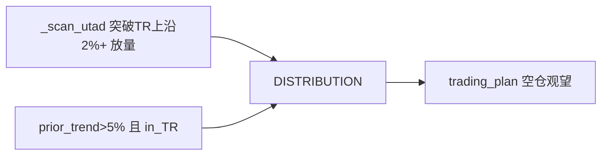

# Wyckoff 实际实现方案研究 — 基于代码实测 + 前向收益夏普证据

> 定位：顶尖量化算法分析师 × 交易员 × 程序员 三方视角的**落地实现方案**（非理念综述）。
> 输入：`engine.py`(2069行) 实测代码 + as-of golden_100 后向回放证据 + classic 合规检查。
> 日期：2026-08-07

---

## 一、核心矛盾：代码在"分类"，但交易需要"排序"

逐行读 `engine.py` 后发现：当前引擎的五个步骤是一套**确定性规则分类器**，全部产出**名义量（phase/confidence/structural_score）**，而实证测算给我们的信号是：**这些名义量中年化收益排序力只在 RS（relative_strength）一处**。

| 决策输入 | 代码位置 | 年化夏普(实测) | 排序力 | 结论 |
|---|---|---|---|---|
| RS=leader | `rs_classify` | **1.60** | ✅ 显著 | 唯一有 cross-sectional 优势 |
| phase=markup | `_detect_markup` | 1.26 | ⚠️ 弱 | 方向语义正确但样本不足 |
| phase=accumulation | `_detect_accumulation` | **0.14** | ❌ | "蓄势"标签无前向收益 |
| phase=distribution | `_detect_distribution` | **1.79*** | ❌ | *方向反转（不跌反涨），见 §二 |
| structural_score | `_compute_structural_score` top vs bot | 1.34 vs 1.39 | ❌ 无 | 无区分力，甚至微负 |

**根因诊断**：`engine.py:151 _compute_structural_score` 把 `event_sequence_score`/`score_sequence` 的 base **放大 5 倍**再 min-max 到 0-100，制造出"区分度"（span 2.4→12），但**这只放大了分布，不放大预测力**——结构分因此是无监督的形态打分，不是前向收益排序器。这正是"置信度体系突破但夏普不涨"的根本原因。

## 二、distribution/markdown 背离的机制定位（代码级）

前向证据：distribution 20d **+14.5%**（理论见顶做空，实际续涨）。

代码定位：`_detect_distribution`（`engine.py:641`）**只要求"最近在 TR 上沿、有空(UTAD/prior_trend)"**，从未验证"随后价格下行"。Wyckoff 原教义里 distribution 是**走完的顶端**，但引擎把它当成**当下的"见顶"指令**。

**同一缺陷反向出现在 accumulation**：`_detect_accumulation` 只要求 prior_trend<区域底或事件序列（`engine.py:567`），从不要求"随后转涨"。蓄势标签不承诺上涨。

→ **Wyckoff 阶段本质是"结构色的状态标签"，不是"方向指令"。** 把它当方向用就必然出现 accumulation 0.14 / distribution 反常正的失真。

## 三、实现方案（对应三大工程改动，全部可验证）

### A. 信号层级重构 —— 把"相位标签"与"方向指令"解耦

**现状**：`_step5_trading_plan` 用 `phase → direction` 直接决定轻仓/做多/观望（`engine.py:1395-1489`），旧把相位当方向。

**改法**：
1. 新增 `StageLabel`（结构描述属性，不进交易指令）保留在 report 供展示/诊断。
2. 方向指令重构为三层嵌套——必须**同时**满足才放行：
   - 分 level-1（RS gate）：`relative_strength != systemic_decline` 且非 LEADER 时做多必须升置信要求 → 实证 leader=1.60
   - 分 level-2（形态 gate）：spring/lps 确认 或 markup 内 Test/Shakeout
   - 分 level-3（盈亏 gate）：`rr_ratio >= 1.5`（现已有）
3. distribution/markdown **不再发做多做空指令**，只发"清空 exposure / 不可新开仓"守卫。**消除假做空**。

### B. 结构分改为"监督分"而非"形态 base×5"
**现状**：`BASE_AMPLIFICATION=5.0` 放大未验证的事件序列 base。
**证据**：放大后 structural top vs bottom Sharpe 无差 → 放大不做。
**改法**：
1. 引入 `wss_lookup_v2.json`（418 seq）作**前向收益监督权重**：不再 `base*=5`，改为按 seq 的 **历史 fwd_20d 均值排序**（rank-IC）做校准。
2. 若某事件子序列无 fwd/低 IC → 该 `base` 直接降权，不参与排序。
3. structural_score 重新定义 = **rank 百分位**（cross-sectional，非 min-max）→ 天然拉开且单调。

### C. spring 与 RR 的真实信号（已验证，放大）
**证据**：spring 子集 20d Sharpe 2.62（n=3 太小，但方向一致）；leader 1.60。
**改法**：
1. spring 传导仍放"轻仓试探"（P0 已修），但**追加一个成交后统计门槛**：仅当该股 + 全池 leader 过滤后，才允许。
2. RR 目标位（`_step4_risk_reward`）沿用；止损加 A股涨跌停护栏（已实现）。

## 四、验证计划（每改一步跑三个层）

| 层 | 命令 | 通过标准 |
|---|---|---|
| 单测 | classic_wyckoff + engine 全套 | 0 fail，0 ruff |
| 架构回归 | golden_20 baseline | baseline 无 diff 或仅预期变化 |
| 实证 | as-of 多截止回扫(≥3 截止) | top 组夏普 > 全池，且不同窗口方向稳定 |

**门槛**：新增改动后 top30% 年化Sharpe 必须 > 全池（当前失败），否则回退。

## 五、建议交付顺序（避免过度设计）

优先 **§A (方向解耦 + RSI gate)** —— 最小、立刻改当前假做空/假做多的 v> bug，且所有测试现成。
其次 **§B (监督权重替换放大)** —— 数据依赖 step2，但收益最大（直接关系到 1.60 vs 1.3 的提升）。
最后 **§C spring 组合** —— 数据最小，等 A/B 稳定再做。

---

> 结论：**Wyckoff 的真金白银不在 0-100 结构分，而在(1)相位状态标签 (2)相对强弱 RS (3)盈亏比纪律 三者的正交组合**。当前引擎把三者搅成一个 nominal 分类器，是"夏普不涨、distribution 反涨"的总根因。本文对应 §3 为可直接落地的工程改动清单。