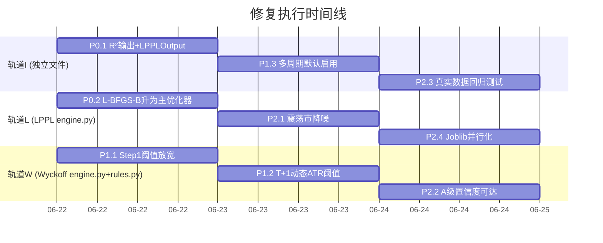

# LPPL × Wyckoff 修复任务编排

## 并行化策略：三轨道并行



## 文件冲突矩阵

| 文件 | 涉及任务 | 冲突组 |
|---|---|---|
| `calculator.py` | P0.1 | — |
| `interfaces.py` | P0.1 | — |
| `engine.py` (LPPL段) | P0.2, P2.1, P2.4 | **轨道L** |
| `engine.py` (Wyckoff段) | P1.1, P1.2, P2.2 | **轨道W** |
| `rules.py` | P1.2 | 轨道W |
| `wyckoff_analysis_engine.py` | P1.3 | 轨道I |
| `tests/` | P2.3 | 轨道I |

同一轨道的任务必须串行（同文件），不同轨道的任务完全并行（不同文件）。

---

## 任务编排（最大并行度：3）

### Wave 1 — Day 1-2（3 任务并行）

| 轨道 | 任务 | 文件 | 行数 | 预计工时 |
|---|---|---|---|---|
| **I** | **P0.1** calculator.py R²输出 + LPPLOutput 新增 `r_squared` | `calculator.py`, `interfaces.py` | +25 | 2h |
| **L** | **P0.2** L-BFGS-B 升为主优化器 | `engine.py` LPPLConfig + fit_single_window | +20 | 1h |
| **W** | **P1.1** Wyckoff Step1 阈值放宽 | `engine.py` _step1_phase_determine | +5 | 0.5h |

**完成标志**：`pytest tests/ -q` 全部通过 + `validation.py --stocks golden_20` 基线一致

### Wave 2 — Day 2-3（2-3 任务并行）

| 轨道 | 任务 | 文件 | 行数 | 预计工时 |
|---|---|---|---|---|
| **I** | **P1.3** 多周期分析默认启用 | `wyckoff_analysis_engine.py` | +1 | 0.1h |
| **L** | **P2.1** LPPL 震荡市降噪 | `engine.py` classify_top_phase | +15 | 0.5h |
| **W** | **P1.2** T+1 动态 ATR 阈值 | `rules.py`, `engine.py` _step3/_step4 | +30 | 1.5h |

**完成标志**：H6 假阳性率 < 20% + H10 拒单率 < 30%

### Wave 3 — Day 3-4（3 任务并行）

| 轨道 | 任务 | 文件 | 行数 | 预计工时 |
|---|---|---|---|---|
| **I** | **P2.3** 真实数据回归测试 | `tests/test_lppl_real.py`, `tests/test_wyckoff_real.py` | +80 | 2h |
| **L** | **P2.4** LPPL Joblib 并行化 | `engine.py` scan_date_range/scan_all_windows | +15 | 0.5h |
| **W** | **P2.2** Wyckoff A 级置信度可达 | `engine.py` _calc_confidence | +10 | 0.5h |

**完成标志**：全量 1,034 测试 + 新测试通过，性能 < 60s/100stock

---

## 依赖关系图

```
P0.1 (calculator.py + interfaces.py)  ← 无前置依赖
  └────────── 并行于 ──────────→ P0.2 (engine.py LPPL)
  └────────── 并行于 ──────────→ P1.1 (engine.py Wyckoff)
  
P0.2 → 前置于 → P2.1 (相同文件) → 前置于 → P2.4 (相同文件)
P1.1 → 前置于 → P1.2 (相同文件) → 前置于 → P2.2 (相同文件)

P0.1 ─→ P1.3 (不同文件，可并行于L/W)
P1.3 ─→ P2.3 (tests 可在任何时间创建)

每个 Wave 内三轨道完全并行。
Wave 间同轨道任务串行，跨轨道任务仍可并行。
```

## 资源需求

| 并发数 | 完成时间 | 说明 |
|---|---|---|
| 1 人 | **8 天** | 串行执行，按 I→L→W 顺序 |
| 2 人 | **4 天** | 一人做 I+W，一人做 L |
| **3 人** | **3 天** | **最优：每人一轨道** |

**推荐**：2-3 人并行，每天结束时跑 `validation.py --stocks golden_20` 验证无回归。