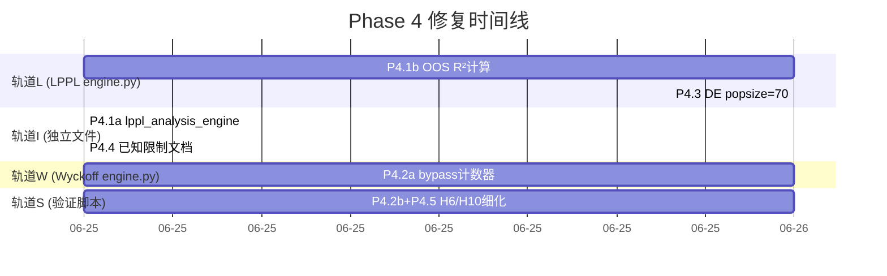

# Phase 4 修复任务编排 — 半成品补完 + 诊断工具

> 基于三角色评估（算法工程师 85/100, 架构工程师 78/100, 交易员 55/100）识别的遗留问题
> 共计 5 项修复（P4.1–P4.5），跨越 7 个文件，总估算工时 ~4h

## 并行化策略：四轨道并行



## 文件冲突矩阵

| 文件 | 涉及任务 | 冲突组 |
|---|---|---|
| `brain/lppl/engine.py` | P4.1b, P4.3 | **轨道L** |
| `services/analysis/lppl_analysis_engine.py` | P4.1a | 轨道I |
| `docs/repair_plan_lppl_wyckoff.md` | P4.4 | 轨道I |
| `brain/wyckoff/engine.py` | P4.2a | **轨道W** |
| `scripts/lppl_wyckoff_cross_validation.py` | P4.2b, P4.5 | **轨道S** |

同一轨道的任务必须串行（同文件），不同轨道完全并行。

---

## 任务编排（最大并行度：4）

### Wave 1 — Day 1（4 任务并行）

| 轨道 | 任务 | 文件 | 变更量 | 预计工时 |
|---|---|---|---|---|
| **I** | **P4.1a** 读取 `r_squared`/`out_of_sample_r_squared` 传入 LPPLOutput | `lppl_analysis_engine.py` | +2行 | 0.3h |
| **L** | **P4.1b** `detect_bubble()` 增加 30 日 holdout R² 计算 | `brain/lppl/engine.py` | +25行 | 2h |
| **W** | **P4.2a** `_calc_confidence` 增加 bypass 计数器 + Reason 记录 | `brain/wyckoff/engine.py` | +8行 | 0.5h |
| **S** | **P4.2b+P4.5** H6 bypass 统计 + H10 逐股票对比表 | `scripts/lppl_wyckoff_cross_validation.py` | +30行 | 0.5h |

**完成标志**：`pytest tests/ -q` 全部通过 + `ruff check src/uniquant/` 无报错

### Wave 2 — Day 2（2 任务并行）

| 轨道 | 任务 | 文件 | 变更量 | 预计工时 |
|---|---|---|---|---|
| **L** | **P4.3** LPPLConfig 新增 `de_popsize: int = 70` + 文档注释 | `brain/lppl/engine.py` | +3行 | 0.3h |
| **I** | **P4.4** 修复计划文档新增"已知限制—Spring 信号密度"章节 | `docs/repair_plan_lppl_wyckoff.md` | +15行 | 0.3h |

**完成标志**：`python3 scripts/capture_baseline.py && python3 scripts/compare_baseline.py` 一致

---

## 依赖关系图

```
P4.1a (lppl_analysis_engine.py)  ← 无前置依赖
  └── 并行于 ──→ P4.1b (brain/lppl/engine.py)  ← 无前置依赖
  └── 并行于 ──→ P4.2a (brain/wyckoff/engine.py)  ← 无前置依赖
  └── 并行于 ──→ P4.2b (scripts/)  ← 无前置依赖

P4.1a ─→ P4.4 (docs, 不同文件 → 可并行于 Wave 1 之后)
P4.1b ─→ P4.3 (相同文件 LPPL engine.py → 必须串行)

P4.2a (engine) 与 P4.2b (scripts) 无文件冲突，可并行；
  但 P4.2b 的 bypass 统计需 P4.2a 的计数器存在才能产生有意义数据。
  建议同 Wave 执行（统计值从 0 开始上升，比下一个 Wave 单独跑更规范）。

P4.5 与 P4.2b 同文件，合并在 Wave 1 一次性完成。
```

## 资源需求

| 并发数 | 完成时间 | 说明 |
|---|---|---|
| 1 人 | **2 天** | 串行 I→L→W→S |
| 2 人 | **1 天** | 一人 L，一人 I+W+S |
| **4 人** | **1 天** | **最优：每人一轨道，Wave 1 全部并行** |
