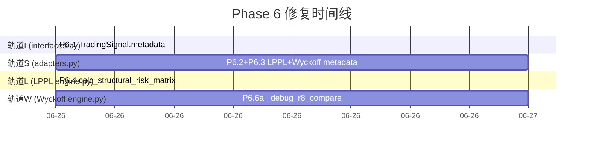

# Phase 6 修复任务编排 — 信号链完整 + 质量过滤 + 路径验证

> 基于 Phase 5 三角色评估（算法78/架构82/交易员65）识别的跨层信号丢失和仲裁器盲区
> 共计 6 项修复（P6.1–P6.6），跨越 6 个文件，总估算工时 ~2.8h

## 并行化策略：四轨道并行



## 文件冲突矩阵

| 文件 | 涉及任务 | 冲突组 |
|---|---|---|
| `shared/interfaces.py` | P6.1 | **I** |
| `signal/adapters.py` | P6.2, P6.3 | **S — 合并为一个任务** |
| `signal/arbitrator.py` | P6.5 | **A** |
| `brain/lppl/engine.py` | P6.4 | **L** |
| `brain/wyckoff/engine.py` | P6.6a | **W** |
| `scripts/lppl_wyckoff_cross_validation.py` | P6.6b | **V** |

同一轨道必须串行，不同轨道完全并行。

## 依赖关系

```
P6.5 (arbitrator.py)  ← 依赖 P6.1 (TradingSignal.metadata 存在) + P6.2 (metadata 有数据)
P6.6b (scripts/)      ← 依赖 P6.6a (Wyckoff engine 的 debug 模式存在)
```

## 任务编排（最大并行度：4）

### Wave 1 — Day 1（4 任务并行）

| 轨道 | 任务 | 文件 | 变更量 | 预计工时 |
|---|---|---|---|---|
| **I** | **P6.1** `TradingSignal` 新增 `metadata: Dict[str, Any] = field(default_factory=dict)` | `shared/interfaces.py:148` | +2 | 0.1h |
| **S** | **P6.2+P6.3** `LPPLAdapter` 传 `r_squared`/OOS R² + `WyckoffAdapter` 传 `phase`/`bypassed`/`rr_ratio` + `_extract_wyckoff` 补充字段 | `signal/adapters.py:93-101,180-185,582-589` | +12 | 0.5h |
| **L** | **P6.4** `calc_structural_risk_matrix` 调用 `detect_bubble()` 替代直接 `calculator.fit()` | `brain/lppl/engine.py:1082` | +1 | 0.1h |
| **W** | **P6.6a** `_calc_confidence` 增加 `_debug_r8_compare` 模式，bypass 时也执行 full R8 矩阵 | `brain/wyckoff/engine.py:830-881` | +15 | 0.5h |

**完成标志**：`pytest tests/ -q` 全部通过 + `ruff check src/uniquant/` 无报错

### Wave 2 — Day 1（2 任务并行）

| 轨道 | 任务 | 文件 | 变更量 | 预计工时 |
|---|---|---|---|---|
| **A** | **P6.5** `SignalArbitrator` 增加 `quality_threshold=0.3`，LPPL SELL 信号 OOS R² < 阈值时降级为 HOLD | `signal/arbitrator.py:65-166` | +10 | 0.5h |
| **V** | **P6.6b** 验证脚本 H8 新增 bypass vs full R8 对比统计 | `scripts/lppl_wyckoff_cross_validation.py` | +20 | 1h |

**完成标志**：`python3 scripts/capture_baseline.py && python3 scripts/compare_baseline.py` 一致

## 资源需求

| 并发数 | 完成时间 | 说明 |
|---|---|---|
| 1 人 | **1 天** | 串行 I→S→L→W→A→V |
| 2 人 | **0.5 天** | 一人 I+S+L，另一人 W+A+V |
| **4 人** | **0.5 天** | **最优：Wave 1 四轨并行 + Wave 2 双轨并行** |

**关键路径**：P6.1 → P6.5（0.6h 依赖链）+ P6.6a → P6.6b（1.5h 依赖链）。Wave 2 的 P6.5 和 P6.6b 无交叉依赖，可完全并行。
