# 投研 API 参考与因子开发指南

> **版本**: v0.6.x | **源码快照**: 2026-06-21
> **代码即真理**: 所有 API 签名、Type Hints、行号引用均从物理源码提取。`[WIP]` 标记表示空壳或桩实现。

---

## 1. 核心 Protocol 接口参考

**文件**: `src/uniquant/shared/interfaces.py` (302 行)

### 1.1 DataFetcherProtocol

```python
# interfaces.py:102-120
@runtime_checkable
class DataFetcherProtocol(Protocol):
    def fetch_history(
        self,
        symbol: str,
        start_date: str,
        end_date: str,
        adjust: str = "qfq",
        period: str = "daily",
    ) -> pd.DataFrame: ...
```

| 方法 | 参数 | 返回类型 | 说明 |
|------|------|----------|------|
| `fetch_history` | `symbol: str, start_date: str, end_date: str, adjust="qfq", period="daily"` | `pd.DataFrame` | 拉取历史行情数据 |

### 1.2 RiskAssessmentProtocol

```python
# interfaces.py:123-140
@runtime_checkable
class RiskAssessmentProtocol(Protocol):
    def calculate_metrics(self, returns: pd.DataFrame) -> Dict[str, Any]: ...
```

| 方法 | 参数 | 返回类型 | 说明 |
|------|------|----------|------|
| `calculate_metrics` | `returns: pd.DataFrame` | `Dict[str, Any]` | 计算风险指标 (含 risk level) |

### 1.3 PositionSizerProtocol

```python
# interfaces.py:143-171
@runtime_checkable
class PositionSizerProtocol(Protocol):
    def calculate_shares(
        self,
        price: float,
        stop_loss: float,
        czsc_bottom: Any,
        market: str = "CN",
        symbol: str = "UNKNOWN",
    ) -> Dict[str, Any]: ...
```

| 方法 | 参数 | 返回类型 | 说明 |
|------|------|----------|------|
| `calculate_shares` | `price: float, stop_loss: float, czsc_bottom: Any, market="CN", symbol="UNKNOWN"` | `Dict[str, Any]` | 计算建议仓位 |

### 1.4 AnalysisEngineProtocol

```python
# interfaces.py:174-192
@runtime_checkable
class AnalysisEngineProtocol(Protocol):
    def analyze(self, data: pd.DataFrame, **kwargs) -> Dict[str, Any]: ...
```

| 方法 | 参数 | 返回类型 | 说明 |
|------|------|----------|------|
| `analyze` | `data: pd.DataFrame, **kwargs` | `Dict[str, Any]` | 分析数据并返回结果 |

### 1.5 CalculationPluginProtocol

```python
# interfaces.py:195-234
@runtime_checkable
class CalculationPluginProtocol(Protocol):
    @property
    def name(self) -> str: ...
    @property
    def version(self) -> str: ...
    @property
    def description(self) -> str: ...
    def calculate(self, data: pd.DataFrame, **kwargs) -> Dict[str, Any]: ...
```

| 方法/属性 | 返回类型 | 说明 |
|-----------|----------|------|
| `name` (property) | `str` | 插件名称 |
| `version` (property) | `str` | 插件版本 |
| `description` (property) | `str` | 插件描述 |
| `calculate` | `Dict[str, Any]` | 执行计算 |

### 1.6 CalculationRegistry

```python
# interfaces.py:237-302
class CalculationRegistry:
    def register(self, plugin: CalculationPluginProtocol) -> None: ...
    def unregister(self, plugin_name: str) -> None: ...
    def get(self, plugin_name: str) -> CalculationPluginProtocol: ...  # KeyError if not found
    def list(self) -> List[str]: ...
    def has(self, plugin_name: str) -> bool: ...

# 全局实例
calculation_registry = CalculationRegistry()  # interfaces.py:302
```

### 1.7 MarketSignalContext

```python
# interfaces.py:22-99
@dataclass
class MarketSignalContext:
    regime: MarketRegime = MarketRegime.NORMAL
    risk: str = "Safe"
    bubble_confidence: float = 0.0
    ntf_side: NtfSide = NtfSide.NONE
    ntf_intensity: float = 0.0
    is_3rd_buy: bool = False
    bi_count: int = 0
    alpha_score: float = 0.0
    ma_status: Optional[str] = None
    price: float = 0.0
    pre_close: float = 0.0
    symbol: str = ""
    name: Optional[str] = None
    atr_stop: float = 0.0
    czsc_bottom: Optional[float] = None
    market: str = "CN"
    returns: Optional[pd.Series] = None
    lppl_days_to_tc: Optional[float] = None

    @classmethod
    def from_dict(cls, data: Dict[str, Any]) -> "MarketSignalContext": ...
    def to_dict(self) -> Dict[str, Any]: ...
```

### 1.8 枚举类型

```python
# interfaces.py:8-19
class MarketRegime(Enum):
    NORMAL = "NORMAL"
    STRESSED = "STRESSED"
    FROZEN = "FROZEN"

class NtfSide(Enum):
    NONE = "NONE"
    SUPPORT = "SUPPORT"
    RESISTANCE = "RESISTANCE"
```

---

## 2. 服务层 API

### 2.1 AnalysisEngineFactory

**文件**: `src/uniquant/services/analysis/engine_factory.py:14-79`

```python
class AnalysisEngineFactory:
    def __init__(self, orchestrator): ...

    @property
    def fsm(self) -> FsmAnalysisEngine: ...       # 延迟初始化
    @property
    def czsc(self) -> CzscAnalysisEngine: ...
    @property
    def lppl(self) -> LpplAnalysisEngine: ...
    @property
    def regime(self) -> RegimeAnalysisEngine: ...
    @property
    def ntf(self) -> NtfAnalysisEngine: ...
    @property
    def macro(self) -> MacroAnalysisEngine: ...
    @property
    def report(self) -> ReportGeneratorEngine: ...
    @property
    def brain(self) -> DecisionBrain: ...
    @property
    def wyckoff(self) -> WyckoffAnalysisEngine: ...
```

**获取引擎实例**:
```python
from uniquant.services.analysis.engine_factory import AnalysisEngineFactory

factory = AnalysisEngineFactory(orchestrator=data_service)
engine = factory.czsc  # 首次访问时延迟创建
```

### 2.2 ServiceContainer

**文件**: `src/uniquant/services/service_container.py:28-83`

```python
class ServiceContainer:
    @classmethod
    def instance(cls) -> "ServiceContainer": ...  # 单例
    def register(self, name: str, service: Any) -> None: ...
    def get(self, name: str) -> Any: ...
    def initialize(self) -> None: ...             # DAG 拓扑初始化
```

**已注册服务**: `"storage"`, `"calendar"`, `"cache"`, `"data_service"`, `"engine_factory"`

### 2.3 分析引擎适配器

| 类 | 文件 | 主要方法 |
|----|------|----------|
| `LpplAnalysisEngine` | `lppl_analysis_engine.py:41` | `run_lppl_analysis(symbol, df=None) -> Dict` |
| `CzscAnalysisEngine` | `czsc_analysis_engine.py:19` | `run_czsc_analysis(symbol, df=None) -> Dict` |
| `FsmAnalysisEngine` | `fsm_analysis_engine.py:19` | `run_fsm_analysis(symbol, df=None) -> Dict` |
| `NtfAnalysisEngine` | `ntf_analysis_engine.py:18` | `run_ntf_detection(symbol, df=None) -> Dict` |
| `RegimeAnalysisEngine` | `regime_analysis_engine.py:18` | `run_regime_detection(symbol, df=None) -> Dict` |
| `WyckoffAnalysisEngine` | `wyckoff_analysis_engine.py:16` | `run_wyckoff_analysis(symbol, df=None) -> Dict` |
| `MacroAnalysisEngine` | `macro_analysis_engine.py:21` | `analyze_macro_health(mock=False) -> Dict` |
| `ReportGeneratorEngine` | `report_generator_engine.py:19` | `generate_report(ticker, data=None) -> bool` |

---

## 3. Brain 引擎 API

### 3.1 LPPLEngine

**文件**: `src/uniquant/brain/lppl/engine.py:941-1020`

```python
class LPPLEngine:
    def __init__(self): ...
    def detect_bubble(self, df: pd.DataFrame, column: str = "close") -> Dict[str, Any]: ...
    def detect_bubble_confidence(self, df: pd.DataFrame, column: str = "close") -> Dict[str, Any]: ...
    def calculate_tc_days(self, df: pd.DataFrame, column: str = "close") -> float: ...
    def scan_all_windows(self, df: pd.DataFrame) -> List[Dict]: ...
    def calc_structural_risk_matrix(self, indices_data: Dict[str, pd.DataFrame]) -> Dict[str, Any]: ...
```

| 方法 | 返回类型 | 说明 |
|------|----------|------|
| `detect_bubble` | `Dict[str, Any]` | 单窗口泡沫检测: `is_bubble, tc, days_to_tc, confidence, risk_level, model_params` |
| `detect_bubble_confidence` | `Dict[str, Any]` | 多窗口投票: `risk_level, confidence, votes, details` |
| `calculate_tc_days` | `float` | 距临界点天数 |
| `calc_structural_risk_matrix` | `Dict[str, Any]` | 多指数结构化风险矩阵 |

**输入 DataFrame**: `date`, `close` (必需), `volume` (可选)

### 3.2 CZSCEngine

**文件**: `src/uniquant/brain/czsc/czsc_engine.py:84-622`

```python
class CZSCEngine:
    def __init__(self): ...
    def get_czsc_signals(self, df: pd.DataFrame) -> Dict[str, Any]: ...
    def update_and_get_signals(self, df_latest_row: pd.Series) -> Dict[str, Any]: ...
```

| 方法 | 返回类型 | 说明 |
|------|----------|------|
| `get_czsc_signals` | `Dict[str, Any]` | 批量分析: `bi_count, is_3rd_buy, czsc_signal, bottom_fractal, czsc_bottom_price` |
| `update_and_get_signals` | `Dict[str, Any]` | 增量更新, 毫秒级响应 |

**输入 DataFrame**: `date`, `open`, `close`, `high`, `low` (必需), `volume`/`vol` (可选)

### 3.3 DecisionBrain

**文件**: `src/uniquant/brain/fsm/fsm.py:178-707`

```python
class DecisionBrain:
    def __init__(
        self,
        evt_risk: Optional[RiskAssessmentProtocol] = None,
        sizer: Optional[PositionSizerProtocol] = None,
        persist_state: bool = True,
        state_file: Optional[str] = None,
        data_service: Any = None,
    ): ...
    def make_decision(self, data_packet: Union[dict, MarketSignalContext]) -> Dict[str, Any]: ...
    def reset_state(self): ...
    def get_state(self) -> FSMState: ...
```

**`make_decision` 返回**:
```python
{
    "action": str,          # "BUY" | "SELL" | "HOLD" | "ADD" | "EXECUTE_SELL" | "EXECUTE_BUY" | "CIRCUIT_BREAK" | "FORCE_WAIT" | "FORCE_EXIT"
    "reason": str,
    "regime": str,          # MarketRegime.value
    "risk": str,
    "bubble_confidence": float,
    "ntf_side": str,        # NtfSide.value
    "ntf_intensity": float,
    "is_3rd_buy": bool,
    "bi_count": int,
    "alpha_score": float,
    "final_decision": str,  # 同 action
    "final_score": int,     # 综合得分
    "state": str,           # FSMState.value (通过 **kwargs 注入)
}
```

> **注意**: `state` 键通过 `**kwargs` 注入，不在 `_build_response` 的固定字段中，但在 `_execute_buy` 和 `_check_sell_conditions` 等路径中会包含。

### 3.4 WyckoffEngine

**文件**: `src/uniquant/brain/wyckoff/engine.py:64-1456`

```python
class WyckoffEngine:
    def __init__(
        self,
        lookback_days: int = 120,
        weekly_lookback: int = 180,
        monthly_lookback: int = 120,
        is_st: bool = False,
    ): ...
    def analyze(self, df, symbol="UNKNOWN", period="日线", multi_timeframe=False, image_evidence=None) -> WyckoffReport: ...
    def scan_signal(self, df, symbol="UNKNOWN") -> dict: ...
    def detect_spring(self, df, symbol="UNKNOWN") -> dict: ...
    def detect_utad(self, df, symbol="UNKNOWN") -> dict: ...
    def detect_lps(self, df, symbol="UNKNOWN") -> dict: ...
    def detect_sow(self, df, symbol="UNKNOWN") -> dict: ...
```

**输入 DataFrame**: `date`, `open`, `high`, `low`, `close` (必需), `volume`/`vol` (推荐)

---

## 4. 风控层 API

### 4.1 DrawdownAnalyzer

**文件**: `src/uniquant/risk/drawdown_analyzer.py:84-189`

```python
class DrawdownAnalyzer:
    @staticmethod
    def compute_drawdown_series(equity: np.ndarray) -> np.ndarray: ...
    @classmethod
    def analyze_drawdown(cls, equity: np.ndarray, annual_return: float = 0.0) -> DrawdownMetrics: ...
    @staticmethod
    def analyze_tail_risk(returns: np.ndarray) -> TailRiskMetrics: ...
    @staticmethod
    def stress_scenario(equity: np.ndarray, scenario_name: str) -> StressTestResult: ...
```

**数据类**:
```python
@dataclass
class DrawdownMetrics:
    max_drawdown: float = 0.0
    max_drawdown_duration: int = 0
    avg_drawdown: float = 0.0
    avg_drawdown_duration: float = 0.0
    calmar_ratio: float = 0.0
    ulcer_index: float = 0.0
    rolling_mdd_60d: float = 0.0
    rolling_mdd_120d: float = 0.0
    rolling_mdd_252d: float = 0.0

@dataclass
class TailRiskMetrics:
    var_95: float = 0.0
    var_99: float = 0.0
    cvar_95: float = 0.0
    cvar_99: float = 0.0
    tail_ratio: float = 1.0
    skewness: float = 0.0
    kurtosis: float = 3.0
```

内置压力测试场景: `"2015_crash"` (-40%), `"2016_meltdown"` (-10%), `"2018_bear"` (-30%), `"2020_covid"` (-15%), `"2024_microcap_stampede"` (-25%)

### 4.2 HistoricalSimulationRisk

**文件**: `src/uniquant/risk/evt_risk.py:24-389`

```python
class HistoricalSimulationRisk:
    def calculate_metrics(self, returns: pd.Series) -> Dict[str, Any]: ...
    def calculate_var(self, returns: pd.Series, confidence: float) -> float: ...
    def calculate_cvar(self, returns: pd.Series, confidence: float) -> float: ...
    def detect_regime(self, returns: pd.Series) -> str: ...
    def calculate_stress_test(self, returns: pd.Series, scenarios: List[str]) -> Dict[str, float]: ...
```

`calculate_metrics` 返回: `var_95, var_99, cvar_95, cvar_99, max_drawdown, regime, ntf_signal, summary`

**实现 `RiskAssessmentProtocol`**: `calculate_metrics(returns: pd.Series) -> Dict[str, Any]`

### 4.3 PositionSizer

**文件**: `src/uniquant/risk/sizer.py:71-213`

```python
class PositionSizer:
    def __init__(self, initial_capital: float = 100000.0, risk_pct: float = 0.05): ...
    def calculate_shares(
        self,
        price: float,
        stop_loss: float,
        market: str = "CN",
        czsc_bottom: Optional[float] = None,
        atr_stop: Optional[float] = None,
        symbol: str = "UNKNOWN",
    ) -> Dict[str, Any]: ...
```

> **Protocol 不匹配**: `PositionSizerProtocol` 定义 `czsc_bottom` 为第 3 个位置参数，但 `PositionSizer` 实现中 `market` 是第 3 个位置参数、`czsc_bottom` 是第 4 个。`isinstance(sizer, PositionSizerProtocol)` 检查会失败。

返回: `建议动作, 入场区间, 几何止损, ATR止损, 执行止损, 风险敞口, 建议仓位, 资金占用, 是否触发熔断`

**A 股特殊处理**: T+1 惩罚系数 `CN=1.2`

#### PortfolioSizer

```python
# sizer.py:234-266
class PortfolioSizer:
    def __init__(self, max_total_risk=0.25, max_single=0.10, max_daily_loss=0.02): ...
    def allocate(
        self,
        signals: Dict[str, PositionSizingResult],
        portfolio_equity: float,
        daily_pnl: float = 0.0,
    ) -> PortfolioAllocation: ...
```

### 4.4 PortfolioOptimizer

**文件**: `src/uniquant/risk/portfolio_optimizer.py:36-370`

```python
class PortfolioOptimizer:
    def __init__(self, config: Optional[OptimizerConfig] = None): ...
    def optimize_risk_parity(self, returns: pd.DataFrame, target_weights=None) -> Dict[str, Any]: ...
    def optimize_mean_variance(self, returns: pd.DataFrame, expected_returns=None, target="max_sharpe") -> Dict[str, Any]: ...
    def get_efficient_frontier(self, returns: pd.DataFrame, expected_returns=None, n_points=20) -> pd.DataFrame: ...
```

---

## 5. 异常体系

**文件**: `src/uniquant/shared/exceptions.py:1-123`

```mermaid
graph TD
    A["Exception"] --> B["AlphaTacticianError"]
    B --> C["DataError"]
    C --> C1["DataFetchError"]
    C --> C2["DataValidationError"]
    C --> C3["DataStorageError"]
    C3 --> C3a["DatabaseConnectionError"]
    C --> C4["DataAccessError"]
    C --> C5["CacheError"]
    B --> D["AnalysisError"]
    D --> D1["LPPLFitError"]
    D --> D2["CZSCEngineError"]
    D --> D3["EngineError"]
    B --> E["RiskError"]
    E --> E1["PositionSizingError"]
    E --> E2["EVTRiskError"]
    E --> E3["RiskCalculationError"]
    B --> F["ServiceError"]
    F --> F1["AnalysisServiceError"]
    F --> F2["DataServiceError"]
    F --> F3["PortfolioServiceError"]
    F --> F4["DependencyError"]
    B --> G["UIError"]
    B --> H["ConfigurationError"]
    B --> I["OperationTimeoutError"]
    B --> J["ValidationError"]
    B --> K["BacktestError"]
    B --> L["LPPLException"]
    L --> L1["DataNotFoundError"]
    L --> L2["ComputationError"]
    B --> M["WyckoffError"]
    M --> M1["BCNotFoundError"]
    M --> M2["InvalidInputDataError"]
    M --> M3["ImageProcessingError"]
    M --> M4["FusionConflictError"]
    M --> M5["RuleEngineError"]
```



**模块级额外异常**:

| 模块 | 异常 | 基类 | 文件 |
|------|------|------|------|
| FSM | `InvalidInputError` | `ValueError` | `fsm.py:37` |
| FSM | `StateTransitionError` | `AnalysisError` | `fsm.py:41` |
| CZSC | `CZSCAnalysisError` | `AnalysisError` | `czsc_engine.py:80` |
| Sizer | `InvalidStopLossError` | `ValueError` | `sizer.py:63` |

---

## 6. 因子开发指南

### 6.1 因子注册机制

**文件**: `src/uniquant/brain/factors/registry.py:28-102`

UniQuant 使用 **`FactorRegistry` 单例 + `FactorInfo` 数据类** 模式。不需要装饰器或基类继承，仅需一个 `Callable[[pd.DataFrame], pd.Series]` 函数。

#### FactorInfo 数据类

```python
# registry.py:16-25
@dataclass
class FactorInfo:
    name: str                    # 唯一名称
    category: str                # "technical" | "fundamental" | "alternative" | "custom"
    compute_func: Callable[[pd.DataFrame], pd.Series]
    default_weight: float = 1.0
    enabled: bool = True
    description: str = ""
    ic_ir_history: Optional[List[float]] = None
```

#### FactorRegistry API

```python
class FactorRegistry:
    @classmethod
    def register(cls, name: str, compute_func: Callable,
                 category: str = "custom",
                 default_weight: float = 1.0,
                 description: str = ""): ...

    @classmethod
    def get_all(cls) -> List[FactorInfo]: ...
    @classmethod
    def get_enabled(cls) -> List[FactorInfo]: ...
    @classmethod
    def get_factor(cls, name: str) -> Optional[FactorInfo]: ...
    @classmethod
    def enable(cls, name: str): ...
    @classmethod
    def disable(cls, name: str): ...
```

### 6.2 内置因子

**文件**: `src/uniquant/brain/factors/custom_factors.py:105-183`

| 因子名称 | 类别 | 默认权重 | 说明 |
|----------|------|----------|------|
| `momentum_20d` | technical | 1.0 | 20日动量 (收益率) |
| `momentum_60d` | technical | 0.9 | 60日动量 |
| `volatility_20d` | technical | 0.8 | 20日波动率 |
| `volatility_60d` | technical | 0.7 | 60日波动率 |
| `ma_ratio_5_20` | technical | 0.85 | 5日/20日均线比率 |
| `ma_ratio_10_60` | technical | 0.75 | 10日/60日均线比率 |
| `volume_ratio_5_20` | technical | 0.6 | 5日/20日成交量比率 |
| `rsi_14` | technical | 0.8 | 14日RSI |
| `price_position_20d` | technical | 0.7 | 20日价格位置 |
| `turnover_momentum_20d` | technical | 0.85 | 20日换手率动量 |

### 6.3 防前视偏差原则

UniQuant 在多个层级防止 Look-Ahead Bias:

| 层级 | 机制 | 来源 |
|------|------|------|
| FSM 盘中模式 | `is_intraday=True` 时排除最后一根未确定 K 线 | `fsm.py:99-101` |
| FactorAnalyzer 模式守卫 | `mode="live"` 时 `_compute_forward_returns` 抛出 `ValueError` | `analyzer.py:97-102` |
| FactorAnalyzer 未来日期检测 | 检测数据中是否包含超过当前时间的日期 | `analyzer.py:104-111` |
| WalkForwardFactorPipeline | 训练窗口→IC/IR→权重; 测试窗口→用训练权重打分; 滚动前进 | `walk_forward_pipeline.py` |
| Point-in-time 财务数据 | `ANNOUNCEMENT_DATE_COLS` 确保财务数据仅在公告日后可用 | `financial_bridge.py:71-76` |

### 6.4 Step-by-Step: 编写并注册一个防前视偏差的新 Alpha 因子

#### 步骤 1: 编写计算函数

函数签名必须为 `(df: pd.DataFrame) -> pd.Series`，返回与 `df` 等长的 Series。

**关键约束**:
- 只使用 `df` 中**当前行及之前**的数据 (`.rolling()` 天然满足)
- 绝不使用 `shift(-n)` (负 shift 引入未来数据)
- 如果因子需要财务数据，使用 `FinancialFactorBridge` 的 Point-in-time 映射

#### 步骤 2: 注册因子

调用 `FactorRegistry.register()`。

#### 步骤 3: (可选) 在 `config/factors.yaml` 中覆盖权重

#### 步骤 4: 使用 `FactorComposer.compose_scores()` 生成合成分数

### 6.5 代码模板

```python
# my_custom_factor.py
import pandas as pd
import numpy as np
from uniquant.brain.factors.registry import FactorRegistry


def compute_bollinger_width(df: pd.DataFrame) -> pd.Series:
    """
    布林带宽度因子

    公式: (upper - lower) / middle
    使用 20日均线 +/- 2倍标准差

    Args:
        df: 必须包含 'close' 列

    Returns:
        pd.Series: 布林带宽度, 与 df 等长
    """
    if 'close' not in df.columns:
        return pd.Series(index=df.index, dtype=float)

    close = df['close']
    middle = close.rolling(window=20).mean()
    std = close.rolling(window=20).std()
    upper = middle + 2 * std
    lower = middle - 2 * std

    # .rolling() 天然防前视偏差: 每个值只使用当前及之前的数据
    width = (upper - lower) / middle.replace(0, np.nan)
    return width


# 注册 (模块导入时自动执行)
FactorRegistry.register(
    name="bollinger_width",
    compute_func=compute_bollinger_width,
    category="technical",
    default_weight=0.75,
    description="布林带宽度因子 (20日, 2σ)"
)
```

#### 使用因子

```python
from uniquant.brain.factors import FactorComposer

composer = FactorComposer(orthogonalize=True)
result_df = composer.compose_scores(
    df=my_dataframe,
    ic_weights=None,           # None = 使用默认权重或 IC 计算权重
    factor_cols=None,          # None = 使用所有已注册因子
    date_col="date",
    neutralize=False,          # True = 市值/行业中性化
)
# result_df 包含所有标准化因子列 + "composite_score" 列
```

### 6.6 因子分析工具

#### FactorAnalyzer — `brain/factors/analyzer.py:51-459`

```python
class FactorAnalyzer:
    DEFAULT_HOLDING_PERIODS: List[int] = [1, 5, 20]

    def compute_rank_ic(self, factor_values: pd.Series, forward_returns: pd.Series) -> float: ...
    def compute_ic_ir(
        self, df, factor_cols, holding_periods=None, date_col="date",
        code_col="code", price_col="close",
        mode=AnalysisMode.BACKTEST, half_life=None,
    ) -> Dict: ...
    def compute_factor_correlation(self, df, factor_cols, method="spearman") -> pd.DataFrame: ...
    def get_top_factors(self, metric="icir", top_n=10, min_periods=10) -> List[Tuple[str, float]]: ...
```

> **防前视偏差**: `mode` 参数为 `AnalysisMode` 枚举 (非字符串)。`mode=AnalysisMode.LIVE` 时 `_compute_forward_returns` 抛出 `ValueError`，禁止未来数据泄漏。

#### FactorComposer — `brain/factors/composer.py:18-307`

```python
class FactorComposer:
    def __init__(self, orthogonalize: bool = True): ...
    def compute_all_factors(self, df: pd.DataFrame) -> pd.DataFrame: ...
    def compose_scores(self, df, ic_weights=None, factor_cols=None, date_col="date", neutralize=False) -> pd.DataFrame: ...
```

**对称正交化**: `F_orth = F @ (F.T @ F)^{-1/2}` 消除因子共线性

#### WalkForwardFactorPipeline — `brain/factors/walk_forward_pipeline.py`

```python
class WalkForwardFactorPipeline:
    def __init__(
        self,
        factor_analyzer: Optional[FactorAnalyzer] = None,
        factor_composer: Optional[FactorComposer] = None,
        train_window: int = 504,    # ~2年
        test_window: int = 63,      # ~3个月
        min_train_days: int = 252,  # ~1年
        weight_method: str = "rank_icir",
    ): ...
```

---

## 7. 装饰器与工具函数

### 7.1 handle_errors — `error_handling.py:67-180`

```python
def handle_errors(
    *expected_exceptions: Type[Exception],
    default_return: Any = None,
    log_level: int = logging.ERROR,
    reraise: bool = False,
    error_type: str = "unknown",
    context: Optional[Dict[str, Any]] = None,
) -> Callable:
```

三层异常捕获: 预期异常 → `AlphaTacticianError` → 未预期异常。

```python
@handle_errors(AnalysisError, ValueError, default_return={})
def my_analysis(data): ...
```

### 7.2 validate_inputs — `error_handling.py:258-293`

```python
@validate_inputs(
    ticker=lambda x: isinstance(x, str) and bool(x.strip()),
    window=lambda x: isinstance(x, int) and x > 0,
)
def fetch_data(ticker: str, window: int = 200): ...
```

### 7.3 retry — `retry_decorator.py:15-85`

```python
def retry(
    max_retries: int = 3,
    delay: float = 1.0,
    backoff: float = 2.0,
    max_delay: Optional[float] = None,
    exceptions: Tuple[Type[Exception], ...] = (Exception,),
    on_retry: Optional[Callable[[Exception, int], None]] = None,
    on_failure: Optional[Callable[[Exception], None]] = None,
) -> Callable:
```

### 7.4 专用错误处理装饰器

| 装饰器 | 说明 |
|--------|------|
| `handle_network_errors(default_return, max_retries)` | 网络异常 + 自动重试 |
| `handle_file_errors(default_return)` | 文件 I/O 异常 |
| `handle_data_errors(default_return)` | Pandas/数据处理异常 |
| `handle_api_errors(default_return, max_retries)` | API 调用异常 + 重试 |

---

## 附录: 模块导出索引

### services/__init__.py — 14 个延迟导出

```python
__all__ = [
    "CacheCoordinator", "DataService", "HealthService",
    "PortfolioService", "ScanPipeline", "StockQueryService",
    "ValidationService", "AnalysisService", "ServiceContainer",
    "DataAccessService", "DataQualityService",
    "MarketRegimeService", "ReportService", "SignalGenerationService",
]
```

### risk/__init__.py

```python
__all__ = [
    "DrawdownAnalyzer", "PositionSizer", "EVTRisk",
    "PortfolioOptimizer", "StructuralRiskManager",
]
```

### brain/factors/__init__.py

```python
__all__ = ["FactorRegistry", "FactorAnalyzer", "FactorComposer", "FinancialFactorBridge"]
```

---

*文档基于代码事实提取 | 生成时间: 2026-06-01 | 文件行号引用均为精确位置*
