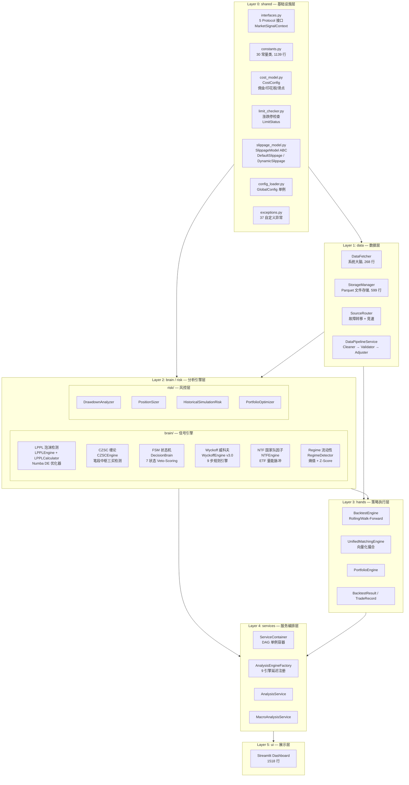
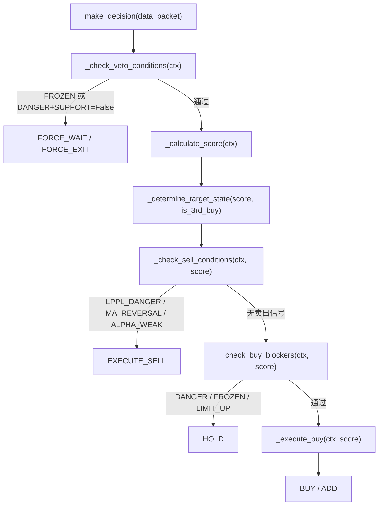
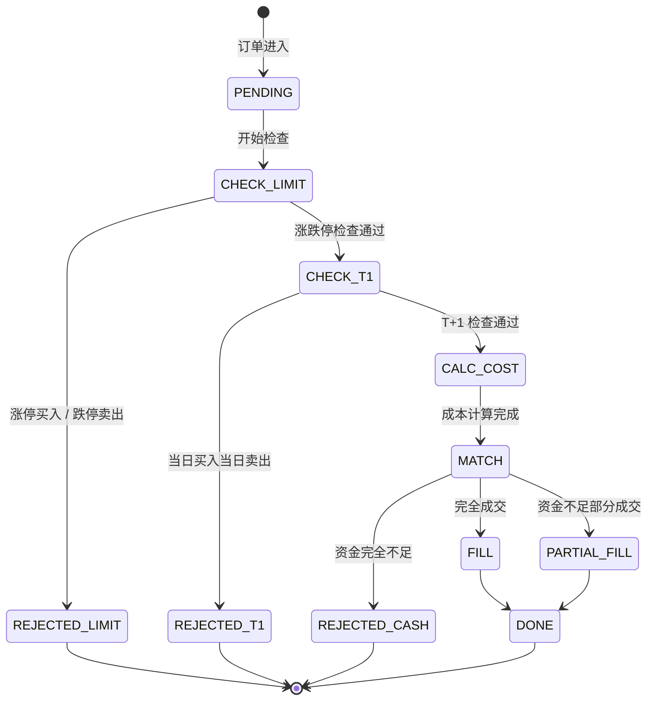
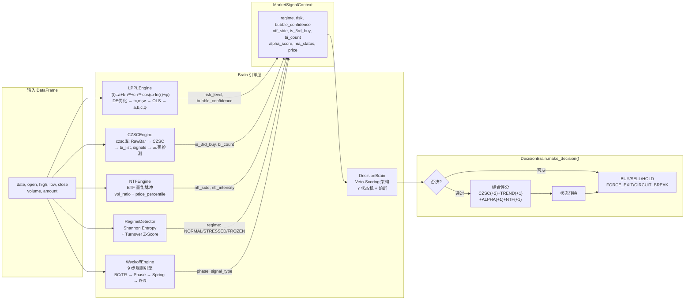
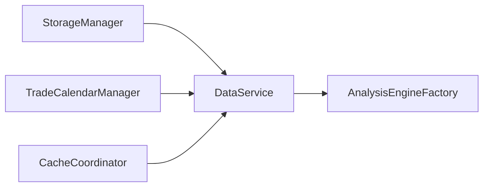

# UniQuant 核心算法与撮合架构白皮书

> **版本**: v0.3+ | **源码快照**: 2026-06-01 (架构内容仍有效，但完成度已过时) | **当前完成度**: ~100% (269 文件, ~59,441 LOC, 8 层全部就绪, 1034+ 测试)
> **代码即真理**: 所有 API 签名、行号引用均从物理源码提取。`[WIP]` 标记表示空壳或桩实现。

---

## 1. 系统架构总览

### 1.1 六层 DAG 架构图

UniQuant 采用严格的六层有向无环图 (DAG) 架构 (L0-L5)，上层依赖下层，**禁止反向依赖和循环引用**。

> **`signal/` 是横切层**: `signal` 包（7 文件，8 Adapters + Arbitrator）的职责是标准化 brain 输出为 `TradingSignal`。它在逻辑上跨越 L2（消费 brain 引擎输出）、L0（`TradingSignal` 类型定义于 `interfaces.py`）和 L4（`adapters.py` 在服务层编排）。架构图中未单独列为一层，但其存在是 L2→L3 信号传输的关键桥梁。



### 1.2 层间依赖规则

| 规则 | 机制 | 来源 |
|------|------|------|
| 单向依赖 | 上层 import 下层, 禁止反向 | `AGENTS.md` |
| 接口解耦 | `@runtime_checkable Protocol` 鸭子类型 | `interfaces.py:102-234` |
| 延迟导入 | `__getattr__` + `importlib.import_module` | `services/__init__.py:16-43` |
| 工厂模式 | `@property` 延迟初始化引擎实例 | `engine_factory.py:20-33` |
| 单例模式 | `ServiceContainer.instance()` / `GlobalConfig` 双重检查锁 | `service_container.py:29-39` |

---

## 2. Protocol 接口定义

**文件**: `src/uniquant/shared/interfaces.py` (302 行)

### 2.1 辅助数据类型

#### `MarketRegime` (Enum) — `interfaces.py:8-12`

```python
class MarketRegime(Enum):
    NORMAL = "NORMAL"       # 正常市场
    STRESSED = "STRESSED"   # 紧张市场 (高波动/流动性枯竭)
    FROZEN = "FROZEN"       # 冻结市场 (极端恐慌)
```

#### `NtfSide` (Enum) — `interfaces.py:15-19`

```python
class NtfSide(Enum):
    NONE = "NONE"             # 无信号
    SUPPORT = "SUPPORT"       # 国家队护盘
    RESISTANCE = "RESISTANCE" # 国家队降温
```

#### `MarketSignalContext` (dataclass) — `interfaces.py:22-99`

```python
@dataclass
class MarketSignalContext:
    """市场信号上下文数据包 — DecisionBrain.make_decision() 的类型化输入"""
    regime: MarketRegime = MarketRegime.NORMAL
    risk: str = "Safe"
    bubble_confidence: float = 0.0
    ntf_side: NtfSide = NtfSide.NONE
    ntf_intensity: float = 0.0
    is_3rd_buy: bool = False
    bi_count: int = 0
    alpha_score: float = 0.0
    ma_status: Optional[str] = None
    price: float = 0.0
    pre_close: float = 0.0
    symbol: str = ""
    name: Optional[str] = None
    atr_stop: float = 0.0
    czsc_bottom: Optional[float] = None
    market: str = "CN"
    returns: Optional[pd.Series] = None
    lppl_days_to_tc: Optional[float] = None

    @classmethod
    def from_dict(cls, data: Dict[str, Any]) -> "MarketSignalContext": ...
    def to_dict(self) -> Dict[str, Any]: ...
```

### 2.2 五大 Protocol 接口

#### `DataFetcherProtocol` — `interfaces.py:102-120`

```python
@runtime_checkable
class DataFetcherProtocol(Protocol):
    def fetch_history(
        self,
        symbol: str,
        start_date: str,
        end_date: str,
        adjust: str = "qfq",
        period: str = "daily",
    ) -> pd.DataFrame: ...
```

#### `RiskAssessmentProtocol` — `interfaces.py:123-140`

```python
@runtime_checkable
class RiskAssessmentProtocol(Protocol):
    def calculate_metrics(self, returns: pd.DataFrame) -> Dict[str, Any]: ...
```

#### `PositionSizerProtocol` — `interfaces.py:143-171`

```python
@runtime_checkable
class PositionSizerProtocol(Protocol):
    def calculate_shares(
        self,
        price: float,
        stop_loss: float,
        czsc_bottom: Any,
        market: str = "CN",
        symbol: str = "UNKNOWN",
    ) -> Dict[str, Any]: ...
```

#### `AnalysisEngineProtocol` — `interfaces.py:174-192`

```python
@runtime_checkable
class AnalysisEngineProtocol(Protocol):
    def analyze(self, data: pd.DataFrame, **kwargs) -> Dict[str, Any]: ...
```

#### `CalculationPluginProtocol` — `interfaces.py:195-234`

```python
@runtime_checkable
class CalculationPluginProtocol(Protocol):
    @property
    def name(self) -> str: ...
    @property
    def version(self) -> str: ...
    @property
    def description(self) -> str: ...
    def calculate(self, data: pd.DataFrame, **kwargs) -> Dict[str, Any]: ...
```

### 2.3 CalculationRegistry (全局插件注册表)

**文件**: `interfaces.py:237-302`

```python
class CalculationRegistry:
    """线程安全的计算插件注册表"""
    def register(self, plugin: CalculationPluginProtocol) -> None: ...
    def unregister(self, plugin_name: str) -> None: ...
    def get(self, plugin_name: str) -> CalculationPluginProtocol: ...  # KeyError if not found
    def list(self) -> List[str]: ...
    def has(self, plugin_name: str) -> bool: ...

# 全局实例
calculation_registry = CalculationRegistry()  # interfaces.py:302
```

---

## 3. Brain 引擎层详解

### 3.1 LPPL 泡沫检测引擎

**包路径**: `src/uniquant/brain/lppl/` (11 个源文件)

#### 3.1.1 核心算法 — LPPL 模型函数

**文件**: `calculator.py:19-39`

LPPL (Log-Periodic Power Law) 模型描述金融泡沫的超指数增长与对数周期振荡:

$$f(t) = a + b \cdot (t_c - t)^m + c \cdot (t_c - t)^m \cdot \cos(\omega \cdot \ln(t_c - t) + \phi)$$

| 参数 | 含义 | 约束 |
|------|------|------|
| $t_c$ | 临界点时间 (crash time) | `(1, 100)` 天 |
| $m$ | 缩放指数 | `(0.1, 0.9)` |
| $\omega$ | 角频率 | `(5, 18)` |
| $a, b, c, \phi$ | 线性参数 | OLS 变量投影法求解 |

#### 3.1.2 LPPLConfig — `engine.py:48-91`

```python
@dataclass
class LPPLConfig:
    window_range: List[int]                       # 窗口列表, 默认 [40, 60, 80]
    optimizer: str = "de"                         # "de" | "lbfgsb"
    maxiter: int = 500                            # 最大迭代次数
    popsize: int = 15                             # DE 种群大小
    tol: float = 0.05                             # 收敛容差
    m_bounds: Tuple[float, float] = (0.1, 0.9)    # 缩放指数范围
    w_bounds: Tuple[float, float] = (5, 18)       # 角频率范围
    tc_bound: Tuple[float, float] = (1, 100)      # 临界点范围
    r2_threshold: float = 0.5                     # R² 阈值
    danger_days: int = 5                          # Danger 天数阈值
    warning_days: int = 12                        # Warning 天数阈值
    watch_days: int = 25                          # Watch 天数阈值
    consensus_threshold: float = 0.5              # 共识阈值
    n_workers: int = -1                           # 并行工作线程 (-1 = CPU-2)
```

#### 3.1.3 三层多窗口拟合系统

**文件**: `multifit.py`

```python
MULTI_WINDOW_CONFIGS = {
    "short":  WindowConfig(windows=[40, 60, 80],   m_bounds=(0.10, 0.25), weight=0.3),
    "medium": WindowConfig(windows=[80, 120, 180],  m_bounds=(0.15, 0.90), weight=0.5),
    "long":   WindowConfig(windows=[180, 240, 360], m_bounds=(0.15, 0.60), weight=0.2),
}
```

综合得分: `final_score = min(1.0, weighted_score + consistency_bonus)`
- 2 层 danger → +0.15 一致性奖励
- 3 层 danger → +0.30 一致性奖励

#### 3.1.4 Numba 差分进化优化器

**文件**: `numba_optimizer.py`

| 函数 | 行号 | 说明 |
|------|------|------|
| `_reduced_cost_numba()` | `:13-97` | JIT 编译的变量投影成本函数 |
| `_solve_linear_parameters_numba()` | `:100-172` | JIT 编译的 OLS 正规方程求解器 |
| `_de_solve_numba()` | `:175-265` | JIT 编译的全功能 DE 优化器 |

DE 参数: `popsize=15, maxiter=500, tol=0.01, mutation=(0.5, 1.0), recombination=0.7, seed=42`

#### 3.1.5 LPPLEngine 主接口 — `engine.py:941-1020`

```python
class LPPLEngine:
    def __init__(self): ...
    def detect_bubble(self, df: pd.DataFrame, column: str = "close") -> Dict[str, Any]: ...
    def detect_bubble_confidence(self, df: pd.DataFrame, column: str = "close") -> Dict[str, Any]: ...
    def calculate_tc_days(self, df: pd.DataFrame, column: str = "close") -> float: ...
    def scan_all_windows(self, df: pd.DataFrame) -> List[Dict]: ...
    def calc_structural_risk_matrix(self, indices_data: Dict[str, pd.DataFrame]) -> Dict[str, Any]: ...
```

**输入 DataFrame**: `date`, `close` (必需), `volume` (可选)

**输出 Schema** (`detect_bubble`):
```python
{
    "is_bubble": bool,
    "tc": float,           # 临界点时间
    "days_to_tc": float,   # 距临界点天数
    "confidence": float,   # 0.0 ~ 1.0
    "lppl_risk": str,      # "Danger" | "Warning" | "Safe"
    "risk_level": str,     # 同上
    "model_params": {"m", "w", "a", "b", "c", "phi"},
    "market_metrics": {"optimization_success", "cost_function_value", "valid_constraints", "data_points"},
}
```

#### 3.1.6 信号聚类检测 — `cluster.py`

`SignalClusterDetector` (`cluster.py:31-124`):
- 窗口: 30 天内 danger 信号 ≥ 3 次 → 100% 对应真实顶部
- 强阈值: 5 次, 中阈值: 3 次, 弱阈值: 1 次
- 衰减半衰期: 15 天

---

### 3.2 CZSC 缠论引擎

**包路径**: `src/uniquant/brain/czsc/` (2 个源文件)

#### 3.2.1 CZSCEngine — `czsc_engine.py:84-622`

```python
class CZSCEngine:
    MIN_DATA_POINTS = DataValidationConstants.MIN_DATA_POINTS  # 30
    REQUIRED_COLUMNS = {"date", "open", "close", "high", "low"}
    VOLUME_COLUMNS = ["volume", "vol"]

    def __init__(self): ...
    def get_czsc_signals(self, df: pd.DataFrame) -> Dict[str, Any]: ...
    def update_and_get_signals(self, df_latest_row: pd.Series) -> Dict[str, Any]: ...
```

| 方法 | 参数 | 返回 | 说明 |
|------|------|------|------|
| `get_czsc_signals` | `df: pd.DataFrame` | `Dict[str, Any]` | 批量分析, 返回完整 CZSC 信号 |
| `update_and_get_signals` | `df_latest_row: pd.Series` | `Dict[str, Any]` | 增量更新, 毫秒级响应 |

#### 3.2.2 CZSCSignalType (Enum) — `czsc_engine.py:31-77`

```python
class CZSCSignalType(Enum):
    FIRST_BUY = "一买"     # 第一类买点 (趋势背驰)
    FIRST_SELL = "一卖"
    SECOND_BUY = "二买"    # 第二类买点 (中枢确认)
    SECOND_SELL = "二卖"
    THIRD_BUY = "三买"     # 第三类买点 (中枢突破)
    THIRD_SELL = "三卖"
    UNKNOWN = "UNKNOWN"
```

#### 3.2.3 `get_czsc_signals` 输出 Schema

```python
{
    "bi_count": int,              # 笔的数量
    "last_bi_direction": int,     # 1=向上, -1=向下, None
    "is_3rd_buy": bool,           # 是否为第三类买点
    "czsc_signal": str,           # "3rd_BUY" | "NONE"
    "bottom_fractal": float,      # 底部分形价格
    "czsc_bottom_price": float,   # 缠论底部价格
    "signals": Dict,              # 原始信号字典
    "geometry_desc": str,         # 几何分析描述
    "analysis_coverage": float,   # 有效K线/总K线
    "error": str | None,
}
```

**输入 DataFrame**: `date`, `open`, `close`, `high`, `low` (必需), `volume`/`vol` (可选)

---

### 3.3 FSM 状态机引擎

**包路径**: `src/uniquant/brain/fsm/` (2 个源文件)

#### 3.3.1 FSMState (Enum) — `fsm.py:27-34`

```python
class FSMState(Enum):
    IDLE = "IDLE"                   # 空闲
    SIGNAL = "SIGNAL"               # 信号触发
    PROBE = "PROBE"                 # 试探性建仓
    MONITOR = "MONITOR"             # 监控持仓
    PYRAMID = "PYRAMID"             # 加仓
    EXIT = "EXIT"                   # 退出
    CIRCUIT_BREAK = "CIRCUIT_BREAK" # 熔断
```

#### 3.3.2 FSM — `fsm.py:45-175`

```python
class FSM:
    _REQUIRED_COLUMNS = frozenset({"close", "high", "low", "open"})

    def __init__(
        self,
        ma_short: int = IndicatorThresholds.FSM_MA_SHORT,   # 默认 20
        ma_long: int = IndicatorThresholds.FSM_MA_LONG,     # 默认 60
        is_intraday: bool = False,
    ): ...

    def infer_state(self, df: pd.DataFrame) -> Dict[str, Any]: ...
```

**状态转换逻辑** (`fsm.py:95-161`):
1. `price > MA60 && prev_price <= prev_MA60` → **SIGNAL**
2. `price > MA60 && MA20 > MA60 && price in [MA20×0.95, MA20×1.05]` → **PROBE**
3. `price > MA60 && MA20 > MA60` → **MONITOR**
4. 其他 → **IDLE**

**防前视偏差**: `is_intraday=True` 时排除最后一根未确定 K 线 (`df.iloc[:-1]`) (`fsm.py:99-106`)

#### 3.3.3 DecisionBrain — `fsm.py:178-707` (Veto-Scoring 架构)

```python
class DecisionBrain:
    def __init__(
        self,
        evt_risk: Optional[RiskAssessmentProtocol] = None,
        sizer: Optional[PositionSizerProtocol] = None,
        persist_state: bool = True,
        state_file: Optional[str] = None,
        data_service: Any = None,
    ): ...

    def make_decision(self, data_packet: Union[dict, MarketSignalContext]) -> Dict[str, Any]: ...
    def reset_state(self): ...
    def get_state(self) -> FSMState: ...
```

**决策流水线**:



**综合评分规则** (`fsm.py:267-278`):

| 信号源 | 条件 | 分值 |
|--------|------|------|
| CZSC | `is_3rd_buy == True` | +2 |
| TREND | `ma_status == "MA20 > MA60"` | +1 |
| ALPHA | `alpha_score > 0` | +1 |
| NTF | `ntf_side == SUPPORT` | +1 |

**合法状态转换矩阵** (`fsm.py:425-437`):

```python
valid_transitions = {
    IDLE:            [SIGNAL, PROBE, CIRCUIT_BREAK],
    SIGNAL:          [PROBE, IDLE, CIRCUIT_BREAK],
    PROBE:           [MONITOR, IDLE, EXIT, CIRCUIT_BREAK],
    MONITOR:         [PYRAMID, EXIT, IDLE, CIRCUIT_BREAK],
    PYRAMID:         [MONITOR, EXIT, CIRCUIT_BREAK],
    EXIT:            [IDLE, CIRCUIT_BREAK],
    CIRCUIT_BREAK:   [IDLE],
}
```

**熔断机制** (`fsm.py:521-554`): 当日跌幅超过 `brain.fsm.circuit_break_threshold` (默认 -5%) → 强制进入 `CIRCUIT_BREAK`; 跌幅回到阈值内 → 恢复 `IDLE`

**状态持久化**: JSON 文件 + FileLock (`fsm.py:640-707`)

---

### 3.4 Wyckoff 威科夫引擎

**包路径**: `src/uniquant/brain/wyckoff/` (10 个源文件, v3.0)

#### 3.4.1 WyckoffEngine — `engine.py:64-1456`

```python
class WyckoffEngine:
    def __init__(
        self,
        lookback_days: int = 120,
        weekly_lookback: int = 180,
        monthly_lookback: int = 120,
        is_st: bool = False,
    ): ...

    def analyze(
        self,
        df: pd.DataFrame,
        symbol: str = "UNKNOWN",
        period: str = "日线",
        multi_timeframe: bool = False,
        image_evidence: Optional[ImageEvidenceBundle] = None,
    ) -> WyckoffReport: ...

    def scan_signal(self, df: pd.DataFrame, symbol: str = "UNKNOWN") -> dict: ...
```

#### 3.4.2 九步分析流程

| Step | 方法 | 说明 | 行号 |
|------|------|------|------|
| 0 | `_step0_bc_tr_scan` | BC/TR 定位扫描, 向量化评分 | `:238-267` |
| 1 | `_step1_phase_determine` | 阶段判定: ACCUMULATION/MARKUP/DISTRIBUTION/MARKDOWN | `:269-458` |
| 2 | `_step2_effort_result` | 努力与结果: 量价背离、缺口检测 | `:460-577` |
| 3 | `_step3_phase_c_t1` | Spring/UTAD + T+1 风险 | `:579-684` |
| 3.5 | `_step35_counterfactual` | 反事实压力测试 | `:686-742` |
| 4 | `_step4_risk_reward` | 盈亏比投影 (目标 ≥ 1:2.5) | `:744-828` |
| 5 | `_step5_trading_plan` | 交易计划生成 | `:865-1016` |

#### 3.4.3 V3Rules — `rules.py:21-352`

| 规则 | 方法 | 说明 |
|------|------|------|
| Rule 1 | `rule1_relative_volume` | 相对量能分类 (30 日均量) |
| Rule 2 | `rule2_no_long_in_markdown` | Markdown/Distribution 禁止做多 |
| Rule 3 | `rule3_t1_risk_test` | T+1 极限回撤测试 |
| Rule 4 | `rule4_no_trade_zone` | 信号矛盾强制空仓 |
| Rule 5 | `rule5_bc_tr_fallback` | BC/TR 降级策略 |
| Rule 6 | `rule6_spring_validation` | Spring 结构事件验证 + 作废逻辑 |
| Rule 7 | `rule7_counterfactual` | 反事实仲裁 |
| Rule 8 | `rule8_confidence_matrix` | 5 条件置信度矩阵 (A/B/C/D) |
| Rule 9 | `rule9_multiframe_alignment` | 多周期一致性 |
| Rule 10 | `rule10_stop_loss` | 精确止损 (关键低点 × 0.995) |

#### 3.4.4 WyckoffPhase (Enum) — `models.py:11-18`

```python
class WyckoffPhase(Enum):
    ACCUMULATION = "accumulation"   # 吸筹
    MARKUP = "markup"               # 上涨
    DISTRIBUTION = "distribution"   # 派发
    MARKDOWN = "markdown"           # 下跌
    UNKNOWN = "unknown"
```

#### 3.4.5 输出数据结构 — `models.py:660-680`

```python
@dataclass
class WyckoffReport:
    symbol: str
    period: str
    structure: WyckoffStructure
    signal: WyckoffSignal
    risk_reward: RiskRewardProjection
    trading_plan: TradingPlan
    limit_moves: List[LimitMove]
    stress_tests: List[StressTest]
    chip_analysis: Optional[ChipAnalysis]
    engine_version: str = "v3.0"
    image_evidence: Optional[ImageEvidenceBundle]
    multi_timeframe: Optional[MultiTimeframeContext]
```

**输入 DataFrame**: `date`, `open`, `high`, `low`, `close` (必需), `volume`/`vol` (推荐), `amount` (可选)

---

### 3.5 NTF 国家队因子引擎

**包路径**: `src/uniquant/brain/ntf/` (2 个源文件)

#### 3.5.1 NTFEngine — `ntf_engine.py:17-183`

```python
class NTFEngine:
    def __init__(self, volume_ratio_threshold: Optional[float] = None): ...
    def detect_intervention(self, etf_df: pd.DataFrame, window: Optional[int] = None) -> Dict[str, Any]: ...
    def scan_for_giants(self, market_data: Dict[str, pd.DataFrame]) -> Dict: ...
```

**算法** (`ntf_engine.py:54-105`):
1. `vol_ratio = curr_volume / mean_volume[-(window+1):-1]`
2. `price_percentile` (近 20 天分位数)
3. 判定: `vol_ratio >= threshold` 时:
   - `price_percentile < panic_threshold` → **SUPPORT** (护盘买入)
   - `price_percentile > heat_threshold` → **RESISTANCE** (降温卖出)
   - 其他 → **LIQUIDITY_PULSE**

**输出 Schema**:
```python
{"detected": bool, "side": str, "volume_ratio": float, "price_percentile": float, "confidence": float, "action": str}
```

**输入 DataFrame**: `close`, `volume`/`vol` (必需)

---

### 3.6 Regime 流动性状态检测器

**包路径**: `src/uniquant/brain/regime/` (2 个源文件)

#### 3.6.1 Regime (Enum) — `regime_detector.py:18-22`

```python
class Regime(Enum):
    NORMAL = "NORMAL"
    STRESSED = "STRESSED"
    FROZEN = "FROZEN"
    UNKNOWN = "UNKNOWN"
```

#### 3.6.2 RegimeDetector — `regime_detector.py:29-272`

```python
class RegimeDetector:
    def __init__(
        self,
        entropy_threshold: Optional[float] = None,
        turnover_z_limit: Optional[float] = None,
        min_data_points: Optional[int] = None,
    ): ...
    def detect(self, df: pd.DataFrame) -> Regime: ...
    def get_summary(self, df: pd.DataFrame) -> Dict[str, Any]: ...
```

**算法** (`regime_detector.py:140-189`):
1. Shannon Entropy: `entropy_series = Indicators.calc_market_entropy(df)` → `e_pct < threshold` → **FROZEN**
2. Turnover Z-Score: `z_series = Indicators.calc_turnover_z(df)` → `|curr_z| > limit` → **STRESSED**
3. 其他 → **NORMAL**

**输入 DataFrame**: `close`, `volume` (必需)

---

## 4. A 股撮合规则引擎

### 4.1 撮合状态机



### 4.2 T+1 规则

**实现位置**: `engine.py:114-139` (BacktestEngine), `unified_matching_engine.py:168-183` (UnifiedMatchingEngine)

```python
def _check_t1_constraint(self, buy_date: datetime, current_date: datetime) -> bool:
    # 使用 TradeCalendarManager 查询真实交易日历
    # current_idx[0] - buy_idx[0] >= 1 才允许卖出
```

- 使用**真实交易日历** (`TradeCalendarManager`), 非简单日期差
- 保守策略: 无法确认交易日历时拒绝卖出 (`engine.py:129`)
- 买入日期不在交易日历中时拒绝卖出 (`engine.py:136`)

### 4.3 涨跌停检查

**实现位置**: `src/uniquant/shared/limit_checker.py`

#### 板块识别 — `limit_checker.py:28-66`

```python
def get_board_type(symbol: str, name: Optional[str] = None) -> str:
    # 返回: "main" | "sci_tech" | "gem" | "st" | "beijing"
```

#### 涨跌停比例

| 板块类型 | 代码前缀 | 涨跌停比例 | 来源 |
|---------|---------|-----------|------|
| 主板 | 600, 601, 603, 605, 000, 001, 002 | ±10% | `constants/market.py:76-82` |
| 科创板 | 688, 689 | ±20% | 同上 |
| 创业板 | 300, 301, 302 | ±20% | 同上 |
| 北交所 | 83, 87, 920 | ±30% | 同上 |
| ST 股 | 名称以 ST/*ST 开头 | ±5% | 同上 |

#### IPO 特殊规则 — `limit_checker.py:109-148`

| 板块 | IPO 规则 |
|------|---------|
| 科创板/创业板 | 前 5 个交易日无涨跌停限制 |
| 北交所 | 首个交易日无涨跌停限制 |
| 主板 IPO 首日 | +44%/-36% |

#### LimitStatus 数据类 — `limit_checker.py:16-26`

```python
@dataclass
class LimitStatus:
    is_limit_up: bool
    is_limit_down: bool
    can_buy: bool
    can_sell: bool
    board_type: str
    up_limit_price: float
    down_limit_price: float
    price_ratio: float
```

### 4.4 成本与滑点模型

#### 4.4.1 CostConfig — `cost_model.py:58-123`

```python
@dataclass
class CostConfig:
    buy_fee_pct: float = 0.0003       # 万3 佣金
    sell_fee_pct: float = 0.0003      # 万3 佣金
    stamp_tax_pct: float = 0.0005     # 万5 印花税 (仅卖出, 2023-08-28 起)
    slippage_pct: float = 0.0005      # 万5 滑点
    min_commission: float = 5.0       # 最低 5 元/笔
    transfer_fee_pct: float = 0.00001 # 万0.1 过户费
```

成本常量 (`cost_model.py:26-36`):
```python
COMMISSION_PCT: float = 0.0003       # 万3
STAMP_TAX_PCT: float = 0.0005        # 万5 (仅卖出)
MIN_COMMISSION: float = 5.0          # 单笔最低 5 元
SLIPPAGE_PCT: float = 0.0005         # 万5
COST_BUY = COMMISSION_PCT            # 0.03%
COST_SELL = COMMISSION_PCT + STAMP_TAX_PCT  # 0.08%
```

#### 4.4.2 非线性滑点模型 — `backtest/engine.py:77-112`

```python
def _calculate_slippage(self, price, is_buy, volume, avg_daily_volume) -> float:
    base_slippage = self.slippage_rate                       # 0.05% 基础滑点
    impact_slippage = 0.001 * (volume_ratio ** 0.5)          # 非线性冲击
    impact_slippage = min(impact_slippage, 0.02)             # 上限 2%
    total_slippage = base_slippage + impact_slippage
```

**UnifiedMatchingEngine 向量化版本** — `unified_matching_engine.py:61-76`:
```python
def compute_execution_prices(self, prices, volumes, avg_daily_volumes, is_buy) -> np.ndarray:
    vol_ratios = np.minimum(volumes / np.maximum(avg_daily_volumes, 1e-8), 1.0)
    impact = np.minimum(0.001 * np.sqrt(vol_ratios), 0.02)
    total_slip = self.slippage_rate + impact
    direction = 1.0 if is_buy else -1.0
    return prices * (1.0 + direction * total_slip)
```

#### 4.4.3 SlippageModel ABC — `slippage_model.py`

```python
class SlippageModel(ABC):
    @abstractmethod
    def estimate(self, symbol: str, quantity: int, direction: str,
                 price: float, timestamp: datetime) -> float: ...

class DefaultSlippage(SlippageModel):   # 返回固定 SLIPPAGE_PCT (0.05%)
class DynamicSlippage(SlippageModel):   # 流动性 + 波动率 + 市场冲击 + 时间衰减
```

DynamicSlippage (`slippage_model.py:20-44`):
- `_market_impact`: `min(0.003, ratio × 0.01)` — 非线性
- `_time_decay`: 开盘/收盘 30 分钟内 +0.05%
- 最终范围: `[0.01%, 0.5%]`

---

## 5. Brain 引擎数据流总图



---

## 6. 服务编排层

### 6.1 DAG 容器

**文件**: `src/uniquant/services/service_container.py`

```python
class ServiceContainer:
    _instance: Optional["ServiceContainer"] = None

    @classmethod
    def instance(cls) -> "ServiceContainer": ...   # 单例
    def register(self, name: str, service: Any): ...
    def get(self, name: str) -> Any: ...
    def initialize(self) -> None: ...              # 拓扑初始化全部服务
```

**初始化拓扑顺序** (`service_container.py:54-82`):



| 序号 | 服务 | 注册名 |
|------|------|--------|
| 1 | `StorageManager()` | `"storage"` |
| 2 | `TradeCalendarManager()` | `"calendar"` |
| 3 | `CacheCoordinator()` | `"cache"` |
| 4 | `StockQueryService()` | (不注册) |
| 5 | `DataService(storage, cache, stock_query)` | `"data_service"` |
| 6 | `AnalysisEngineFactory(orchestrator=data_svc)` | `"engine_factory"` |

### 6.2 引擎工厂

**文件**: `src/uniquant/services/analysis/engine_factory.py`

```python
class AnalysisEngineFactory:
    def __init__(self, orchestrator): ...
```

**9 个延迟初始化引擎** (`engine_factory.py:35-79`):

| 属性 | 模块路径 | 类名 |
|------|----------|------|
| `fsm` | `..analysis.fsm_analysis_engine` | `FsmAnalysisEngine` |
| `czsc` | `..analysis.czsc_analysis_engine` | `CzscAnalysisEngine` |
| `lppl` | `..analysis.lppl_analysis_engine` | `LpplAnalysisEngine` |
| `regime` | `..analysis.regime_analysis_engine` | `RegimeAnalysisEngine` |
| `ntf` | `..analysis.ntf_analysis_engine` | `NtfAnalysisEngine` |
| `macro` | `..analysis.macro_analysis_engine` | `MacroAnalysisEngine` |
| `report` | `..analysis.report_generator_engine` | `ReportGeneratorEngine` |
| `brain` | 直接导入 `DecisionBrain` | `DecisionBrain` |
| `wyckoff` | `..analysis.wyckoff_analysis_engine` | `WyckoffAnalysisEngine` |

**懒加载机制** (`engine_factory.py:20-33`):
```python
def _lazy_init(self, name, module_path, class_name, **kwargs) -> Any:
    if name not in self._engines:
        with self._lock:  # RLock, 双重检查锁
            if name not in self._engines:
                mod = importlib.import_module(module_path, package=__package__)
                cls = getattr(mod, class_name)
                self._engines[name] = cls(orchestrator=self._orchestrator, **kwargs)
    return self._engines[name]
```

---

## 7. Hands 层 (回测与策略)

### 7.1 BacktestEngine — `hands/backtest/engine.py:25-536`

```python
class BacktestEngine:
    def __init__(
        self,
        initial_capital: float = BacktestConstants.DEFAULT_INITIAL_CAPITAL,  # 100000.0
        commission_rate: float = BacktestConstants.DEFAULT_COMMISSION_RATE,  # 0.0003
        stamp_duty_rate: float = BacktestConstants.DEFAULT_STAMP_DUTY_RATE, # 0.0005
        slippage_rate: float = BacktestConstants.DEFAULT_SLIPPAGE_RATE,     # 0.0005
        min_commission: float = BacktestConstants.DEFAULT_MIN_COMMISSION,   # 5.0
        trade_calendar: Optional[TradeCalendarManager] = None,
    ): ...

    def run_backtest(self, df, signal_generator, symbol, name, position_size) -> BacktestResult: ...
    def run_rolling_backtest(self, df, signal_generator, ...) -> List[BacktestResult]: ...
    def run_walk_forward(self, df, signal_generator_factory, ...) -> List[BacktestResult]: ...
    def run_stress_test(self, df, signal_generator, ..., scenarios) -> Dict[str, BacktestResult]: ...
    def execute_buy(self, price, shares, timestamp, ...) -> Optional[TradeRecord]: ...
    def execute_sell(self, price, shares, timestamp, ...) -> Optional[TradeRecord]: ...
```

### 7.2 UnifiedMatchingEngine — `hands/backtest/unified_matching_engine.py:33-207`

向量化撮合引擎:

```python
class UnifiedMatchingEngine:
    def __init__(
        self,
        commission_rate: float,
        stamp_duty_rate: float = 0.0005,
        min_commission: float,
        slippage_rate: float,
        trade_calendar: Optional[TradeCalendarManager] = None,
    ): ...

    def fill_buy(self, prices, shares_requested, cash_available, pre_closes, symbols, ...) -> FillResult: ...
    def fill_sell(self, prices, shares_requested, positions_held, ...) -> FillResult: ...
    def compute_execution_prices(self, prices, volumes, avg_daily_volumes, is_buy) -> np.ndarray: ...
    def compute_limit_status_vectorized(self, prices, pre_closes, symbols) -> Dict: ...
```

### 7.3 Hands 层其他模块

| 模块 | 文件 | 说明 |
|------|------|------|
| `PortfolioEngine` | `hands/backtest/portfolio_engine.py` | 组合级回测引擎 |
| `MonteCarloSimulator` | `hands/backtest/monte_carlo.py` | 蒙特卡洛模拟 |
| `OverfittingDetector` | `hands/backtest/overfitting_detector.py` | 过拟合检测 |
| `RobustnessChecker` | `hands/backtest/robustness_checker.py` | 鲁棒性检验 |
| `SensitivityAnalyzer` | `hands/backtest/sensitivity_analyzer.py` | 敏感性分析 |
| `SignalIntegrator` | `hands/backtest/signal_integrator.py` | 多信号整合 |
| `ReportGenerator` | `hands/backtest/report_generator.py` | 回测报告生成 |
| `BacktestResult` | `hands/backtest/result.py` | 回测结果数据类 |
| `TradeRecord` | `hands/backtest/result.py` | 交易记录数据类 |
| `strategies/` | `hands/strategies/` | 策略库目录 |
| `tuning/` | `hands/tuning/` | 参数调优目录 |
| `reporter.py` | `hands/reporter.py` | 报告器 |
| `results_manager.py` | `hands/results_manager.py` | 结果管理器 |

### 7.4 BacktestResult & TradeRecord — `result.py`

```python
@dataclass
class TradeRecord:
    timestamp: datetime
    action: str           # "BUY" | "SELL"
    price: float
    shares: int
    commission: float
    slippage: float
    pnl: float = 0.0
    pnl_pct: float = 0.0
    reason: str = ""

@dataclass
class BacktestResult:
    initial_capital: float
    final_capital: float
    total_return: float
    annualized_return: float
    max_drawdown: float
    sharpe_ratio: float
    win_rate: float
    profit_factor: float
    total_trades: int
    winning_trades: int
    losing_trades: int
    avg_win: float
    avg_loss: float
    avg_holding_days: float
    trades: List[TradeRecord]
    equity_curve: List[float]
    daily_returns: List[float]
```

---

## 附录 A: 文件索引

| 层 | 文件 | 行数 | 状态 |
|---|------|------|------|
| shared | `shared/interfaces.py` | 302 | ✅ |
| shared | `shared/limit_checker.py` | 302 | ✅ |
| shared | `shared/cost_model.py` | 123 | ✅ |
| shared | `shared/slippage_model.py` | 44 | ✅ |
| brain/lppl | `lppl/engine.py` | 1020 | ✅ |
| brain/lppl | `lppl/calculator.py` | 601 | ✅ |
| brain/lppl | `lppl/numba_optimizer.py` | 265 | ✅ |
| brain/lppl | `lppl/multifit.py` | 270 | ✅ |
| brain/lppl | `lppl/cluster.py` | 124 | ✅ |
| brain/lppl | `lppl/regime.py` | 142 | ✅ |
| brain/czsc | `czsc/czsc_engine.py` | 622 | ✅ |
| brain/fsm | `fsm/fsm.py` | 707 | ✅ |
| brain/wyckoff | `wyckoff/engine.py` | 1456 | ✅ |
| brain/wyckoff | `wyckoff/models.py` | 817 | ✅ |
| brain/wyckoff | `wyckoff/rules.py` | 352 | ✅ |
| brain/ntf | `ntf/ntf_engine.py` | 183 | ✅ |
| brain/regime | `regime/regime_detector.py` | 272 | ✅ |
| hands | `hands/backtest/engine.py` | 536 | ✅ |
| hands | `hands/backtest/unified_matching_engine.py` | 207 | ✅ |
| hands | `hands/backtest/result.py` | 163 | ✅ |
| services | `services/service_container.py` | 83 | ✅ |
| services | `services/analysis/engine_factory.py` | 79 | ✅ |

**历史备注 (2026-06-01)**: 以下模块当时为有限实现；当前已全部功能完善（见 [risk package](../packages/risk.md)）:
- `risk/sizer.py` → `PositionSizer`: 已实现 kelly/penalty/shares 计算
- `risk/evt_risk.py` → `HistoricalSimulationRisk`: 已实现 VaR/CVaR/相关性/回撤等指标

---

## 附录 B: A 股约束速查表

| 约束 | 值 | 来源 |
|------|-----|------|
| 主板涨跌停 | ±10% | `constants/market.py:76` |
| 科创板/创业板 | ±20% | `constants/market.py:78-79` |
| 北交所 | ±30% | `constants/market.py:80` |
| ST 股 | ±5% | `constants/market.py:77` |
| 佣金 | 0.03% (万3) | `cost_model.py:27` |
| 印花税 | 0.05% (万5, 卖方) | `cost_model.py:29` |
| 最低佣金 | 5 元/笔 | `cost_model.py:31` |
| 滑点 | 0.05% (万5) | `cost_model.py:32` |
| 交易时段 | 9:30-11:30, 13:00-15:00 | `constants/market.py:116-123` |
| 集合竞价 | 9:15-9:25 (早), 14:57-15:00 (深) | `constants/market.py:126-133` |
| 价格容差 | 0.1% | `constants/market.py:85` |

---

*文档基于代码事实提取 | 生成时间: 2026-06-01 | 文件行号引用均为精确位置*
