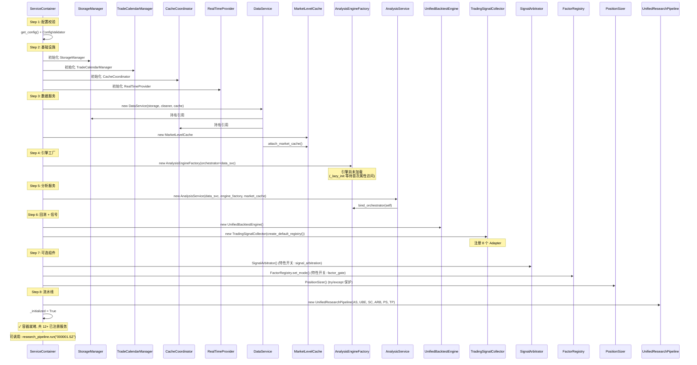

# UniQuant 部署架构白皮书

> **版本**: v0.3+ | **源码快照**: 2026-06-17 | **Python**: ≥ 3.12
> **层数**: 8 层 (shared → data → brain/risk/signal → hands → services → ui)
> **代码即真理**: 所有组件名、类名、服务名均与物理源码 `src/uniquant/` 一致。

---

## 目录

1. [部署拓扑图](#1-部署拓扑图)
2. [组件说明表](#2-组件说明表)
3. [部署模式](#3-部署模式)
4. [系统需求](#4-系统需求)
5. [关键路径解释](#5-关键路径解释)
6. [附录: 配置项参考](#6-附录-配置项参考)

---

## 1. 部署拓扑图

### 1.1 单机全量部署拓扑

下列 Mermaid 图展示 UniQuant 在单机全量模式下的完整架构。箭头方向表示数据流动方向。

```mermaid
graph TD
    %% ── 样式定义 ──
    classDef dev fill:#e3f2fd,stroke:#1565c0,stroke-width:2px,color:#000
    classDef source fill:#fff3e0,stroke:#e65100,stroke-width:2px,color:#000
    classDef lake fill:#e8f5e9,stroke:#2e7d32,stroke-width:2px,color:#000
    classDef compute fill:#f3e5f5,stroke:#6a1b9a,stroke-width:2px,color:#000
    classDef signal fill:#fce4ec,stroke:#c62828,stroke-width:2px,color:#000
    classDef cache fill:#e0f2f1,stroke:#00695c,stroke-width:2px,color:#000
    classDef presentation fill:#fff8e1,stroke:#f57f17,stroke-width:2px,color:#000
    classDef infra fill:#eceff1,stroke:#37474f,stroke-width:2px,color:#000
    classDef dep fill:#f5f5f5,stroke:#9e9e9e,stroke-width:1px,stroke-dasharray: 3 3,color:#000

    %% ── 边界: 开发工作站 vs 生产服务器 ──
    subgraph Workstation["💻 开发工作站 (Developer Workstation)"]
        direction TB
        IDE["IDE / 终端<br/>源码编辑 + 调试"]
        LOCAL_DATA["本地 TDX 数据文件<br/>~/.local/share/tdxcfv/"]
        GIT["Git 仓库<br/>config/ + scripts/"]
    end

    subgraph Server["🖥️ 生产服务器 (Production Server)"]
        direction TB

        %% ── L1: 数据源层 ──
        subgraph L1["L1: 数据源层 (Data Sources)"]
            TDX["MootdxLocalSource<br/>通达信本地文件<br/>mootdx Reader.factory"]
            ON_TDX["MootdxOnlineSource<br/>通达信在线行情<br/>mootdx Quotes.factory"]
            AKSHARE["AkShare<br/>akshare 免费行情"]
            BAOSTOCK["BaoStockSource<br/>baostock 证券行情<br/>[已禁用]"]
            SINA["SinaSource<br/>新浪财经实时<br/>[已禁用]"]
            TENCENT["TencentSource<br/>腾讯财经实时<br/>[已禁用]"]
            EASTMONEY["EastmoneySource<br/>东方财富<br/>[已禁用]"]
            STOCK_DS["StockDataSource ★<br/>合并数据源<br/>priority=1"]
            INDEX_DS["IndexDataSource ★<br/>指数数据源<br/>priority=2"]
            ETF_DS["EtfDataSource ★<br/>ETF 数据源<br/>priority=3"]
        end

        %% ── L1.5: 源路由 + 管道 ──
        subgraph L1_Router["数据路由与管道 (Data Routing & Pipeline)"]
            ROUTER["SourceRouter<br/>故障转移 + 竞速<br/>source_router.py"]
            PIPELINE["DataPipelineService<br/>Cleaner → Validator → Adjuster"]
        end

        %% ── L2: 数据湖层 ──
        subgraph L2["L2: 数据湖层 (Data Lake)"]
            SM["StorageManager<br/>Parquet 文件管理<br/>599 LOC"]
            LAKE_FILES["📁 Parquet + Snappy 文件<br/>data/lake/quotes/daily/*.parquet<br/>data/lake/index/*.parquet<br/>data/lake/quotes/1mins/*.parquet"]
            DUCKDB["DuckDB 引擎<br/>嵌入式分析 SQL<br/>engine=duckdb"]
            TCM["TradeCalendarManager<br/>交易日历<br/>A 股交易日判定"]
        end

        %% ── L3: 缓存层 ──
        subgraph L3["L3: 缓存层 (Caching)"]
            CC["CacheCoordinator<br/>磁盘缓存<br/>TTL 策略: stock=3600s<br/>realtime=60s"]
            MLC["MarketLevelCache<br/>市场级共享缓存<br/>Regime / NTF / Benchmark<br/>线程安全锁保护"]
            DISK_CACHE["📁 磁盘缓存文件<br/>data/cache/*.joblib"]
        end

        %% ── L4: 服务编排层 (含计算) ──
        subgraph L4["L4: 服务编排层 (Service Orchestration)"]
            CONTAINER["ServiceContainer<br/>DAG 单例容器<br/>双重检查锁"]

            subgraph DataSvc["数据服务"]
                DS["DataService<br/>数据访问门面<br/>三级降级: 缓存→源→湖"]
                SQS["StockQueryService<br/>代码→名称映射"]
                DQS["DataQualityService<br/>数据质量检查"]
            end

            subgraph Compute["计算引擎"]
                EF["AnalysisEngineFactory<br/>9 引擎延迟注册<br/>importlib 动态加载"]
                AS["AnalysisService<br/>纯流程编排器<br/>300 LOC"]
                RP["UnifiedResearchPipeline<br/>端到端流水线<br/>分析→信号→回测"]
            end

            subgraph Engines["9 个分析引擎"]
                FSM["FsmAnalysisEngine<br/>状态机 + 熔断"]
                CZSC["CzscAnalysisEngine<br/>缠论 笔段中枢"]
                LPPL["LpplAnalysisEngine<br/>泡沫检测 DE 优化"]
                REG["RegimeAnalysisEngine<br/>熵值 + Z-Score"]
                NTF["NtfAnalysisEngine<br/>国家队量能脉冲"]
                WYCK["WyckoffAnalysisEngine<br/>9 步规则引擎"]
                MACRO["MacroAnalysisEngine<br/>宏观健康分析"]
                BRAIN["DecisionBrain<br/>Veto-Scoring 决策"]
                REPORT["ReportGeneratorEngine<br/>报告生成"]
            end

            subgraph Signal["信号层"]
                COLLECTOR["TradingSignalCollector<br/>8 Adapter 收集器"]
                ADAPTERS["8 个适配器:<br/>LPPL/CZSC/Wyckoff/FSM<br/>Regime/NTF/Alpha/MA"]
                ARB["SignalArbitrator<br/>SELL 优先仲裁<br/>引擎优先级排序"]
            end

            subgraph Backtest["回测执行"]
                UBE["UnifiedBacktestEngine<br/>信号驱动回测"]
                UME["UnifiedMatchingEngine<br/>向量化 A 股撮合<br/>T+1 / 涨跌停 / 滑点"]
                PE["PortfolioEngine<br/>组合级回测"]
                BT_RES["BacktestResult<br/>回测结果数据类"]
            end

            subgraph Risk["风控"]
                PS["PositionSizer<br/>Kelly/Penalty/股数"]
                DA["DrawdownAnalyzer<br/>回撤分析"]
                EVTR["HistoricalSimulationRisk<br/>VaR / CVaR"]
                PO["PortfolioOptimizer<br/>组合优化"]
            end

            subgraph Support["支持服务"]
                HS["HealthService<br/>系统健康监控<br/>CPU/内存/磁盘/组件"]
                EVENT_BUS["EventBus<br/>Sync + Async<br/>ThreadPoolExecutor"]
                TIME["RealTimeProvider<br/>FrozenTimeProvider<br/>可测试时间"]
                FACT_GATE["FactorRegistry<br/>因子准入模式<br/>warn/off/enforce"]
            end
        end

        %% ── L5: 展示层 ──
        subgraph L5["L5: 展示层 (Presentation)"]
            DASHBOARD["Streamlit Dashboard<br/>1518 LOC<br/>streamlit run"]
            REPORT_UI["研究报告 UI<br/>LPPL 可视化<br/>组合持仓展示"]
        end
    end

    %% ── 部署方式切换 ──
    subgraph Config["⚙️ 配置与基础设施"]
        CFG["GlobalConfig 单例<br/>config/config.yaml<br/>UNIQUANT_ 环境变量"]
        LOGS["日志文件<br/>logs/*.log<br/>Loguru"]
    end

    %% ── 数据流 ──
    IDE --> GIT
    GIT --> CFG
    LOCAL_DATA --> TDX

    %% 数据源 → 路由
    TDX --> ROUTER
    ON_TDX --> ROUTER
    AKSHARE --> ROUTER
    BAOSTOCK --> ROUTER
    SINA --> ROUTER
    TENCENT --> ROUTER
    EASTMONEY --> ROUTER
    STOCK_DS --> ROUTER
    INDEX_DS --> ROUTER
    ETF_DS --> ROUTER

    %% 路由 → 管道 → 数据湖
    ROUTER --> PIPELINE
    PIPELINE --> SM
    SM --> LAKE_FILES
    SM --> DUCKDB
    TCM --> SM

    %% 数据湖 → 缓存
    SM --> DS
    SM --> CC
    CC --> DISK_CACHE
    DS --> MLC

    %% 缓存 → 分析引擎
    DS --> AS
    MLC --> AS
    CC --> AS
    AS --> EF
    EF --> FSM
    EF --> CZSC
    EF --> LPPL
    EF --> REG
    EF --> NTF
    EF --> WYCK
    EF --> MACRO
    EF --> BRAIN
    EF --> REPORT

    %% 分析 → 信号
    AS --> COLLECTOR
    COLLECTOR --> ADAPTERS
    ADAPTERS --> ARB

    %% 信号 → 回测
    ARB --> RP
    RP --> UBE
    UBE --> UME
    UME --> BT_RES
    UME --> PE

    %% 风控集成
    PS --> ARB
    PS --> RP
    EVTR --> BRAIN
    DA --> PE

    %% 回测 → UI
    BT_RES --> RP
    RP --> DASHBOARD
    RP --> REPORT_UI

    %% 支持服务集成
    HS --> DS
    HS --> AS
    HS --> CC
    TIME --> AS
    TIME --> RP
    EVENT_BUS --> AS
    EVENT_BUS --> RP
    FACT_GATE --> EF
    CONTAINER --> DS
    CONTAINER --> EF
    CONTAINER --> AS
    CONTAINER --> RP

    %% 配置
    CFG --> CONTAINER
    CFG --> CC
    LOGS --> HS

    %% 环境变量注入
    ENV["UNIQUANT_ 环境变量"] -.-> CFG

    %% ── 样式应用 ──
    class Workstation,IDE,GIT,LOCAL_DATA dev
    class TDX,ON_TDX,AKSHARE,BAOSTOCK,SINA,TENCENT,EASTMONEY,STOCK_DS,INDEX_DS,ETF_DS source
    class SM,LAKE_FILES,DUCKDB,TCM lake
    class EF,AS,RP,FSM,CZSC,LPPL,REG,NTF,WYCK,MACRO,BRAIN,REPORT compute
    class COLLECTOR,ADAPTERS,ARB signal
    class CC,MLC,DISK_CACHE cache
    class DASHBOARD,REPORT_UI presentation
    class CFG,LOGS,ENV,CONTAINER,HS,EVENT_BUS,TIME,FACT_GATE infra
    class ROUTER,PIPELINE,DS,SQS,DQS,UBE,UME,PE,BT_RES,PS,DA,EVTR,PO dep
```



### 1.2 部署边界说明

| 边界 | 网络需求 | 典型配置 |
|------|---------|---------|
| **开发工作站** | 无需连接生产环境 | Linux/macOS, Python 3.12, TDX 本地数据文件 |
| **生产服务器** | 需访问数据源 API (互联网) | Linux 服务器, 无 GUI, 定时任务驱动 |
| **配置同步** | 通过 Git 推送 `config/config.yaml` | `git pull` + `config.reload()` |

---

## 2. 组件说明表

### 2.1 数据源层 (L1)

| 组件名 | 类/模块 | 文件 | 职责 | 状态 |
|--------|---------|------|------|------|
| `StockDataSource` | `data.sources.stock_sources.StockDataSource` | `stock_sources.py` | 合并股票数据源 (优先) | ✅ 启用 |
| `IndexDataSource` | `data.sources.index_sources.IndexDataSource` | `index_sources.py` | 指数数据源 | ✅ 启用 |
| `EtfDataSource` | `data.sources.etf_sources.EtfDataSource` | `etf_sources.py` | ETF 数据源 | ✅ 启用 |
| `MootdxLocalSource` | `data.sources.mootdx_local.MootdxLocalSource` | `mootdx_local.py` | 通达信本地文件读取 (离线) | ✅ |
| `MootdxOnlineSource` | `data.sources.mootdx_online.MootdxOnlineSource` | `mootdx_online.py` | 通达信在线行情 | ✅ |
| `SinaSource` | `data.sources.sina.SinaSource` | `sina.py` | 新浪财经实时数据 | ✅ (已禁用) |
| `TencentSource` | `data.sources.tencent.TencentSource` | `tencent.py` | 腾讯财经实时数据 | ✅ (已禁用) |
| `BaoStockSource` | `data.sources.baostock.BaostockSource` | `baostock.py` | BaoStock 证券行情 | ✅ (已禁用) |
| `EastmoneySource` | `data.sources.eastmoney.EastmoneySource` | `eastmoney.py` | 东方财富数据 | ✅ (已禁用) |
| `SourceRouter` | `data.managers.source_router.SourceRouter` | `source_router.py` | 多源路由: 故障转移 + 竞速模式 | ✅ |
| `DataPipelineService` | `data.pipeline.DataPipelineService` | 管道目录 | 清洗 → 校验 → 复权流水线 | ✅ |

**数据源优先级**: `StockDataSource(1) > IndexDataSource(2) > EtfDataSource(3) >> 传统源(10+)`

所有传统源 (`SinaSource`, `TencentSource`, `BaoStockSource`, `EastmoneySource`, `EfinanceSource`, `ThsSource`) 已**禁用** (`enabled: false`)，保留为故障降级路径。

### 2.2 数据湖层 (L2)

| 组件名 | 类/模块 | 文件 | 职责 |
|--------|---------|------|------|
| `StorageManager` | `data.lake.storage_manager.StorageManager` | `storage_manager.py` | Parquet 文件读写, 路径映射, 压缩管理 |
| `TradeCalendarManager` | `data.managers.trade_calendar_manager.TradeCalendarManager` | `trade_calendar_manager.py` | A 股交易日历 (用于 T+1 判定) |
| DuckDB 引擎 | 嵌入于 `config.yaml:base.data_lake.engine` | — | 嵌入式分析 SQL 引擎 |
| Parquet 文件 | `data/lake/quotes/daily/*.parquet` | 文件系统 | 日线/周线/月线/分钟线 Parquet + Snappy 压缩 |

**数据湖目录结构**:

```
data/lake/
├── quotes/
│   ├── daily/*.parquet       # 日线 (symbol 纬度)
│   ├── weekly/*.parquet      # 周线 (StorageManager 合成)
│   ├── monthly/*.parquet     # 月线
│   ├── 1mins/*.parquet       # 1 分钟线
│   └── 5mins/*.parquet       # 5 分钟线
├── index/*.parquet           # 指数数据
├── factors/*.parquet         # 复权因子 (TDX gbbq 解析)
└── fq/gbbq.parquet           # 股本变迁数据
```

### 2.3 缓存层 (L3)

| 组件名 | 类/模块 | 文件行数 | 职责 | TTL 策略 |
|--------|---------|---------|------|---------|
| `CacheCoordinator` | `services.cache_coordinator.CacheCoordinator` | 233 | 全局缓存管理, 一致性检查, 健康监控 | stock=3600s, realtime=60s, index=3600s |
| `MarketLevelCache` | `services.market_cache.MarketLevelCache` | 102 | 市场级共享缓存 (Regime/NTF/Benchmark), 线程安全锁 | 每日刷新 |
| 磁盘缓存 | `data/cache/*.joblib` | 文件系统 | joblib 序列化的磁盘缓存 | max_age=7 天 |

### 2.4 服务编排层 (L4)

#### 2.4.1 核心容器

| 组件名 | 类 | 文件行数 | 职责 | 生命周期 |
|--------|---|---------|------|---------|
| `ServiceContainer` | `services.service_container.ServiceContainer` | 183 | DAG 依赖注入容器, 双重检查锁单例 | 应用级 |
| `GlobalConfig` | `shared.config_loader.GlobalConfig` | 419 | 配置加载器, 双重检查锁单例 | 应用级 |
| `RealTimeProvider` | `shared.time_provider.RealTimeProvider` | — | 生产时间源 | 应用级 |
| `EventBus` | `shared.event_bus.EventBus` | — | 同步事件总线 | 应用级 |
| `AsyncEventBus` | `shared.event_bus.AsyncEventBus` | — | 异步事件总线 (ThreadPoolExecutor) | 应用级 |

#### 2.4.2 数据服务

| 组件名 | 类 | 职责 |
|--------|---|------|
| `DataService` | `services.data_service.DataService` | 数据访问门面: 三级降级 (缓存→源→湖) |
| `StockQueryService` | `services.stock_query_service.StockQueryService` | 股票代码→名称映射, 市场判断 |
| `DataQualityService` | `services.data_quality_service.DataQualityService` | 数据质量检查 |

#### 2.4.3 分析引擎 (9 个)

| 属性名 | 引擎类 | 模块路径 | 分析类型 | 依赖数据 |
|--------|--------|---------|---------|---------|
| `fsm` | `FsmAnalysisEngine` | `analysis.fsm_analysis_engine` | 状态机交易决策 (7 状态) | OHLCV |
| `czsc` | `CzscAnalysisEngine` | `analysis.czsc_analysis_engine` | 缠论: 笔/段/中枢/三买 | OHLCV |
| `lppl` | `LpplAnalysisEngine` | `analysis.lppl_analysis_engine` | LPPL 泡沫检测 (DE 优化) | close |
| `regime` | `RegimeAnalysisEngine` | `analysis.regime_analysis_engine` | 市场状态: 熵值 + Z-Score | close, volume |
| `ntf` | `NtfAnalysisEngine` | `analysis.ntf_analysis_engine` | 国家队因子: ETF 量能脉冲 | close, volume |
| `wyckoff` | `WyckoffAnalysisEngine` | `analysis.wyckoff_analysis_engine` | 威科夫 9 步规则引擎 | OHLCV |
| `macro` | `MacroAnalysisEngine` | `analysis.macro_analysis_engine` | 宏观健康分析 | 指数数据 |
| `brain` | `DecisionBrain` | `brain.fsm.DecisionBrain` | Veto-Scoring 决策 (7 状态机) | MarketSignalContext |
| `report` | `ReportGeneratorEngine` | `analysis.report_generator_engine` | 个股研究报告生成 | 分析结果 |

所有引擎均通过 `AnalysisEngineFactory._lazy_init()` 延迟初始化 (双重检查锁)。

#### 2.4.4 信号层 (8 Adapter + Arbitrator)

| 组件名 | 类 | 输入键 | 输出动作 |
|--------|---|--------|---------|
| `LPPLAdapter` | `signal.adapters.LPPLAdapter` | `risk_level`, `confidence` | SELL (Danger) / HOLD |
| `CZSCAdapter` | `signal.adapters.CZSCAdapter` | `is_3rd_buy`, `bi_count` | BUY (三买) / HOLD |
| `WyckoffAdapter` | `signal.adapters.WyckoffAdapter` | `wyckoff_phase`, `wyckoff_confidence` | BUY/SELL/HOLD |
| `FSMAdapter` | `signal.adapters.FSMAdapter` | `action`, `final_decision` | BUY/SELL/HOLD |
| `RegimeAdapter` | `signal.adapters.RegimeAdapter` | `regime` | HOLD (FROZEN) |
| `NTFAdapter` | `signal.adapters.NTFAdapter` | `ntf_side`, `ntf_intensity` | SELL (RESISTANCE) |
| `AlphaScoreAdapter` | `signal.adapters.AlphaScoreAdapter` | `alpha_score` | BUY (>0.6) / SELL (<0.3) |
| `MAStatusAdapter` | `signal.adapters.MAStatusAdapter` | `ma_status` | BUY (MA20>MA60) / SELL |
| `SignalArbitrator` | `signal.arbitrator.SignalArbitrator` | 多信号冲突 | SELL 优先, 引擎优先级排序 |

#### 2.4.5 回测执行

| 组件名 | 类 | 文件行数 | 职责 |
|--------|---|---------|------|
| `UnifiedBacktestEngine` | `hands.backtest.unified_engine.UnifiedBacktestEngine` | 信号驱动回测引擎 |
| `UnifiedMatchingEngine` | `hands.backtest.unified_matching_engine.UnifiedMatchingEngine` | 207 | 向量化 A 股撮合: T+1/涨跌停/滑点/成本 |
| `PortfolioEngine` | `hands.backtest.portfolio_engine.PortfolioEngine` | 组合级回测 |
| `BacktestResult` | `hands.backtest.result.BacktestResult` | 回测结果: 收益/回撤/夏普/交易 |
| `TradeRecord` | `hands.backtest.result.TradeRecord` | 单笔交易记录 |
| `MonteCarloSimulator` | `hands.backtest.monte_carlo.MonteCarloSimulator` | 蒙特卡洛模拟 |
| `RobustnessChecker` | `hands.backtest.robustness_checker.RobustnessChecker` | 鲁棒性检验 |
| `SensitivityAnalyzer` | `hands.backtest.sensitivity_analyzer.SensitivityAnalyzer` | 敏感性分析 |

#### 2.4.6 风控

| 组件名 | 类 | 职责 |
|--------|---|------|
| `PositionSizer` | `risk.sizer.PositionSizer` | 仓位计算: Kelly / 惩罚 / 固定股数 |
| `DrawdownAnalyzer` | `risk.drawdown.DrawdownAnalyzer` | 回撤分析 |
| `HistoricalSimulationRisk` | `risk.evt_risk.HistoricalSimulationRisk` | VaR / CVaR / 相关性 |
| `PortfolioOptimizer` | `risk.portfolio_optimizer.PortfolioOptimizer` | 组合优化 (Mean-Variance) |
| `StructuralRiskModel` | `risk.structural_risk.StructuralRiskModel` | 结构化风险矩阵 |

#### 2.4.7 支持服务

| 组件名 | 类 | 职责 |
|--------|---|------|
| `HealthService` | `services.health_service.HealthService` | 全系统健康监控: CPU/内存/磁盘/组件 |
| `UnifiedResearchPipeline` | `services.research_pipeline.UnifiedResearchPipeline` | 端到端投研流水线 |
| `ScanPipeline` | `services.scan_service.ScanPipeline` | 全市场扫描: 因子→IC/IR→评分→报告 |
| `PortfolioService` | `services.portfolio_service.PortfolioService` | 投资组合构建与管理 |
| `TechnicalAnalysisService` | `services.analysis.technical_service.TechnicalAnalysisService` | 技术分析计算 |
| `SignalAnalysisService` | `services.analysis.signal_service.SignalAnalysisService` | 信号层面分析 |

### 2.5 展示层 (L5)

| 组件名 | 模块 | 文件 | 启动命令 |
|--------|------|------|---------|
| Streamlit Dashboard | `ui.dashboard` | `dashboard.py` | `streamlit run src/uniquant/ui/dashboard.py` |
| 健康检查 UI | `ui.health_check` | — | 内嵌于 Dashboard |
| LPPL 可视化 | `ui.lppl_visualizer` | — | 内嵌于 Dashboard |
| 组合持仓展示 | `ui.portfolio` | — | 内嵌于 Dashboard |
| 报表生成器 | `ui.manager_logic` | — | 内嵌于 Dashboard |

---

## 3. 部署模式

### 3.1 模式 A: 单机全量模式

**适用场景**: 个人研究、本地开发、小规模回测

```
┌─────────────────────────────────────────────────────┐
│                    单机部署                            │
├──────────┬──────────┬──────────┬──────────┬──────────┤
│ 数据源    │ 数据湖    │ 分析引擎  │ 回测      │ UI       │
│ TDX ← →  │ Parquet  │ 9 引擎    │ Matching │ Streamlit│
│ AkShare   │ DuckDB   │ Arbitrator│ Portfolio│ Dashboard│
│ 路由/管道 │ 缓存      │ Signal    │ Risk     │ 报告     │
└──────────┴──────────┴──────────┴──────────┴──────────┘
     │           │          │            │            │
     └───────────┴──────────┴────────────┴────────────┘
                     全部运行在同一进程
```

**特征**:
- 单一 Python 进程, 进程内线程安全
- `ServiceContainer` 管理所有服务生命周期
- `RealTimeProvider` 提供统一时间源
- 数据湖和缓存使用本地磁盘

**启动命令**:

```bash
# 完整安装
pip install -e ".[all]"

# 启动 Streamlit 仪表盘
streamlit run src/uniquant/ui/dashboard.py

# 批处理回测
python scripts/run_batch_backtest.py --symbols 000001.SZ 600000.SH

# 全市场扫描
python -c "from uniquant.services import ServiceContainer; c = ServiceContainer(); c.initialize(); pipeline = c.get('research_pipeline'); pipeline.run_batch(['000001.SZ'])"

# 健康检查
python -c "from uniquant.services.health_service import HealthService; hs = HealthService(); print(hs.get_health_summary())"
```

### 3.2 模式 B: 数据服务器 + 分析工作站分离

**适用场景**: 量化研究团队 (多用户共享数据, 各自运行分析)

```
┌───────────────────┐         ┌───────────────────────────┐
│  数据服务器          │         │  分析工作站 (N 个副本)     │
│  ┌─────────────┐   │  NFS /   │  ┌───────────────────┐   │
│  │ 数据源层     │   │  Samba   │  │ 分析引擎            │   │
│  │ TDX / AkShare│──┤─────────│──┤ 9 引擎 + Arbitrator │   │
│  │ SourceRouter│   │ 只读     │  │ SignalCollector    │   │
│  └──────┬──────┘   │  挂载    │  └────────┬──────────┘   │
│         │          │         │           │               │
│  ┌──────┴──────┐   │         │  ┌────────┴──────────┐   │
│  │ 数据湖       │   │         │  │ 回测引擎            │   │
│  │ StorageMgr  │──│─────────│──│ UBE + UME + PE    │   │
│  │ Parquet文件  │   │         │  └────────┬──────────┘   │
│  │ DuckDB      │   │         │           │               │
│  └─────────────┘   │         │  ┌────────┴──────────┐   │
│                    │         │  │ UI (Streamlit)     │   │
│  ┌─────────────┐   │         │  │ 每个工作站独立实例  │   │
│  │ 交易日历     │   │         │  └───────────────────┘   │
│  │ TradeCal    │   │         │                           │
│  └─────────────┘   │         └───────────────────────────┘
└───────────────────┘
```

**特征**:
- 数据服务器: 数据采集 + 数据湖存储 + 交易日历 (低频)
- 分析工作站: 计算密集型 (分析引擎 + 回测 + UI) (高频)
- 通过 NFS/Samba 共享数据湖目录 (`base.data_lake.path`)
- 每个工作站独立 `ServiceContainer`, 互不干扰

**配置差异**:

```yaml
# 数据服务器 config.yaml
base:
  data_lake:
    path: "/shared/data/lake"     # NFS 共享路径
    engine: "duckdb"
  tdx:
    path: "/opt/tdx_data"          # TDX 本地路径

# 分析工作站 config.yaml (通过 UNIQUANT_BASE__DATA_LAKE__PATH 覆盖)
export UNIQUANT_BASE__DATA_LAKE__PATH=/mnt/nfs/lake
```

### 3.3 模式 C: 未来分布式架构

**适用场景**: 全市场 5000+ 标的批量分析、实盘低延迟交易

```
┌─────────────┐   ┌──────────────────────────────────────────┐
│ 配置服务      │   │              主调度节点                    │
│ etcd/ZooKeeper│──│  ServiceContainer (仅调度)               │
│ 配置分发      │   │  TaskQueue → Celery Worker         │
└─────────────┘   └────────────┬─────────────────────────────┘
                               │
          ┌────────────────────┼────────────────────┐
          ▼                    ▼                    ▼
   ┌──────────────┐    ┌──────────────┐    ┌──────────────┐
   │ Worker Node 1 │    │ Worker Node 2 │    │ Worker Node N │
   │ ┌──────────┐ │    │ ┌──────────┐ │    │ ┌──────────┐ │
   │ │Engine 子集│ │    │ │Engine 子集│ │    │ │Engine 子集│ │
   │ │ LPPL      │ │    │ │ CZSC      │ │    │ │ Wyckoff   │ │
   │ │ Regime    │ │    │ │ NTF       │ │    │ │ FSM       │ │
   │ └──────────┘ │    │ └──────────┘ │    │ └──────────┘ │
   └──────────────┘    └──────────────┘    └──────────────┘
                                                    │
          ┌────────────────────┼────────────────────┘
          ▼                    ▼                    ▼
   ┌──────────────┐    ┌──────────────┐    ┌──────────────┐
   │ Redis 缓存    │    │ 数据湖(共享)  │    │ 回测 Worker  │
   │ 引擎结果缓存  │    │ NFS/Ceph     │    │ 向量化撮合    │
   └──────────────┘    └──────────────┘    └──────────────┘
```

**特征**:
- 引擎水平扩展: 不同 Worker 负责不同引擎子集
- 数据湖共享: NFS/Ceph 分布式文件系统
- 缓存共享: Redis 替代本地磁盘缓存
- 任务队列: Celery / Ray 调度分析任务
- 信号汇总: 汇总节点合并各引擎结果 → `SignalArbitrator`

**必要条件**:
- 分布式文件系统 (Ceph / GlusterFS) 共享数据湖
- Redis 或类似分布式缓存
- 消息队列 (RabbitMQ / Redis Queue)
- 服务发现 (etcd / Consul)
- 引擎结果序列化 (当前 `Dict[str, Any]` → Protocol Buffers)

**未实现**: 此模式当前属于设计蓝图, 无对应源码。

---

## 4. 系统需求

### 4.1 硬件需求

| 资源 | 最低配置 | 推荐配置 | 说明 |
|------|---------|---------|------|
| **CPU** | 2 核 (x86_64) | 8 核 (x86_64/ARM) | Numba DE 优化器在多核上显著加速 |
| **RAM** | 8 GB | 32 GB | 8 GB 可处理 ~2000 只股票日线回测 |
| **磁盘** | 20 GB | 100 GB SSD | ~2 GB/1000 只股票日线 Parquet |
| **网络** | 宽带互联网 | 低延迟 (≤10ms) 到数据源 | 实时数据需要稳定连接 |

### 4.2 软件需求

| 依赖 | 版本 | 用途 |
|------|------|------|
| **Python** | ≥ 3.12 | 运行时 |
| **操作系统** | Linux / macOS / Windows (WSL) | 跨平台 |
| **TDX 数据** | 通达信客户端安装 | 离线数据源 (可选) |

### 4.3 内存估算 (单机全量模式)

| 组件 | 估算内存 | 说明 |
|------|---------|------|
| Python 进程 | ~200 MB | 基础运行时 |
| 数据湖 DuckDB | ~500 MB ~ 2 GB | 取决于加载的股票数 |
| CacheCoordinator | ~100 MB | 100 MB 上限 (`max_memory_mb: 100`) |
| 分析引擎 (单 ticker) | ~500 MB | LPPL Numba DE 优化器内存消耗 |
| Streamlit Dashboard | ~200 MB | 前端 + 缓存 |
| 回测 (500 只股票) | ~2 GB | DataFrame 批量加载 |
| **合计 (典型)** | **~4 GB** | 单 ticker 分析 + UI |
| **合计 (峰值)** | **~10 GB** | 批量回测 + 全市场扫描 |

### 4.4 磁盘估算

| 数据类型 | 年增量 | 5 年总计 |
|---------|--------|---------|
| 日线 (5000 只 x 240 天) | ~650 MB | ~3.2 GB |
| 分钟线 (5000 只 x 240 天) | ~25 GB | ~125 GB |
| 指数数据 | ~50 MB | ~250 MB |
| 缓存文件 | ~2 GB | ~10 GB |
| 回测结果 JSON | ~500 MB | ~2.5 GB |
| 日志 | ~1 GB | ~5 GB |
| **合计** | **~30 GB** | **~150 GB** |

---

## 5. 关键路径解释

### 5.1 完整数据流 (单 ticker)

```
┌─────────┐   ┌──────────┐   ┌─────────┐   ┌──────────┐   ┌────────┐   ┌─────────┐   ┌─────────┐
│ 数据源    │ → │ 数据湖    │ → │ 缓存     │ → │ 分析引擎  │ → │ 信号    │ → │ 回测     │ → │ 展示     │
│ TDX /    │   │ Parquet  │   │ 3600s   │   │ 9 引擎   │   │ 8 Adapter│   │ UBE +   │   │ Dashboard│
│ AkShare  │   │ DuckDB   │   │ TTL     │   │ 并行运行  │   │ +Arbitr │   │ UME     │   │ Streamlit│
└────┬─────┘   └────┬─────┘   └────┬─────┘   └────┬─────┘   └────┬───┘   └────┬────┘   └────┬────┘
     │               │              │              │              │            │             │
     │ ①             │ ②            │ ③            │ ④            │ ⑤          │ ⑥           │ ⑦
     │ fetch_history │ read_data    │ get/set      │ analyze()    │ collect()  │ run()       │ display
     │ (online/off)  │ (parquet)    │ (cache)      │ (python)     │ (python)   │ (vectorized)│ (web)
```

**各步骤说明**:

| 步骤 | 操作 | 组件 | 耗时估算 | 是否必需 |
|------|------|------|---------|---------|
| ① | 获取原始行情 | `SourceRouter.fetch_with_fallback()` | 0.5~5s | ✅ |
| ② | 数据湖持久化 | `StorageManager.write_data()` | 0.1~0.5s | ✅ |
| ③ | 缓存读写 | `CacheCoordinator.get()/set()` | <0.01s | ✅ |
| ④ | 引擎并行分析 | `AnalysisService._run_engines()` | 1~10s | ✅ (可降级) |
| ⑤ | 信号收集 + 仲裁 | `TradingSignalCollector.collect()` + `SignalArbitrator` | <0.05s | ✅ |
| ⑥ | 回测撮合 | `UnifiedBacktestEngine.run()` | 0.1~2s | ⭕ 可选 |
| ⑦ | 前端展示 | Streamlit 渲染 | 0.1~0.5s | ⭕ 可选 |

**总耗时**: 单 ticker 分析 ~2~15s (取决于数据源和引擎数)

### 5.2 组件依赖关系 (必需 vs 可选)

```
                    ┌──────────────────────────┐
                    │     ServiceContainer      │ ← 必须
                    │     (DAG 容器)             │
                    └────────┬─────────────────┘
                             │
        ┌────────────────────┼────────────────────┐
        ▼                    ▼                    ▼
┌───────────────┐   ┌───────────────┐   ┌────────────────┐
│ GlobalConfig  │   │ 数据相关       │   │ 时间源          │
│ 配置加载      │←必→│ StorageManager│←必→│ RealTimeProvider│
│ config.yaml  │   │ DataService   │   │ 所有时间戳      │
└───────────────┘   │ CacheCoord.   │   └────────────────┘
                    │ TradeCalendar │
                    └───────┬───────┘
                            │
          ┌─────────────────┼─────────────────┐
          ▼                 ▼                  ▼
┌─────────────────┐ ┌─────────────┐ ┌──────────────────┐
│ 分析引擎 (9个)   │ │ 信号层       │ │ 回测引擎          │
│ 核心功能         │←必→│ SignalCollec│←⭕→│ UnifiedBacktest  │
│ FsmAnalysisEng. │ │ Arbitrator  │ │ UnifiedMatching  │
│ CzscAnalysisEng │ │ 8 Adapters  │ │ PortfolioEngine  │
│ LpplEngine      │ │             │ │                  │
│ RegimeEngine    │ │             │ │                  │
│ NtfEngine       │ │             │ │                  │
│ WyckoffEngine   │ │             │ │                  │
│ MacroEngine     │ │             │ │                  │
│ DecisionBrain   │ │             │ │                  │
│ ReportEngine    │ │             │ │                  │
└─────────────────┘ └─────────────┘ └──────────────────┘
                            │
          ┌─────────────────┼─────────────────┐
          ▼                 ▼                  ▼
┌─────────────────┐ ┌─────────────┐ ┌──────────────────┐
│ Streamlit UI    │ │ 风控层       │ │ 支持服务          │
│ 仪表盘          │←⭕→│ PositionSiz │←⭕→│ HealthService    │
│ 报告展示        │ │ DrawdownAna │ │ EventBus         │
│ LPPL 可视化     │ │ EVTRisk     │ │ FactorRegistry   │
└─────────────────┘ │ PortfolioOp │ └──────────────────┘
                    └─────────────┘
```

**标记说明**:
- `←必→`: 必需组件, 系统启动时必须就绪
- `←⭕→`: 可选组件, 缺失时系统以降级模式运行 (如无回测引擎仍可分析)

### 5.3 启动顺序 (ServiceContainer DAG)

`ServiceContainer.initialize()` 按拓扑顺序初始化服务:



**注册表** (`self.register()`, 按注册顺序):

| # | 注册名 | 实例 | 初始阶段 |
|---|--------|------|---------|
| 1 | `"storage"` | `StorageManager` | Step 2 |
| 2 | `"calendar"` | `TradeCalendarManager` | Step 2 |
| 3 | `"cache"` | `CacheCoordinator` | Step 2 |
| 4 | `"data_service"` | `DataService` | Step 3 |
| 5 | `"time_provider"` | `RealTimeProvider` | Step 2 |
| 6 | `"engine_factory"` | `AnalysisEngineFactory` | Step 4 |
| 7 | `"market_cache"` | `MarketLevelCache` | Step 3 |
| 8 | `"analysis_service"` | `AnalysisService` | Step 5 |
| 9 | `"backtest_engine"` | `UnifiedBacktestEngine` | Step 6 |
| 10 | `"signal_collector"` | `TradingSignalCollector` | Step 6 |
| 11 | `"arbitrator"` | `SignalArbitrator` (或 `None`) | Step 7 |
| 12 | `"research_pipeline"` | `UnifiedResearchPipeline` | Step 8 |

### 5.4 引擎延迟加载序列

引擎实际初始化发生在首次属性访问时, 而不是容器初始化时:

```python
# 第一次访问触发加载
engine = analysis_service.lppl_engine   # 触发 _lazy_init("lppl", ...)
engine = analysis_service.czsc_engine    # 触发 _lazy_init("czsc", ...)
```

加载顺序由 `AnalysisService._run_engines()` 决定:

1. **Regime** → 市场状态 (熵值 + Z-Score)
2. **LPPL** → 泡沫检测 (DE 优化)
3. **NTF** → 国家队因子 (ETF 量能脉冲)
4. **CZSC** → 缠论 (笔/段/中枢)
5. **Wyckoff** → 威科夫 (9 步规则)
6. **Alpha** → AlphaDecoupler (沪深 300 基准分离)
7. **Derived** → 衍生指标 (MA 状态, ATR 止损, 收益率)
8. **DecisionBrain** → 最终决策 (Veto-Scoring)

### 5.5 配置环境变量覆盖

`GlobalConfig` 支持通过 `UNIQUANT_` 前缀环境变量覆盖 YAML 配置:

```bash
# 覆盖数据湖路径
export UNIQUANT_BASE__DATA_LAKE__PATH=/mnt/nfs/lake

# 覆盖日志级别
export UNIQUANT_LOG_LEVEL=DEBUG

# 启用异步事件总线
export UNIQUANT_EVENT_BUS=true
export UNIQUANT_OBSERVABILITY=true

# 禁用缓存
export UNIQUANT_CACHE_ENABLED=false

# 覆盖 TDX 路径
export UNIQUANT_TDX_PATH=/opt/tdx_data
```

优先级: `环境变量 > config.yaml > get_defaults()`

---

## 6. 附录: 配置项参考

### 6.1 关键部署配置

| 配置键 | 默认值 | 生产调整建议 |
|--------|--------|------------|
| `base.data_lake.path` | `"data/lake"` | `/var/data/uniquant/lake` |
| `base.data_lake.compression` | `"snappy"` | `"zstd"` (更高压缩比) |
| `cache.global.enabled` | `true` | `true` |
| `cache.global.max_age` | `7` | `30` (更多缓存) |
| `cache.limits.max_memory_mb` | `100` | `500` (更多内存) |
| `network.timeout.default` | `30` | `60` (不稳定网络) |
| `network.retry.max_retries` | `3` | `5` |
| `network.rate_limit.requests_per_second` | `5` | `10` |

### 6.2 环境依赖速查

```bash
# ── Python 版本 ──
python3.12 --version                    # ≥ 3.12

# ── 系统包 (Linux) ──
apt-get install build-essential python3.12-dev

# ── 可选: TDX 离线数据 ──
ls ~/.local/share/tdxcfv/drive_c/tc/vipdoc/sh/lday/  # 上海日线
ls ~/.local/share/tdxcfv/drive_c/tc/vipdoc/sz/lday/  # 深圳日线

# ── 验证安装 ──
pip list | grep -E "numpy|pandas|duckdb|duckdb|streamlit|pyarrow"

# ── 端口 (Streamlit) ──
# 默认 8501, 通过 --server.port 修改
streamlit run src/uniquant/ui/dashboard.py --server.port 8501
```

---

*文档基于代码事实提取 | 生成时间: 2026-06-17 | 组件名、类名、路径均与物理源码一致*
