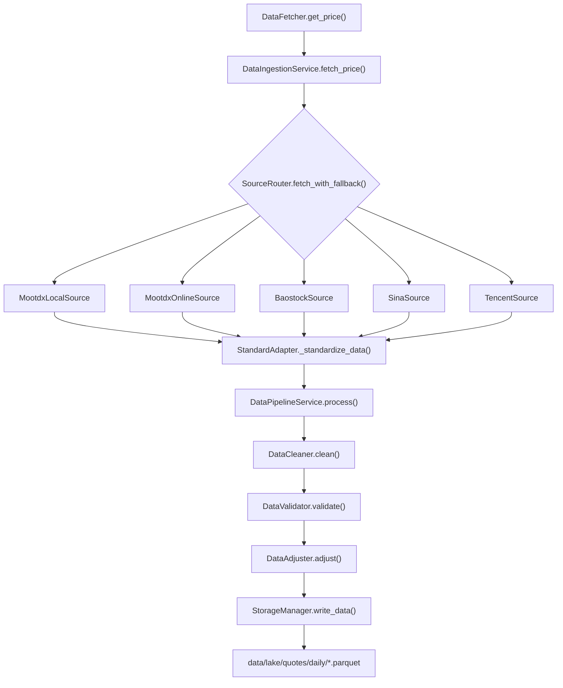

# UniQuant 快速上手与部署指南

> **版本**: v0.3 | **源码快照**: 2026-06-01 | **Python**: ≥ 3.12
> **代码即真理**: 所有配置键、路径、版本约束均从 `pyproject.toml` 和 `config/*.yaml` 物理文件提取。

---

## 1. 项目概述

UniQuant 是面向 A 股市场的全栈量化交易系统，覆盖数据接入、信号生成、因子分析、风险管理到回测撮合的完整量化工作流。

**当前状态**: 重构中期 (Phase 0 未开始)。完成度 ~28% (44/160 文件, ~12.6K LOC)。

| 包 | 状态 | 文件数 | 说明 |
|----|------|--------|------|
| `shared/` | ✅ 基本完整 | 23 | 常量、异常、缓存、配置、成本模型 |
| `data/` | ✅ 已迁移 | 60+ | 完整数据层 (mootdx/DuckDB/Parquet) |
| `services/` | ⚠️ 部分可用 | 11 | 幽灵导入阻塞 `import uniquant.services` |
| `brain/` | ⚠️ 部分可用 | 15 | czsc/fsm/lppl/wyckoff/ntf/regime + indicators/screener/alpha_decoupler |
| `risk/` | ⚠️ 部分可用 | 8 | drawdown_analyzer/evt_risk/sizer/portfolio_optimizer/structural |
| `hands/` | ⚠️ 部分可用 | 14+ | backtest 引擎完整, strategies/tuning 部分 |
| `ui/` | ⚠️ 部分可用 | 2 | Streamlit 仪表盘 (1518 行) |
| `signal/` | 🔲 不存在 | 0 | 信号归一化/聚合/持久化待新建 |

---

## 2. 环境要求与依赖安装

### 2.1 环境要求

- **Python**: ≥ 3.12 (`pyproject.toml:9`)
- **操作系统**: Linux / macOS / Windows (WSL)
- **构建系统**: setuptools ≥ 68.0

### 2.2 安装步骤

```bash
# 1. 克隆仓库
git clone git@github.com:feel6bglues/UniQuant.git
cd UniQuant

# 2. 创建虚拟环境
python3.12 -m venv .venv
source .venv/bin/activate

# 3. 基础安装
pip install -e .

# 4. 完整安装 (含所有可选依赖)
pip install -e ".[all]"

# 5. 仅开发依赖
pip install -e ".[dev]"
```

**注意**: 根目录 `pyproject.toml` 已存在，无需复制 `docs/pyproject.toml`。

### 2.3 核心依赖

| 包名 | 版本约束 | 用途 |
|------|---------|------|
| `numpy` | `>=2.0.0` | 数值计算 |
| `pandas` | `>=2.0.0,<3.0.0` | 数据处理 |
| `scipy` | `>=1.10.0,<2.0.0` | 科学计算 (LPPL 优化器) |
| `pyarrow` | `>=14.0.0,<20.0.0` | Parquet 读写 |
| `duckdb` | `>=0.9.0` | 嵌入式分析数据库 |
| `mootdx` | `>=0.11.7,<1.0.0` | 通达信数据源 |
| `akshare` | `>=1.12.0,<2.0.0` | A 股数据源 |
| `numba` | `>=0.58.0,<1.0.0` | JIT 编译加速 |
| `sqlalchemy` | `>=2.0.0` | SQL ORM |
| `streamlit` | `>=1.20.0` | Web 仪表盘 |
| `plotly` | `>=5.0.0` | 交互式图表 |
| `loguru` | `>=0.7.0` | 日志 |
| `filelock` | `>=3.10.0` | 文件锁 |
| `joblib` | `>=1.3.0,<2.0.0` | 磁盘缓存序列化 |
| `PyYAML` | `>=6.0.0,<7.0.0` | YAML 配置解析 |
| `requests` | `>=2.31.0` | HTTP 请求 |
| `xxhash` | `>=3.4.0` | 高速哈希 |

### 2.4 可选依赖

| Extra | 包名 | 用途 |
|-------|------|------|
| `dev` | `pytest`, `pytest-cov`, `ruff`, `mypy` | 测试/Lint/类型检查 |
| `tdx` | `pytdx`, `tdxpy` | TDX 文件解析 |
| `baostock` | `baostock` | BaoStock 数据源 |
| `curl` | `curl-cffi` | cURL 绑定 |
| `report` | `weasyprint` | PDF 报告 |
| `js` | `py-mini-racer` | JS 执行器 (THS 解析) |
| `all` | 以上所有 | 完整安装 |

### 2.5 验证安装

```bash
# 基础验证 (可能因 services 幽灵导入失败)
python -c "import uniquant; print('OK')"

# 仅验证 shared 层 (安全)
python -c "import uniquant.shared; print('shared OK')"

# 验证配置加载
python -c "from uniquant.shared.config_loader import get_config; c = get_config(); print(c.get('base.data_lake.engine'))"

# 验证数据层
python -c "from uniquant.data.sources import MootdxOnlineSource; print('data OK')"

# 核心测试
pytest tests/test_engine_factory.py -xvs

# Lint
ruff check src/uniquant/
```

### 2.6 已知阻塞问题

| # | 问题 | 影响 | 文件位置 |
|---|------|------|---------|
| 1 | `services/__init__.py` 8 个幽灵导入 | `import uniquant.services` 崩溃 | `src/uniquant/services/__init__.py` |
| 2 | `brain/lppl/__init__.py` 7 个幽灵导入 | LPPL 引擎无法使用 | `src/uniquant/brain/lppl/__init__.py` |
| 3 | `brain/fsm/fsm.py` 的 `from ..indicators import Indicators` | FSM/DecisionBrain 崩溃 (已有 try/except fallback) | `src/uniquant/brain/fsm/fsm.py:19-22` |
| 4 | `engine_factory` 参数错配 | 所有引擎无法初始化 | `src/uniquant/services/analysis/engine_factory.py` |

---

## 3. 配置文件详解

### 3.1 配置加载机制

**文件**: `src/uniquant/shared/config_loader.py`

`GlobalConfig` 采用**双重检查锁单例模式**:

```python
from uniquant.shared.config_loader import get_config

config = get_config()
value = config.get("brain.fsm.ma_short", 20)  # 点分路径读取
config.set("brain.fsm.ma_short", 25)           # 点分路径写入
config.reload()                                  # 重新加载
```

**初始化流程** (`config_loader.py:66-85`):
1. 优先加载 `config/config.yaml` 统一配置
2. 若不存在，加载 10 个独立 YAML 文件
3. 验证必需配置段: `base`, `cache`, `network`, `data_sources`

### 3.2 config.yaml 顶级结构

**文件**: `config/config.yaml` (430 行)

| 顶级键 | 行号 | 说明 |
|--------|------|------|
| `base` | 5-17 | 基础配置: data_lake、logging、tdx 路径 |
| `cache` | 19-53 | 缓存配置: global、ttl、limits、performance、cleanup |
| `network` | 55-118 | 网络配置: timeout、retry、rate_limit、headers、sources |
| `data_sources` | 120-261 | 数据源配置: 9 个数据源 + data_types + industry_concept |
| `indicators` | 263-275 | 技术指标: ma、atr、macd、rsi |
| `czsc` | 277-288 | 缠论配置: bi_params、buy_points |
| `lppl` | 290-360 | LPPL 泡沫检测: m/w 约束、optimizer、bounds、confidence |
| `markets` | 362-405 | 市场配置: etfs、benchmarks、indices |
| `risk` | 406-409 | 风险配置: default_risk_pct、circuit_break_pct |
| `brain` | 411-430 | 核心逻辑: alpha_decoupler、ntf、regime、fsm |

### 3.3 数据湖配置

```yaml
# config.yaml:5-9
base:
  data_lake:
    path: "data/lake"          # 数据湖根目录 (Parquet 文件)
    compression: "snappy"      # Parquet 压缩算法
    engine: "duckdb"           # 存储引擎类型
  tdx:
    path: "/home/james/.local/share/tdxcfv/drive_c/tc"  # 通达信数据目录
```

**路径常量** (`config_loader.py`):
- `LAKE_DIR` = `{ROOT_DIR}/data/lake`
- `CACHE_DIR` = `{ROOT_DIR}/data/cache`
- `DATA_DIR` = `{ROOT_DIR}/data`

### 3.4 数据源配置

**已启用数据源** (priority 1-3):

| 数据源 | 类路径 | 优先级 | 超时 |
|--------|--------|--------|------|
| `StockDataSource` | `data.sources.stock_sources.StockDataSource` | 1 | 10s |
| `IndexDataSource` | `data.sources.index_sources.IndexDataSource` | 2 | 10s |
| `EtfDataSource` | `data.sources.etf_sources.EtfDataSource` | 3 | 10s |

**数据类型 → 数据源映射**:

| 数据类型 | 子类型 | 缓存 TTL |
|---------|--------|---------|
| stock | daily | 3600s (1小时) |
| stock | realtime | 60s (1分钟) |
| index | daily | 3600s |
| sector | daily | 86400s (1天) |
| etf | daily | 3600s |
| industry | -- | 86400s |

### 3.5 缓存配置

```yaml
# config.yaml:19-53
cache:
  global:
    enabled: true
    path: "data/cache"
    max_age: 7              # 最大保存天数
  ttl:
    stock_data: 3600        # 1小时
    index_data: 3600
    realtime_data: 60       # 1分钟
    market_cap: 300         # 5分钟
    lppl_result: 1800       # 30分钟
  limits:
    max_entries: 1000
    max_memory_mb: 100
  cleanup:
    enabled: true
    interval: 300           # 5分钟
```

### 3.6 交易配置

**文件**: `config/trading.yaml` (57 行)

```yaml
execution:
  broker: "simulator"
  initial_capital: 100000.0       # 初始资金 10万
  slippage_pct: 0.0005            # 滑点 万5
  buy_fee_pct: 0.0003             # 买入佣金 万3
  sell_fee_pct: 0.0003            # 卖出佣金 万3
  stamp_tax_pct: 0.0005           # 印花税 万5
  min_commission: 5.0             # 最低佣金 5元

risk:
  max_positions: 30               # 最大持仓数
  max_single_stock_pct: 5.0       # 单股最大占比 5%
  max_single_sector_pct: 20.0     # 单行业最大占比 20%
  max_drawdown_pct: 15.0          # 最大回撤 15%
  var_confidence: 0.95            # VaR 置信度
  max_daily_var_pct: 2.0          # 日 VaR 上限 2%
```

### 3.7 因子配置

**文件**: `config/factors.yaml` (15 行)

```yaml
factors:
  momentum_20d:
    enabled: true
    weight: 1.2
    category: technical
  turnover_momentum_20d:
    enabled: true
    weight: 0.85
    category: technical
  pe_ttm:
    enabled: true
    weight: 0.7
    category: fundamental
```

---

## 4. 数据层架构

### 4.1 目录结构

```
data/
├── lake/
│   └── quotes/
│       ├── daily/*.parquet       # 日线数据
│       ├── weekly/*.parquet      # 周线 (由 StorageManager 合成)
│       ├── monthly/*.parquet     # 月线 (由 StorageManager 合成)
│       ├── 1mins/*.parquet       # 1分钟线
│       └── 5mins/*.parquet       # 5分钟线
├── lake/index/*.parquet          # 指数数据
├── factors/*.parquet             # 复权因子
├── fq/gbbq.parquet              # 股本变迁 (TDX gbbq 解析)
└── cache/*.joblib               # 磁盘缓存
```

**存储路径映射** (`storage_manager.py:495-514`):

| data_type | 目录路径 |
|-----------|---------|
| `daily` / `stock` | `{data_dir}/lake/quotes/daily/{symbol}.parquet` |
| `weekly` | `{data_dir}/lake/quotes/weekly/{symbol}.parquet` |
| `monthly` | `{data_dir}/lake/quotes/monthly/{symbol}.parquet` |
| `factor` | `{data_dir}/factors/{symbol}.parquet` |
| `index` | `{data_dir}/lake/index/{symbol}.parquet` |

### 4.2 核心类

#### DataFetcher — 系统大脑 (`data/data_fetcher.py:58-268`)

```python
class DataFetcher:
    def __init__(self, data_dir: str = "./data"): ...
    def get_price(self, symbol: str, adjust: str = "") -> pd.DataFrame: ...
    def fetch_stock_daily(self, symbol: str, start_date: str, end_date: str, adjust: str = "qfq") -> pd.DataFrame: ...
    def fetch_index_daily(self, symbol: str, start_date: str, end_date: str) -> pd.DataFrame: ...
    def fetch_for_brain(self, symbol: str) -> Dict: ...
    def fetch_all_stock_codes(self, force_update: bool = False) -> pd.DataFrame: ...
    def is_valid_symbol(self, symbol: str) -> bool: ...
    def get_source_health_report(self) -> Dict: ...
```

#### StorageManager — 数据湖存储 (`data/lake/storage_manager.py:16-599`)

```python
class StorageManager:
    def __init__(self, data_dir: str = "./data"): ...
    def read_data(self, symbol: str, data_type: str = "daily", **kwargs) -> pd.DataFrame: ...
    def write_data(self, symbol: str, df: pd.DataFrame, data_type: str = "daily", **kwargs): ...
    def batch_read_data(self, symbols: List[str], data_type: str = "daily", **kwargs) -> Dict[str, pd.DataFrame]: ...
```

#### SourceRouter — 数据源路由 (`data/managers/source_router.py:14-246`)

```python
class SourceRouter:
    def fetch_data(self, symbol: str, start_date: str, max_retries: int = 2) -> pd.DataFrame: ...
    def fetch_data_with_race(self, symbol: str, start_date: str) -> pd.DataFrame: ...
    def fetch_with_fallback(self, symbol: str, method: str = "fetch", **kwargs): ...
```

### 4.3 数据获取流



---

## 5. 最小可运行示例

### 5.1 配置加载

```python
from uniquant.shared.config_loader import get_config

config = get_config()
print(config.get("base.data_lake.engine"))      # "duckdb"
print(config.get("base.data_lake.path"))         # "data/lake"
print(config.get("cache.ttl.stock_data"))        # 3600
print(config.get("brain.fsm.ma_short"))          # 20
```

### 5.2 市场时间查询

```python
from uniquant.shared.constants import MarketHours

is_open = MarketHours.is_market_open()         # True/False
is_trading = MarketHours.is_trading_day()       # True/False
status = MarketHours.get_market_status()        # "交易中" / "午休" / "已收盘" / "休市"
next_open = MarketHours.get_next_open_time()    # datetime
```

### 5.3 涨跌停检查

```python
from uniquant.shared.limit_checker import check_limit_status, get_board_type

board = get_board_type("688001.SH")  # "sci_tech"
board = get_board_type("300001.SZ")  # "gem"

status = check_limit_status(
    current_price=11.0,
    pre_close=10.0,
    symbol="000001.SZ",
    name="平安银行"
)
print(status.is_limit_up)    # True
print(status.can_buy)        # False (涨停无法买入)
print(status.up_limit_price) # 11.0
```

### 5.4 交易成本计算

```python
from uniquant.shared.cost_model import CostConfig

config = CostConfig()
print(config.cost_buy)   # 0.0003 (佣金 万3)
print(config.cost_sell)  # 0.0008 (佣金+印花税 万8)

# 计算 10 元股票 × 1000 股的交易成本
price, quantity = 10.0, 1000
buy_cost = price * quantity * config.cost_buy          # 3.0 元
commission = max(buy_cost, config.min_commission)       # 5.0 元 (最低佣金)
```

### 5.5 数据获取

```python
from uniquant.data import DataFetcher

fetcher = DataFetcher(data_dir="./data")

# 获取个股日线 (前复权)
df = fetcher.fetch_stock_daily("600000.SH", "2024-01-01", "2024-12-31", adjust="qfq")

# 获取指数日线
df = fetcher.fetch_index_daily("000300.SH", "2024-01-01", "2024-12-31")

# 验证股票代码
is_valid = fetcher.is_valid_symbol("600000.SH")  # True
```

### 5.6 使用 mootdx 本地数据源

```python
from uniquant.data.sources import MootdxLocalSource

# 从配置读取 TDX 路径
source = MootdxLocalSource()

# 或指定路径
source = MootdxLocalSource(tdx_dir="/path/to/tdx")

# 获取日线
df = source.fetch_daily("600000.SH", "2024-01-01", "2024-12-31")

# 获取 5 分钟线
df = source.fetch_minute("600000.SH", freq=5)

# 检查能力
caps = source.get_capabilities()
# {'offline': True, 'daily': True, 'minute': True, 'realtime': False, 'financial': False}
```

### 5.7 使用 mootdx 在线数据源

```python
from uniquant.data.sources import MootdxOnlineSource

source = MootdxOnlineSource()
df = source.fetch_daily("600000.SH", "2024-01-01", "2024-12-31")
df = source.fetch_real_time("600000.SH")
source.close()
```

### 5.8 数据同步脚本

```bash
# 日线数据同步 (mootdx → Parquet)
python -m uniquant.data.scripts.sync_daily_mootdx \
    --tdx-dir /home/james/.local/share/tdxcfv/drive_c/tc \
    --output-dir ./data

# 指定股票同步
python -m uniquant.data.scripts.sync_daily_mootdx \
    --tdx-dir /path/to/tdx \
    --symbols 600000.SH 000001.SZ

# TDX 数据导入三步流程
python -m uniquant.data.services.data_importer --data-dir ./data --tdx-path /path/to/tdx --parse-gbbq
python -m uniquant.data.services.data_importer --data-dir ./data --tdx-path /path/to/tdx --import-daily
python -m uniquant.data.services.data_importer --data-dir ./data --calculate-factors
```

### 5.9 缓存使用

```python
from uniquant.shared.cache import cache_manager, smart_cache, CacheFactory

# 全局内存缓存
cache_manager.set("key1", {"data": [1, 2, 3]}, ttl=300)
result = cache_manager.get("key1")

# 磁盘缓存
disk_cache = CacheFactory.create("disk", cache_dir="data/cache", max_cache_age=7)
disk_cache.set("key2", some_dataframe, ttl=3600)

# 装饰器
@smart_cache(ttl=60)
def expensive_calculation(symbol: str) -> pd.DataFrame:
    ...
    return df

# 统计
stats = cache_manager.get_stats()
# {'hits': 100, 'misses': 20, 'size': 80, 'hit_rate': 83.33}
```

---

## 附录: mootdx 数据源能力对比

| 能力 | MootdxLocalSource | MootdxOnlineSource |
|------|-------------------|-------------------|
| 离线数据 | ✅ | ❌ |
| 日线 | ✅ | ✅ |
| 分钟线 | ✅ | ✅ |
| 实时数据 | ❌ | ✅ |
| 财务数据 | ❌ | ❌ |
| 初始化 | `Reader.factory(market='std', tdxdir=tdx_dir)` | `Quotes.factory(market='std', heartbeat=True)` |

---

*文档基于代码事实提取 | 生成时间: 2026-06-01*
